## Praktikum 03 - Link Navigation  

### 1. Test Run Project
  
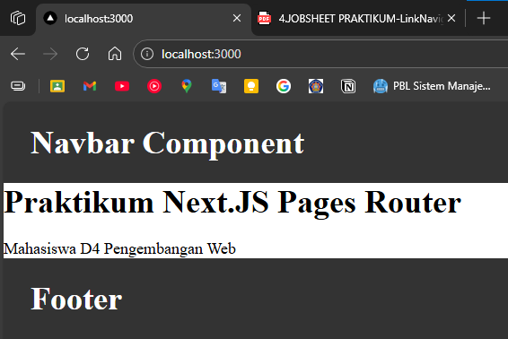  

### 2. Membuat Catch-All Route
- pada folder pages, Buat folder shop dan file […slug].tsx  
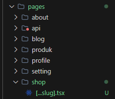  
- Isi file  […slug].tsx  
  
  
- Cek menggunakan console.log  
  
- Modifikasi [...slug].tsx untuk menampilkan nilai query  
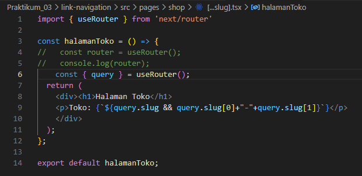  

### 3.  Pengujian Catch-All Route
- /shop/clothes 
  
- /shop/clothes/tops  
 
- /shop/clothes/tops/t-shirt  
 
ada yang tidak terbaca ini dikarenakan segmennya dibatasi Cuma array[0] dan array[1].  
- Modifikasi […slug].tsx  
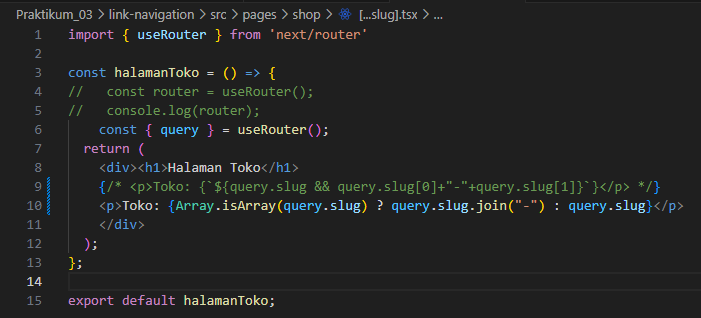  
- Berapapun banyaknya segment tetap terbaca   
  
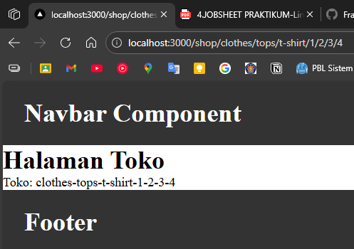  

### 4. Optional Catch-All Route 
- jika mengakses /shop saja maka akan terjadi error  
  
-  Rename file: [...slug].js → [[...slug]].js agar tidak error saat hanya mengakses /shop 
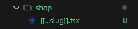  
- hasil  
  

### 5. Validasi Parameter
- Menambah validasi agar tidak error saat slug kosong  
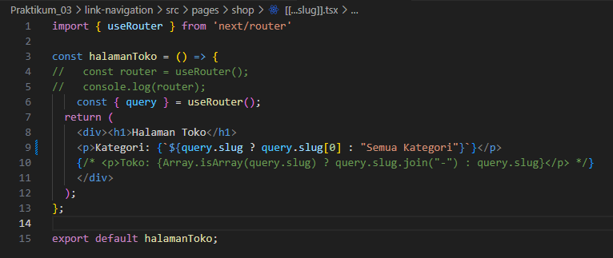  
  

### 6. Membuat Halaman Login & Register
- pada folder pages, buat folder auth, lalu buat file login.tsx dan register.tsx 
  
- login.tsx  
 
- register.tsx  
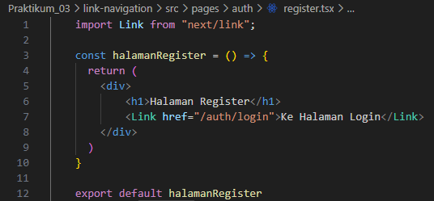 
- hasil  
  

### 7. Navigasi Imperatif (router.push) 
- tambah button login: mengarah ke /produk  
  
- Hasil  
  
#### Perbandingan Penggunaan onClick di React
| Kode | Cara Kerja | Dipanggil Saat | Kelebihan | Kekurangan | Rekomendasi |
|------|------------|---------------|-----------|------------|-------------|
| `onClick={handlerLogin}` | Mengirim referensi fungsi | Tombol diklik | Bersih, efisien, best practice | Tidak bisa kirim parameter langsung | ✅ Sangat direkomendasikan |
| `onClick={() => push('/produk')}` | Arrow function memanggil fungsi | Tombol diklik | Praktis untuk navigasi sederhana | Kurang reusable jika logika bertambah | ✅ Cocok untuk navigasi sederhana |
| `onClick={() => handlerLogin()}` | Arrow function membungkus fungsi | Tombol diklik | Fleksibel kirim parameter | Redundant jika tanpa parameter | ⚠ Gunakan jika perlu argumen |
| `onClick={handlerLogin()}` | Fungsi langsung dieksekusi | Saat render | - | ❌ Bug: tidak menunggu klik | 🚫 Tidak direkomendasikan |

### 8. Simulasi Redirect (Belum Login)
- pada index.tsx tambahkan beberapa code  
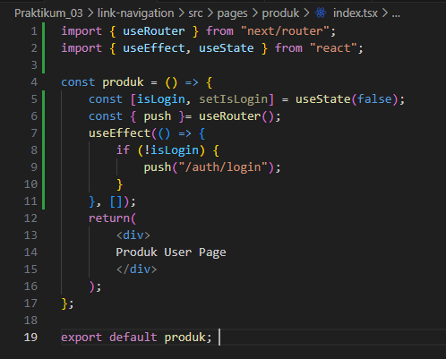  
- Jika Akses /product → otomatis diarahkan ke login.  
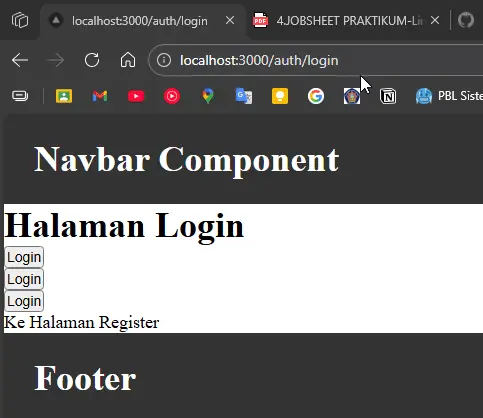 

## Tugas Praktikum

### Tugas 1 (Wajib)
- Buat catch-all route: 
    - /category/[...slug].jsx  
    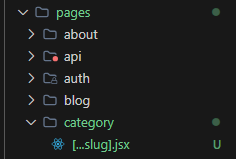  
    - Tampilkan seluruh parameter URL dalam bentuk list.  
    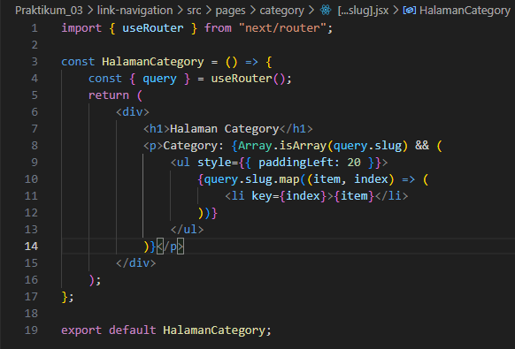  
    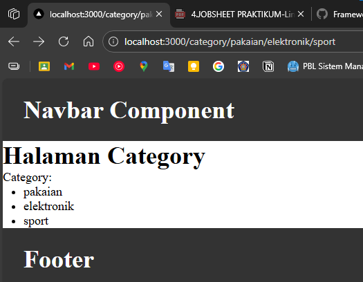  

### Tugas 2 (Wajib)
- Buat navigasi: 
    - Login → Product (imperatif). 
    > sebenarnya sudah diterapkan pada praktikum langkah 7. namun dikarenakan ada redirect pada langkah 8, membuat button login ketika di klik dia membuka /produk sekejap, lalu langsung redirect ke login, jadi login yang sudah dibuat tidak mau masuk ke produk, cara mengatasi adalah dengan menghapus redirect pada langkah 8. maka login yang sudah dibuat berhasil masuk ke produk.  
    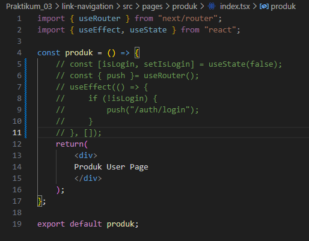 
    > tapi ada juga cara lain yaitu dengan menyimpan sesi login di local storage, sehingga redirect tetap ada dan perlu ditambahkan button logout untuk menghapus sesi login.  
    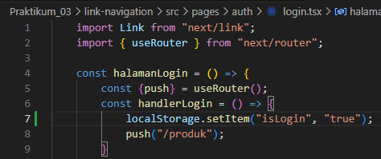  
    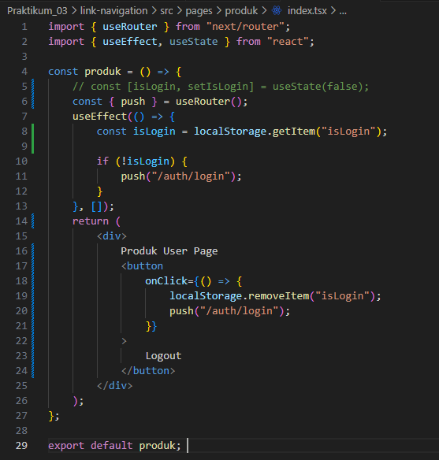  
    karena hanya ditambahkan di handlerLogin, jadi login yang bagian tengah tidak berhasil masuk ke produk. karena langsung pakai push("/produk") dan tidak menyimpan sesi di localStorage.  
    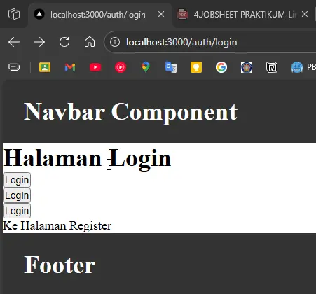  

    - Login ↔ Register (Link)  
    sudah diterapkan pada praktikum langkah 6.

### Tugas 3 (Pengayaan)
- Terapkan redirect otomatis ke login jika user belum login. 
> sebenarnya sudah diterapkan juga, namun disini saya akan ubah agar tidak hanya pada /produk, tapi page lain harus ke page login dulu.  
- modifikasi _app.tsx, index.tsx pada pages/produk, dan login.tsx pada pages/auth/login.
- _app.tsx  
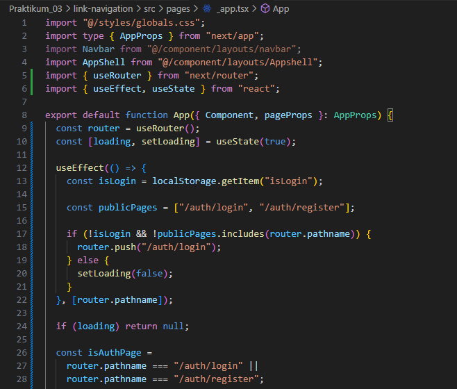  
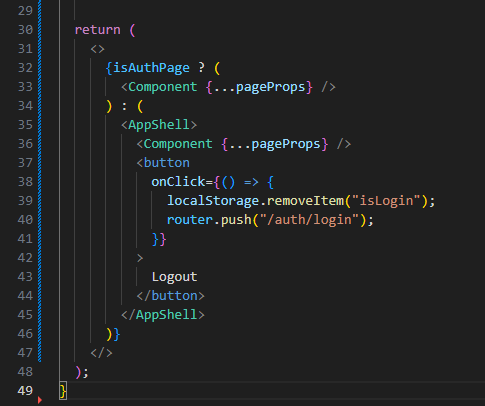  
- index.tsx pada pages/produk  
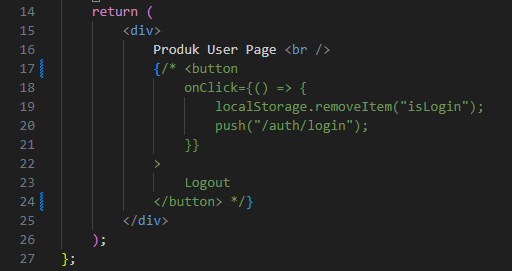  
- login.tsx pada pages/auth/login  
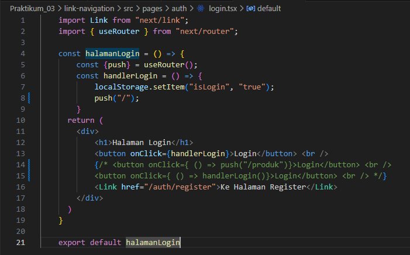 

- hasil  
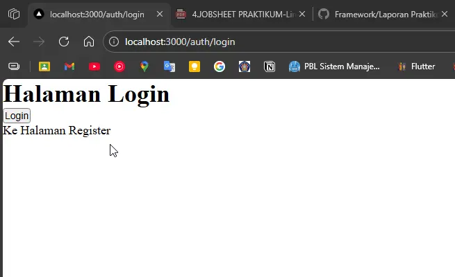 

## Pertanyaan Refleksi
1. **Apa perbedaan [id].js dan [...slug].js?**
    > `[id].js` adalah dynamic route untuk satu segmen URL saja, sedangkan `[...slug].js` adalah catch-all route yang dapat menangkap banyak segmen URL sekaligus ke dalam satu parameter.
2. **Mengapa slug berbentuk array?**
    > Karena catch-all route dapat menangkap lebih dari satu segmen URL, sehingga setiap bagian path tersebut disimpan sebagai elemen dalam sebuah array agar lebih fleksibel.
3. **Kapan sebaiknya menggunakan Link dan router.push()?** 
    > Gunakan komponen `<Link>` untuk navigasi antar halaman standar (deklaratif). Gunakan `router.push()` untuk navigasi yang dipicu oleh logika program atau event tertentu, seperti setelah berhasil submit form (imperatif).
4. **Mengapa navigasi Next.js tidak me-refresh halaman?**
    > Karena Next.js menggunakan *Client-side Navigation*, di mana hanya data dan komponen yang diperlukan saja yang dimuat ulang tanpa melakukan request penuh ke server untuk seluruh dokumen HTML.

