## Praktikum 04 - Styling  

- Nama: Jiha Ramdhan
- NIM: 2341720043
- Kelas: TI-3D

## Daftar Isi
1. [Praktikum 04 - Styling](#praktikum-04---styling)
    - [Global CSS](#1-global-css)
    - [CSS Module (Local Scope)](#2-css-module-local-scope)
    - [Styling Untuk Pages (CSS Module)](#3-styling-untuk-pages-css-module)
    - [Conditional Rendering Navbar (Tanpa Navbar di Login)](#4-conditional-rendering-navbar-tanpa-navbar-di-login)
    - [Refactoring Struktur Project (Best Practice)](#5-refactoring-struktur-project-best-practice)
    - [Inline Styling (CSS-in-js)](#6-inline-styling-css-in-js)
    - [Kombinasi Global CSS + CSS Module](#7-kombinasi-global-css--css-module)
    - [SCSS (SASS)](#8-scss-sass)
    - [Tailwind CSS](#9-tailwind-css)
2. [Tugas Praktikum](#tugas-praktikum)
    - [Tugas 1](#tugas-1)
    - [Tugas 2](#tugas-2)
    - [Tugas 3](#tugas-3)
3. [F. Pertanyaan Refleksi](#f-pertanyaan-refleksi)

### 1. Global CSS
- `styles/globals.css`  
  
- `pages/_app.tsx`  
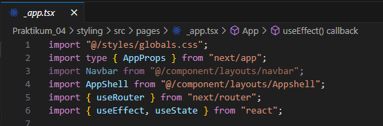 

### 2. CSS Module (Local Scope)
**a. Struktur Komponen Navbar**  
`src/components/layout/Navbar/`  
├── `index.tsx`  
└── `Navbar.module.css`  
  
**b. File CSS Module**  
- Modifikasi `global.css`  
  
- Modifikasi `navbar.module.css`  
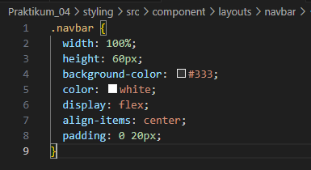 
**c. Pemanggilan di Komponen**  
- Modifikasi kode pada `index.tsx` pada folder navbar  
 
- Jalankan browser  
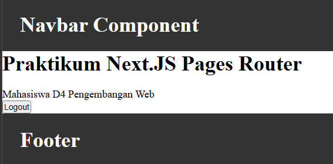 

### 3. Styling Untuk Pages (CSS Module)
- Tambahkan `login.module.css` pada folder `auth`  
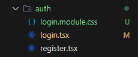 
- Modifikasi `login.module.css`  
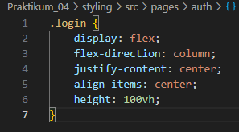 
- Modifikasi `login.tsx`  
    - Tambahkan `import styles from "./login.module.css"`  
    - Tambahkan `className={styles.login}`  
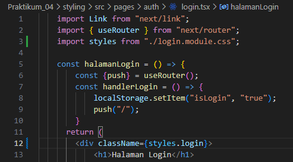 
- Jalankan browser  
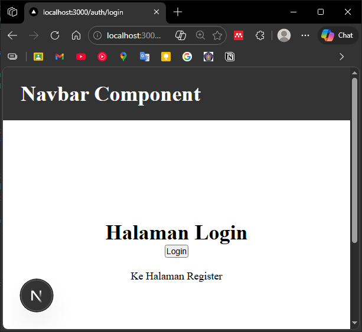 

### 4. Conditional Rendering Navbar (Tanpa Navbar di Login)
- Modifikasi `index.tsx` pada folder `AppShell`  
    - `import { useRouter } from "next/router";`  
    - `const disableNavbar = ["/auth/login", "/auth/register"];`  
    - `const { pathname } = useRouter();`  
    - `{!disableNavbar.includes(pathname) && <Navbar />}`  
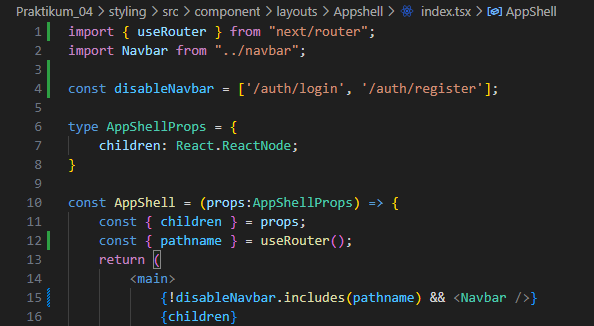 
- Jalankan browser  
 

### 5. Refactoring Struktur Project (Best Practice)
**a. Struktur Awal (Kurang Rapi)**  
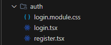 
**b. Struktur Refactor (Disarankan)**  
`src/views/auth/Login/`  
├── `index.tsx`  
└── `Login.module.css`  
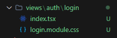 
**c. Langkah-langkah Refactoring**  
- Modifikasi `Login.module.css` pada folder `src/views/auth/Login/`  
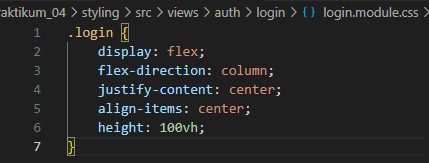 
- Hapus `login.module.css` pada folder `pages/auth/`  
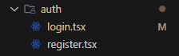 
- Modifikasi `login.tsx` pada folder `pages/auth/`  
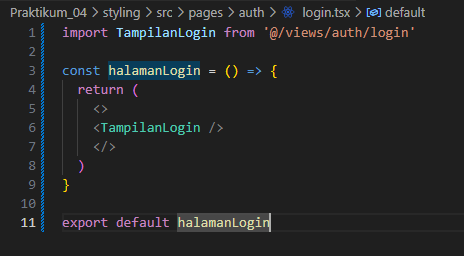 
- Modifikasi `index.tsx` pada folder `views/auth/login`  
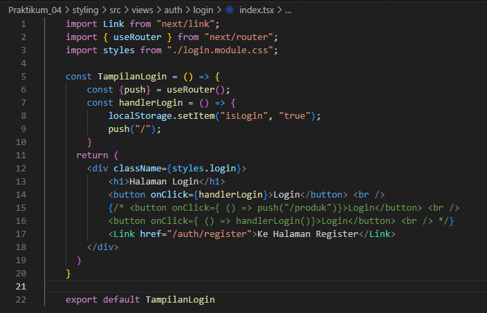 
- Jalankan browser  
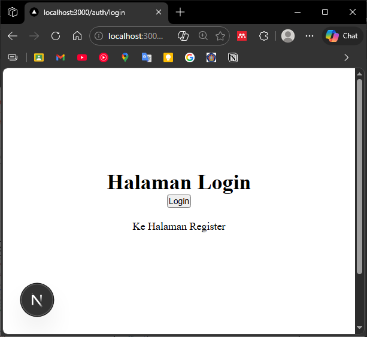 
    > • Routing tetap bersih  
    > • Logic & UI terpisah  
    > • Mudah dikembangkan  

### 6. Inline Styling (CSS-in-JS)

- Modifikasi `index.tsx` pada folder `views/auth/login`  
    - `<h1 style={{ color: "red", border:"1px solid red", borderRadius: "5px", padding: "5px" }}>Belum Punya Akun</h1>`  
    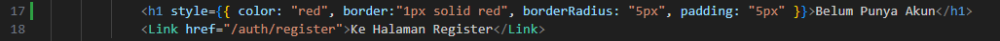 
- Jalankan browser  
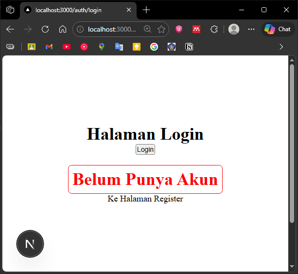 

**Catatan Penting:**  
- Menggunakan camelCase (contoh: `borderRadius: "10px"`)  
- Cocok untuk styling kecil & dinamis  
- Tidak disarankan untuk layout besar  

### 7. Kombinasi Global CSS + CSS Module
- Modifikasi `globals.css`  
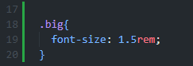 
- Modifikasi `index.tsx` pada folder `components/layouts/navbar`  
    - `
navbar
`  
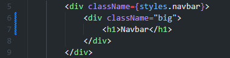 

**Kesimpulan:**
- Global CSS → utility umum & reusable  
- CSS Module → styling spesifik komponen  

### 8. SCSS (SASS)
**a. Install SASS**
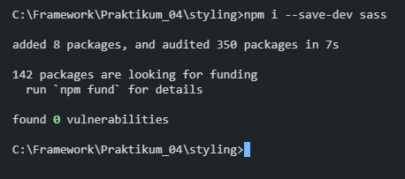  
- Cek `package.json` untuk memastikan instalasi berhasil  
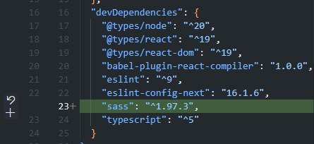  

**b. Global Variable**
- Tambahkan `colors.scss` pada folder `styles` 
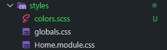 
- Modifikasi `colors.scss` 
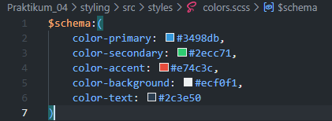 

**c. Gunakan di Module**
- Tambahkan file `login.module.scss` pada folder `views/auth/login/` 
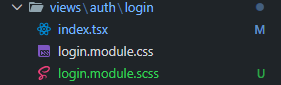 
- Modifikasi `index.tsx`
    - `import styles from "./login.module.scss"`
    - Hapus `import styles from "./login.module.css"` 
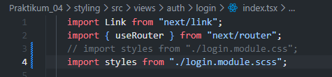 
- Modifikasi `login.module.scss`
    - `background-color: map-get($map: $schema, $key: color-secondary);` 
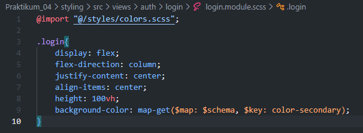 
- Jalankan browser 
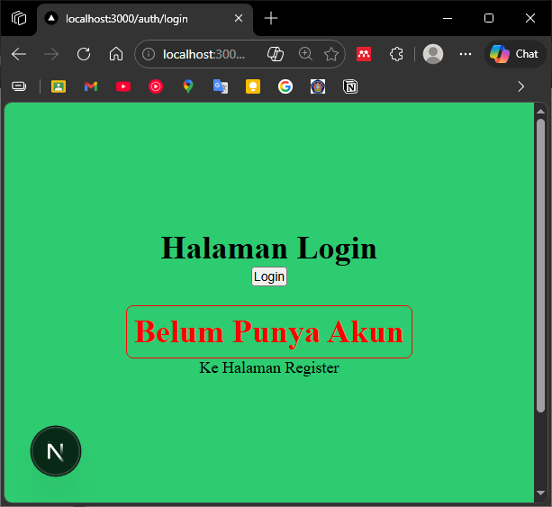 

**Keunggulan SCSS:**
- Variable → Simpan warna, font, ukuran di satu tempat
- Nested rule → Struktur CSS mengikuti struktur HTML
- Maintainable → Ideal untuk project skala besar 

### 9. Tailwind CSS
**a. Install**  
- `npm install -D tailwindcss postcss autoprefixer`  
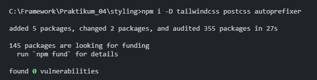  
- `npx tailwindcss init -p`  
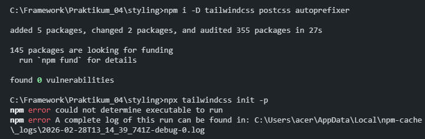  
    - Jika terjadi error, downgrade versi tailwindcss  
    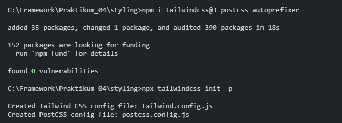  

**b. Konfigurasi tailwind.config.js**  
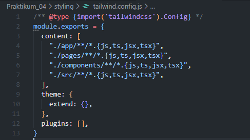 

**c. Import di Global CSS**  
- `@tailwind base;`  
- `@tailwind components;`  
- `@tailwind utilities;`  
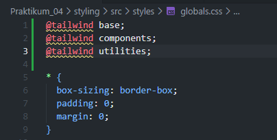 

**d. Contoh Penggunaan**  
- Modifikasi `index.tsx` pada folder `views/auth/login/`  
    - `<h1 className="text-3xl font-bold text-blue-600">Halaman Login</h1>`  
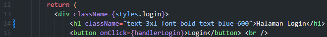 
- Jalankan browser  
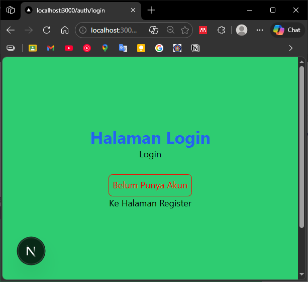 

**Keunggulan Tailwind CSS:**  
- Utility-first → Styling langsung di markup  
- Responsive → Built-in breakpoints  
- Efisien → Hanya include CSS yang digunakan  

## Tugas Praktikum

### Tugas 1
- Buat halaman Register
- Gunakan CSS Module
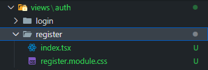  
`index.tsx` di folder `views/auth/register` 
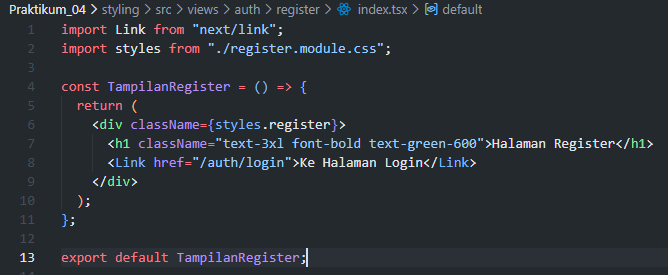  
`register.module.css` di folder `views/auth/register` 
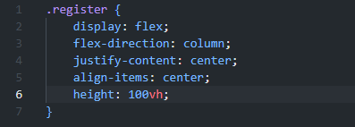 
`register.tsx` di folder `pages/auth` 
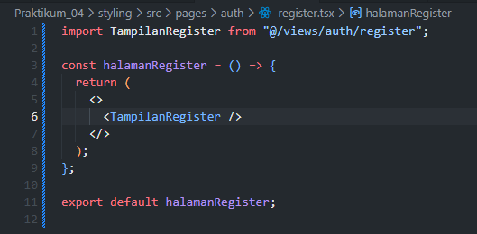 
- Tampilan Browser  
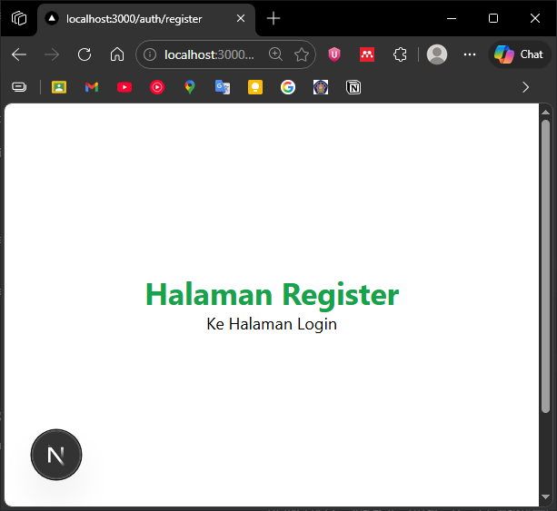 

### Tugas 2
- Refactor halaman Produk ke folder views
- Pisahkan Hero Section dan Main Section  
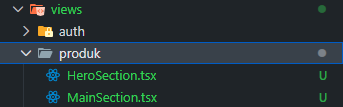
`HeroSection.tsx` 
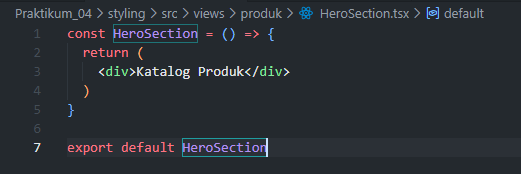 
`MainSection.tsx` 
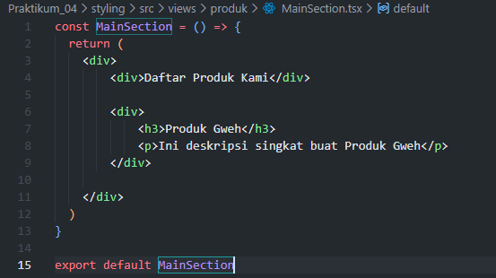 
`index.tsx` pada folder `pages/produk`
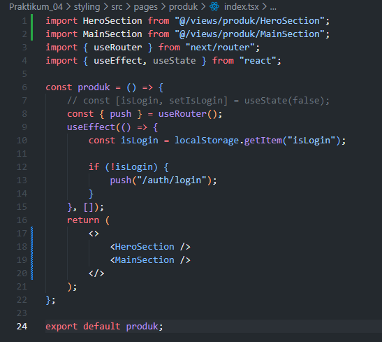 
- Tampilan Browser
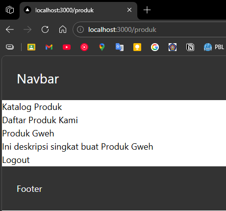  

### Tugas 3
- Terapkan Tailwind CSS
- Gunakan minimal 5 utility class  
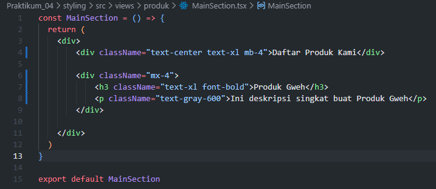 
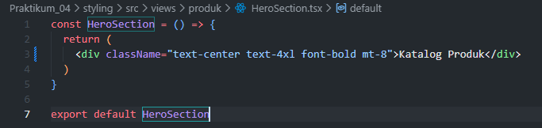 
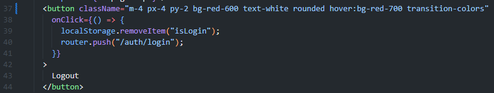 
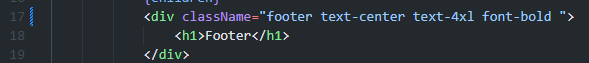 
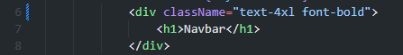 
- Tampilan Browser
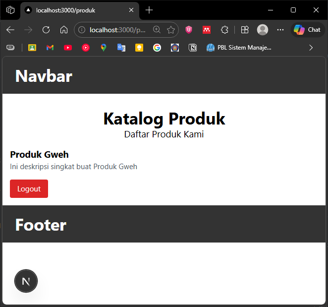    

## F. Pertanyaan Refleksi
1. **Kapan sebaiknya menggunakan CSS Module dibanding Global CSS?**
    > CSS Module digunakan untuk styling komponen tertentu agar tidak bentrok dengan komponen lain. Global CSS digunakan untuk styling umum yang dipakai di banyak tempat, seperti font atau warna dasar aplikasi.

2. **Apa kelemahan inline styling?**
    > Inline styling sulit diperbaharui, tidak bisa menggunakan media query, tidak bisa digunakan kembali di tempat lain, membuat kode terlihat berantakan, dan tidak cocok untuk styling yang rumit. Hanya bagus untuk styling kecil yang berubah-ubah.

3. **Mengapa SCSS cocok untuk project skala besar?**
    > SCSS memiliki fitur variable untuk konsistensi warna, nested rule untuk kode terorganisir, mixin untuk kode yang bisa dipakai ulang, dan import untuk memisahkan file. Semua ini membuat kode lebih mudah dirawat di project besar.

4. **Apa keunggulan Tailwind dibanding CSS tradisional?**
    > Tailwind membuat styling lebih cepat pakai, sudah siap untuk berbagai ukuran layar, hanya menambahkan CSS yang benar-benar dipakai (hemat ukuran), styling konsisten, dan tidak perlu mikir nama class. Cocok untuk development yang cepat.

