## Praktikum 05 - Custom Error & Document

- Nama: Jiha Ramdhan
- NIM: 2341720043
- Kelas: TI-3D

## Daftar Isi
- [1. Menjalankan Project](#1-menjalankan-project)
- [2. Membuat Custom Document](#2-membuat-custom-document)
- [3. Pengaturan Title per Halaman](#3-pengaturan-title-per-halaman)
- [4. Membuat Custom Error Page (404)](#4-membuat-custom-error-page-404)
- [5. Styling Halaman 404](#5-styling-halaman-404)
- [6. Menampilkan Gambar dari Folder Public](#6-menampilkan-gambar-dari-folder-public)
- [E. Tugas Praktikum](#e-tugas-praktikum)
- [F. Pertanyaan Evaluasi](#f-pertanyaan-evaluasi)

### 1. Menjalankan Project
1. Buka folder project
2. Jalankan: `npm run dev`
3. Akses: `http://localhost:3000` 
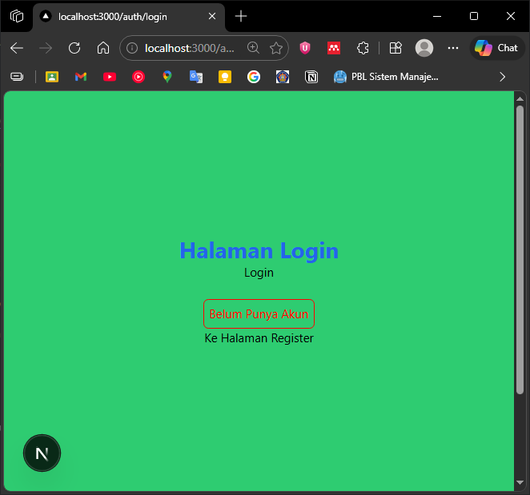 

**Jika ada kendala tampilan:**
- Uninstall Tailwind: `npm uninstall tailwindcss postcss autoprefixer`
- Hapus file konfigurasi:
    - `tailwind.config.js`
    - `postcss.config.js` 
disini saya kembalikan ke sebelum memakai tailwind  
 

### 2. Membuat Custom Document
- Masuk ke folder `pages/_document.js`
- Modifikasi dengan kode yang sesuai
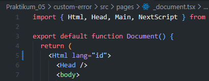  
- Periksa di Inspect Element bahwa atribut `lang="id"` sudah berubah  
  

### 3. Pengaturan Title per Halaman
1. Buka `pages/index.js`
2. Tambahkan title halaman  
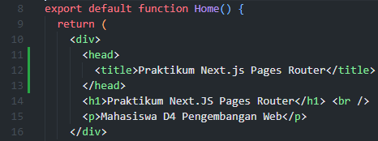 
3. Refresh dan perhatikan judul tab browser  
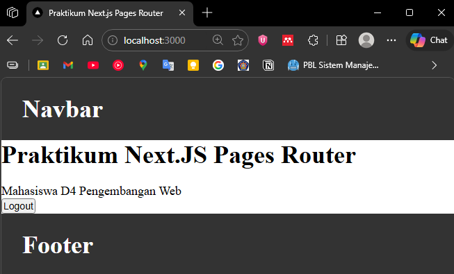 

### 4. Membuat Custom Error Page (404)
- Buat file `pages/404.tsx` 
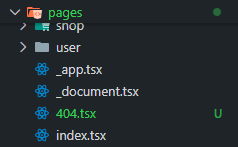 
isinya:  
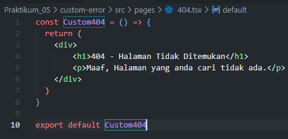  
- Akses URL yang tidak ada, misalnya: `/dashboard` 
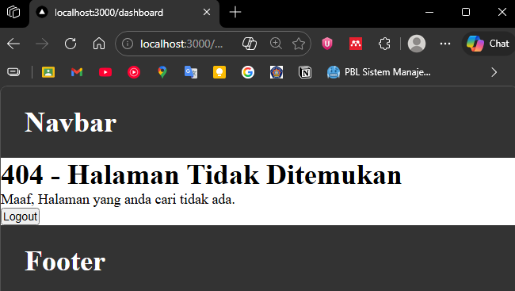  

### 5. Styling Halaman 404
1. Buat file `styles/404.module.scss` 
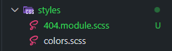 
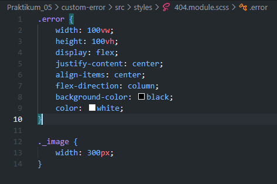 
2. Modifikasi `pages/404.tsx` dengan style yang dibuat 
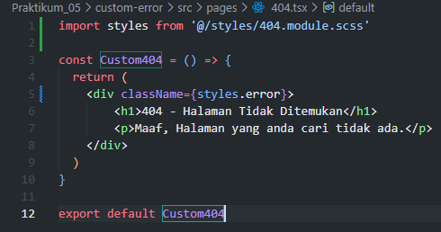 
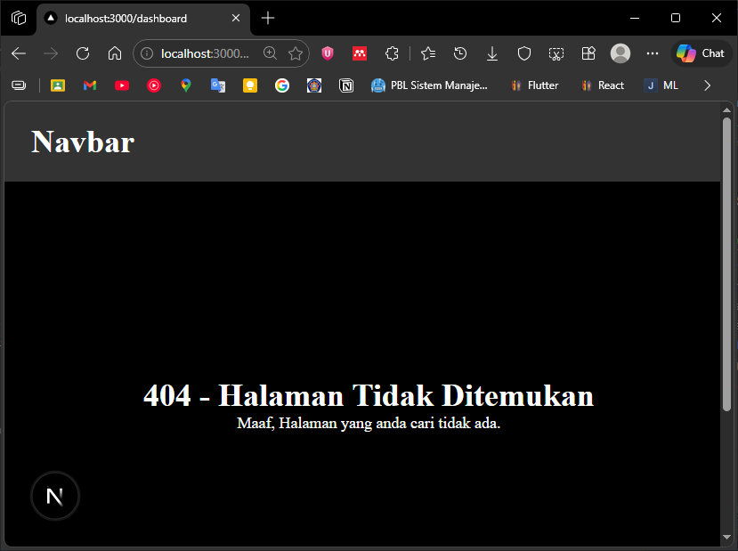 
3. Untuk menghilangkan navbar, tambahkan `/404` pada daftar disable navbar 
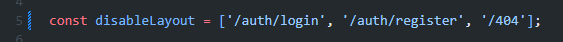 
hasil:  
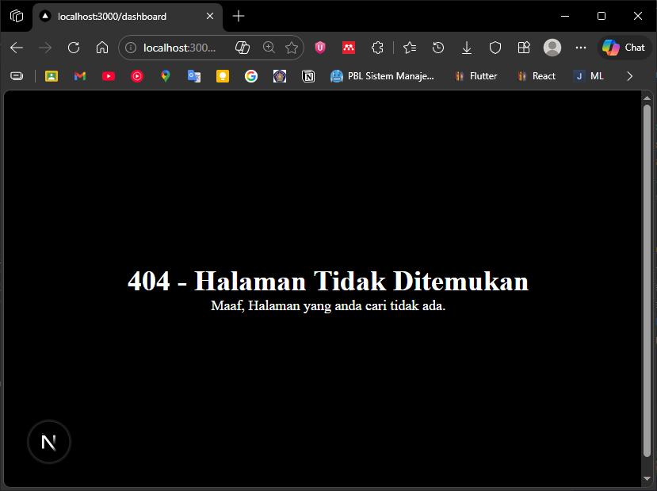 

### 6. Menampilkan Gambar dari Folder Public
1. Download gambar 404 dari https://undraw.co/ 
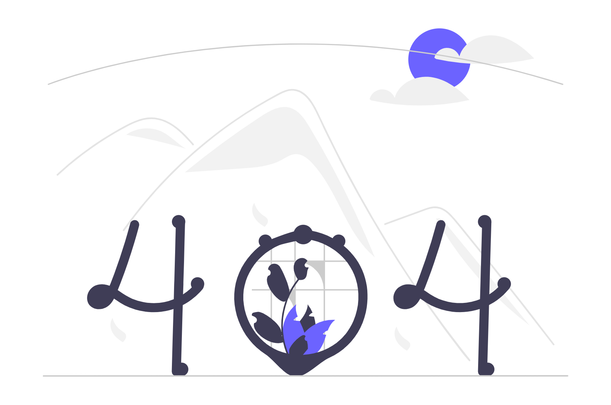 
2. Simpan sebagai `public/page-not-found.png` 
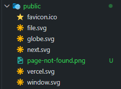 
3. Modifikasi `404.tsx`: `` 
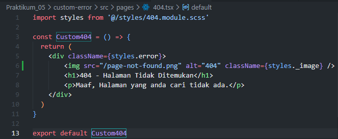 
hasil:  
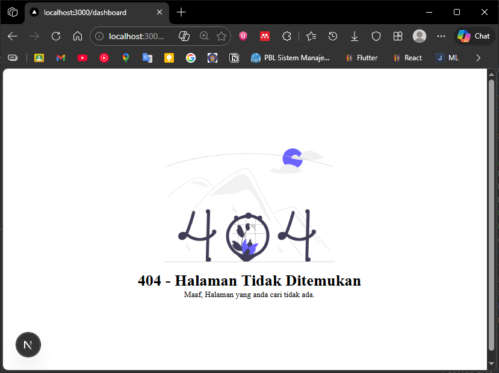 

### E. Tugas Praktikum

**Tugas 1 (Wajib)**
- Tambahkan judul halaman, deskripsi, dan gambar ilustrasi  
- Judul Halaman:  
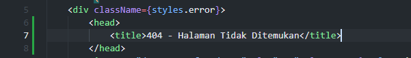 
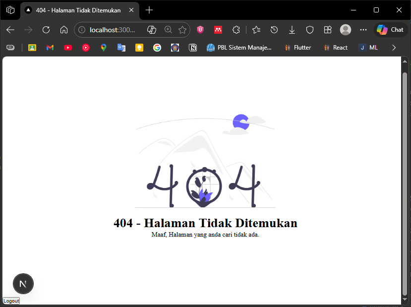 
    >  untuk deskripsi dan gambar ilustrasi sudah ditambahkan pada langkah ke 4-6

**Tugas 2 (Wajib)**
- Custom warna, font, dan layout halaman 404  
`404.module.scss` disini saya menambahkan warna dan font family 
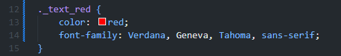 
`404.tsx` penerapan styles 
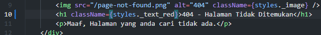 
Hasil: 
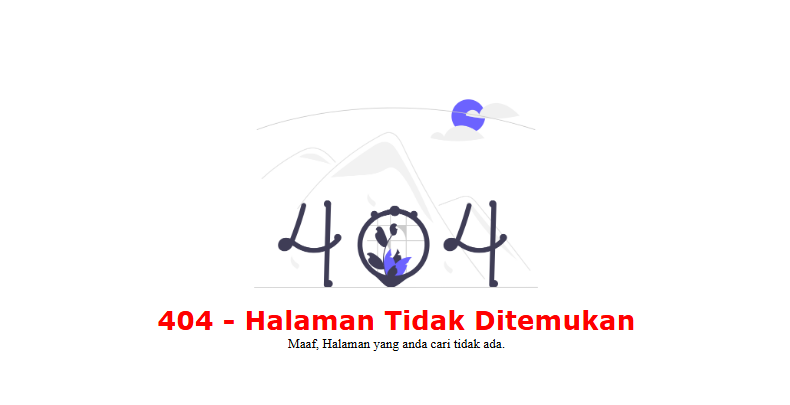 
- Navbar tidak tampil di halaman 404 
    > sudah diterapkan pada praktikum langkah 5 poin ke 3

**Tugas 3 (Pengayaan)**
- Tambahkan tombol "Kembali ke Home" dengan Next.js Link 
`404.module.scss` disini saya menambahkan style button untuk Linknya nanti 
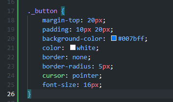 
`404.tsx` tambahkan Link yang mengarah ke "/" 
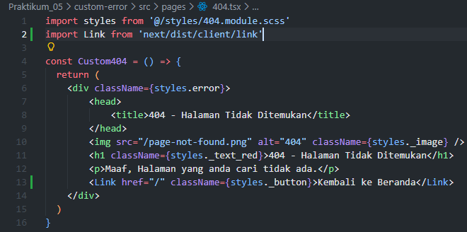 
hasil 
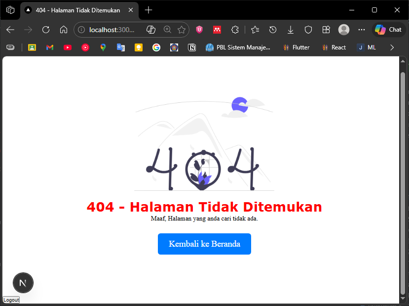 

### F. Pertanyaan Evaluasi
1. Apa fungsi utama `_document.js`?
    > Mengatur struktur HTML dasar (tag `<html>`, `<head>`, `<body>`) yang berlaku untuk semua halaman di aplikasi Next.js.

2. Mengapa `<title>` tidak disarankan di `_document.js`?
    > Karena `<title>` harus unik untuk setiap halaman. Jika di-set di `_document.js`, semua halaman akan memiliki judul yang sama. 
    
3. Apa perbedaan halaman biasa dan halaman `404.js`?
    > Halaman biasa ditampilkan ketika user mengakses route yang valid. Halaman `404.js` adalah halaman khusus yang otomatis ditampilkan Next.js ketika user mengakses route yang tidak ada.

4. Mengapa folder public tidak perlu di-import?
    > Folder `public` di Next.js secara otomatis di-serve sebagai folder statis. File di dalamnya dapat diakses langsung melalui URL root (misal: `/page-not-found.png`), tanpa perlu import atau konfigurasi tambahan.

