## Praktikum 06 - API Routes

### Langkah 1 – Menjalankan Project
- `npm run dev`
- Akses: http://localhost:3000<br>
<br>

### Langkah 2 – Membuat API Produk
1. Buat file `pages/api/produk.ts`<br>
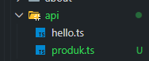<br>
2. Tambahkan data statis<br>
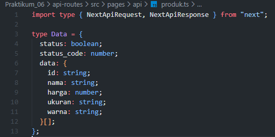<br>
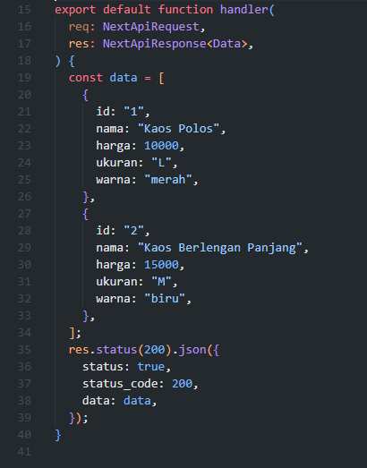<br>
3. Akses: http://localhost:3000/api/produk<br>
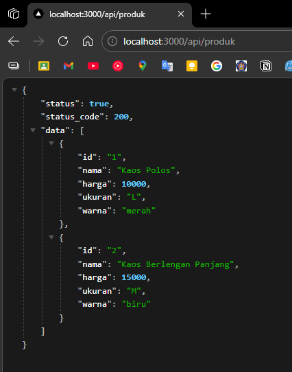<br>

### Langkah 3 – Fetch Data API di Frontend
1. Buka `views/produk/MainSection.tsx`<br>
    - Modifikasi kode<br>
    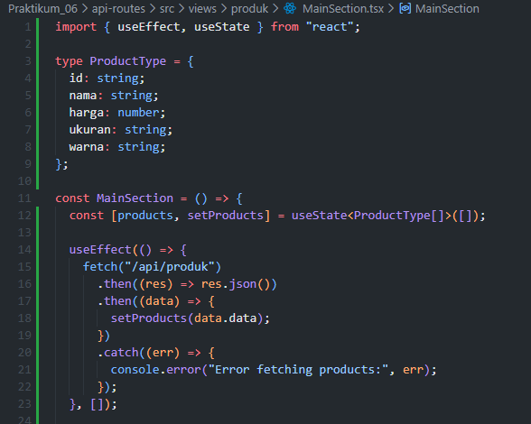<br>
    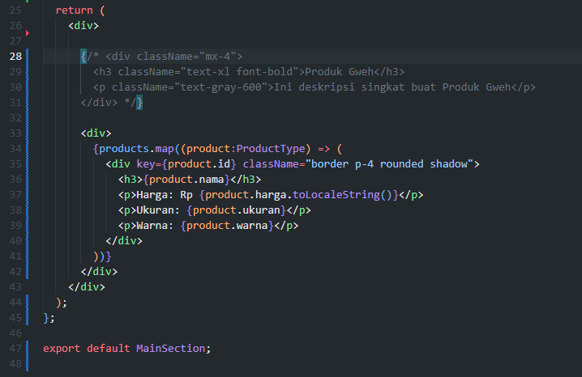<br>
2. Jalankan browser: http://localhost:3000/produk<br>
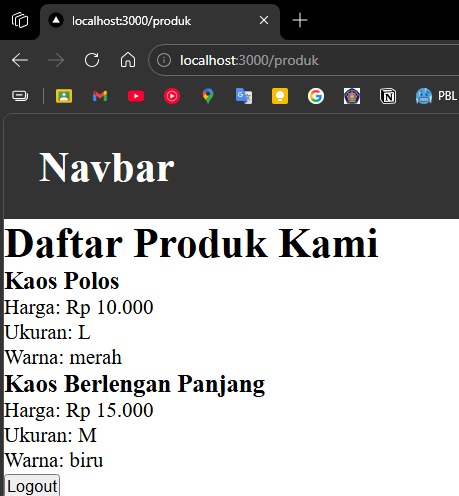<br>

## Integrasi Firebase

### Langkah 5 – Setup Firebase
1. Buka Firebase Console (login dengan Google)<br>
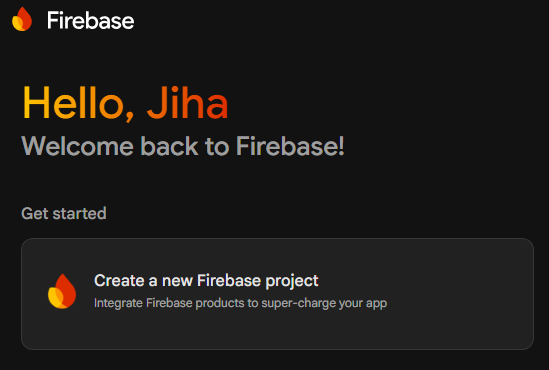<br>
    - **Note:** Jangan lupa select parent resource<br>
    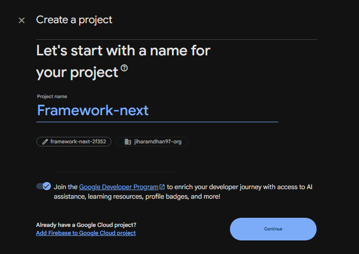<br>
    - **Note:** Klik create project dan disable Google Analytics<br>
    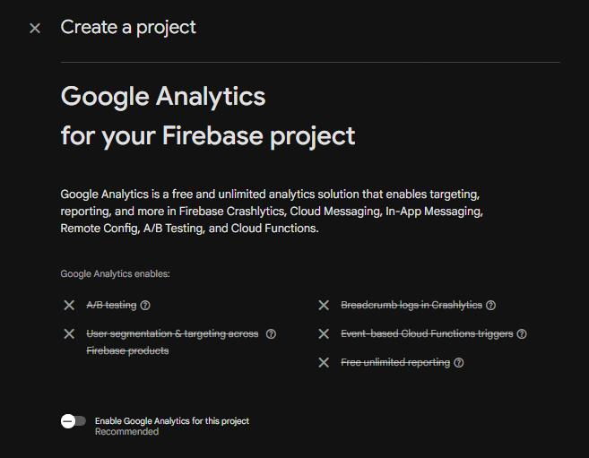<br>
    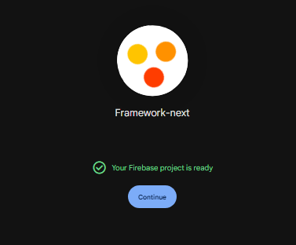<br>
    - **Note:** Klik add app dan pilih web<br>
    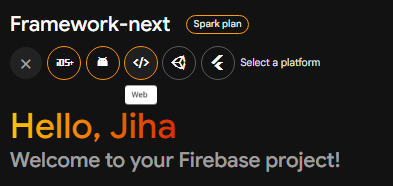<br>
    - **Note:** Klik register app<br>
    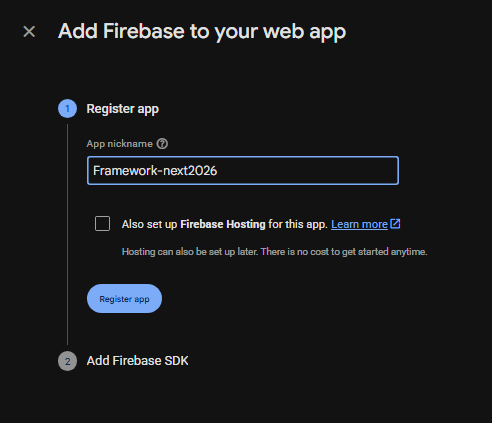<br>
    - **Note:** Klik continue to console<br>
    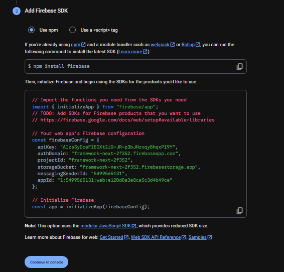<br>

2. Aktifkan Firestore Database<br>
    - Klik create database<br>
    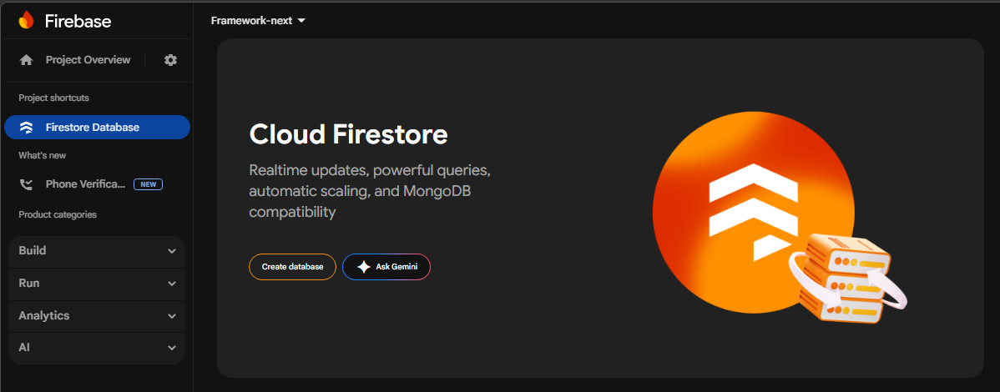<br>
    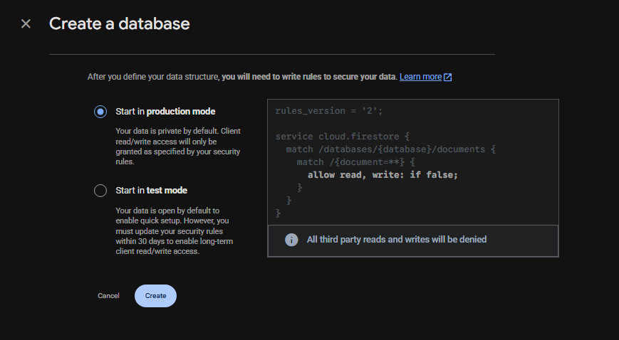<br>
    - Ubah rules menjadi `true` dan klik publish<br>
    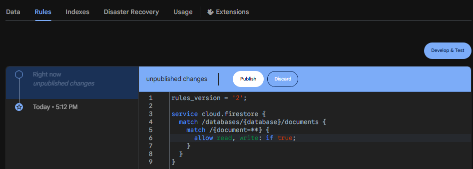<br>

3. Buat collection: `produk`
    - Gunakan auto-id<br>
    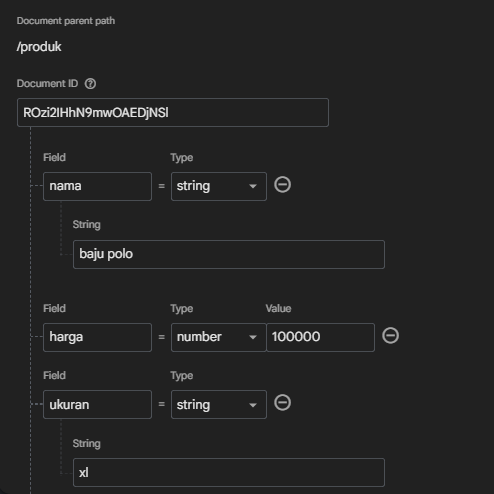<br>

### Langkah 6 – Install Firebase
1. `npm install firebase`<br>
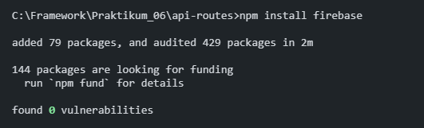<br>
2. Buat folder dan file: `pages/utils/db/firebase.ts`<br>
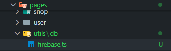<br>
3. Copy paste konfigurasi ke file `firebase.ts`<br>
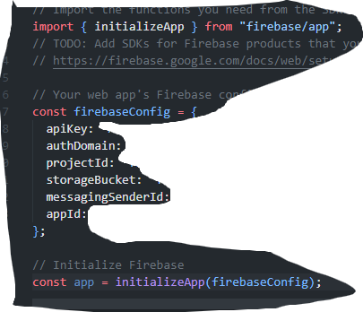<br>

### Langkah 7 – Konfigurasi Environment Variable
1. Buat file: `.env.local`<br>
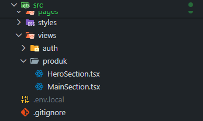<br>
2. Modifikasi file `.env`:
    ```
    FIREBASE_API_KEY=xxxx
    FIREBASE_AUTH_DOMAIN=xxxx
    FIREBASE_PROJECT_ID=xxxx
    FIREBASE_STORAGE_BUCKET=xxxx
    FIREBASE_MESSAGING_SENDER_ID=xxxx
    FIREBASE_APP_ID=xxxx
    ```
    <br>
    
    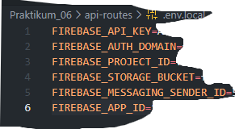<br>

### Langkah 8 – Konfigurasi Firebase
- Modifikasi `firebase.ts`<br>
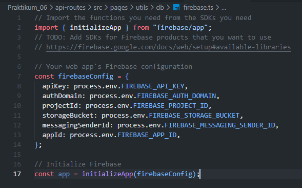<br>

### Langkah 9 – Ambil Data dari Firestore
1. Buat file: `utils/db/servicefirebase.js`<br>
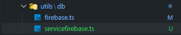<br>
2. Modifikasi file `servicefirebase.js`<br>
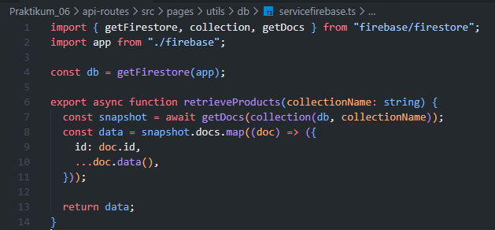<br>

### Langkah 10 – API Mengambil Data Firebase
1. Edit `pages/api/product.ts`<br>
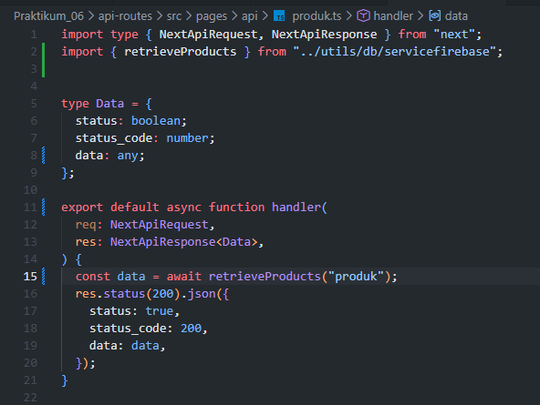<br>
2. Jalankan browser: http://localhost:3000/api/produk<br>
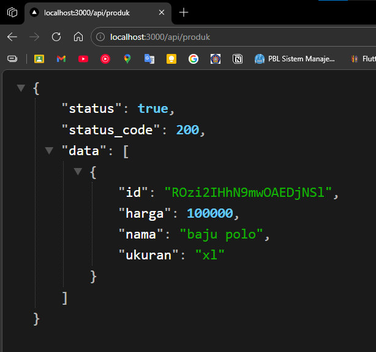<br>
3. Modifikasi `MainSection.tsx` pada `views/produk` sesuaikan nama type dan database<br>
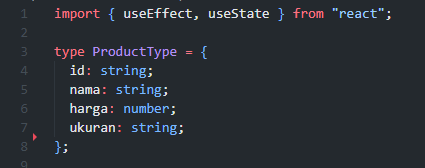<br>
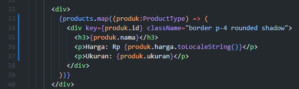<br>
hasil<br>
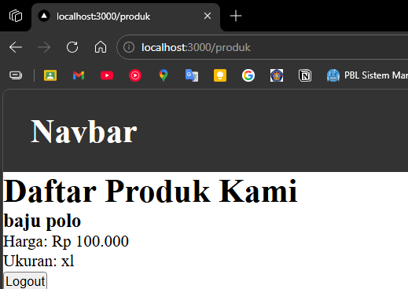<br>

## E. Tugas Praktikum

### Tugas 1 (Wajib)
- Tambahkan minimal 3 data produk di Firestore<br>
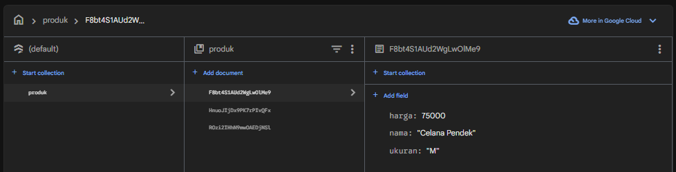<br>
- Pastikan data tampil di halaman produk<br>
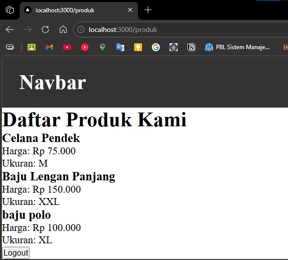<br>

### Tugas 2 (Wajib)
- Tambahkan field baru: `category`<br>
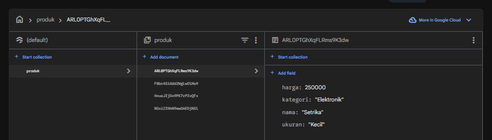<br>
- Tampilkan category di frontend<br>
- `MainSection.tsx` <br>
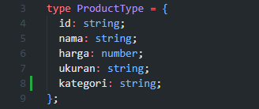 <br>
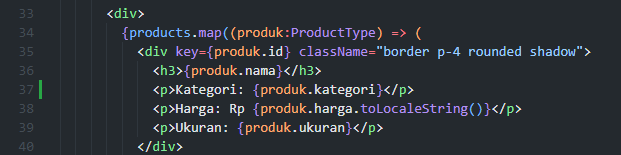 <br>
- hasil <br>
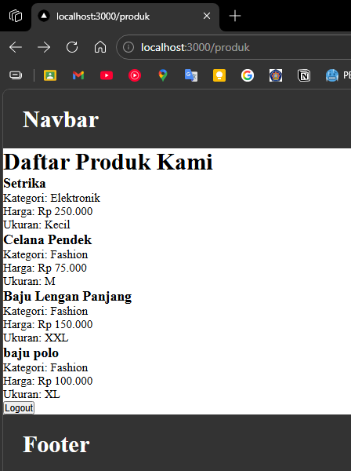<br>

### Tugas 3 (Pengayaan)
- Tambahkan tombol Refresh Data<br>
- Gunakan fetch ulang tanpa reload halaman<br>
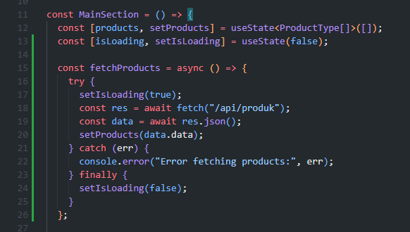<br>
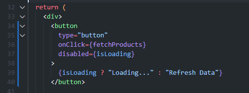<br>
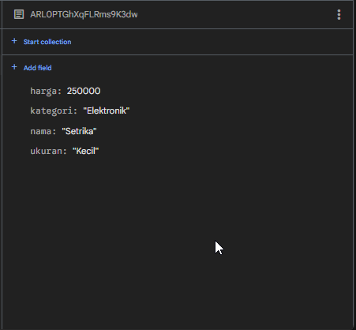<br>
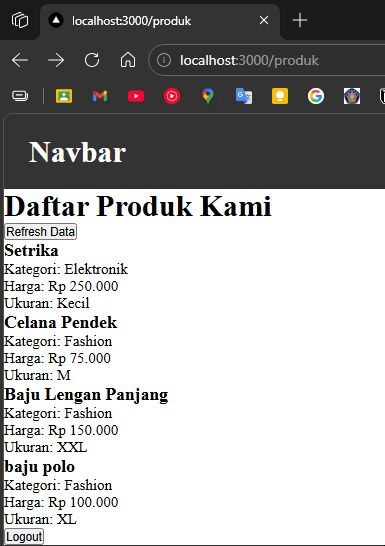<br>

## F. Pertanyaan Evaluasi
1. Apa fungsi API Routes pada Next.js?
    > API Routes memungkinkan pembuat aplikasi membuat endpoint backend langsung di folder `pages/api/`, sehingga bisa menangani request HTTP tanpa perlu server terpisah.

2. Mengapa `.env.local` tidak boleh di-push ke repository?
    > Karena file `.env.local` berisi kunci rahasia (API key, kredensial database) yang tidak boleh dibagikan publik untuk mencegah akses tidak sah ke layanan.

3. Apa perbedaan data statis dan data dinamis?
    > Data statis tidak berubah dan disimpan langsung dalam kode, sedangkan data dinamis bersumber dari database dan bisa berubah sesuai kebutuhan.

4. Mengapa Next.js disebut framework fullstack?
    > Karena Next.js dapat menangani frontend (tampilan website) dan backend (API) dalam satu project, sehingga developer bisa membuat aplikasi lengkap tanpa tools terpisah.

