## Praktikum 07 - Client-Side Rendering

- **Nama**: Jiha Ramdhan
- **NIM**: 2341720043
- **Kelas**: TI-3D

## Daftar Isi
1. [Langkah 1: Setup Data Produk](#langkah-1-setup-data-produk)
2. [Langkah 2: Implementasi CSR dengan useEffect](#langkah-2-implementasi-csr-dengan-useeffect)
3. [Langkah 3: Implementasi Skeleton Loading](#langkah-3-implementasi-skeleton-loading)
4. [Langkah 5: Implementasi SWR](#langkah-5-implementasi-swr)
5. [Hasil & Perbandingan](#hasil--perbandingan)
6. [Tugas Praktikum](#tugas-praktikum)

### Langkah 1: Setup Data Produk
1. Siapkan project Next.js
2. Buat endpoint API `/api/produk`
3. Pastikan data memiliki struktur:
  - `id`
  - `nama`
  - `kategori`
  - `harga`
  - `image`
4. Jalankan: `http://localhost:3000/api/products` 
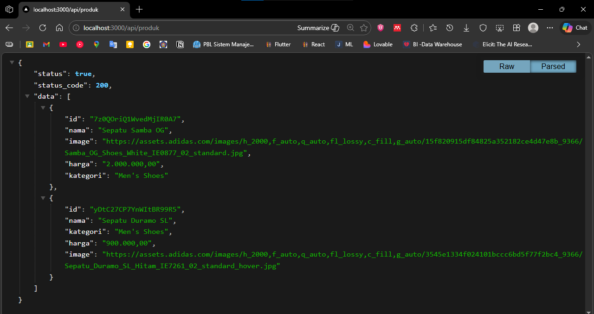 

### Langkah 2: Implementasi CSR dengan useEffect
1. Buat file `index.tsx` di folder `views/produk` 
 
2. Modifikasi `index.tsx` 
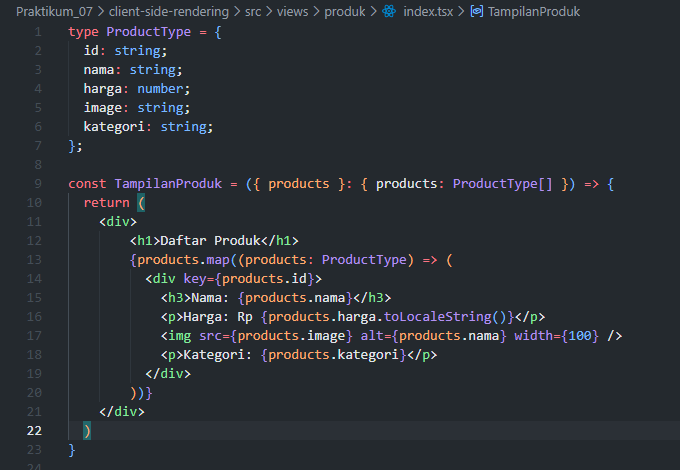 
3. Buka file `index.tsx` di `pages/produk/` 
 
4. Modifikasi `index.tsx` 
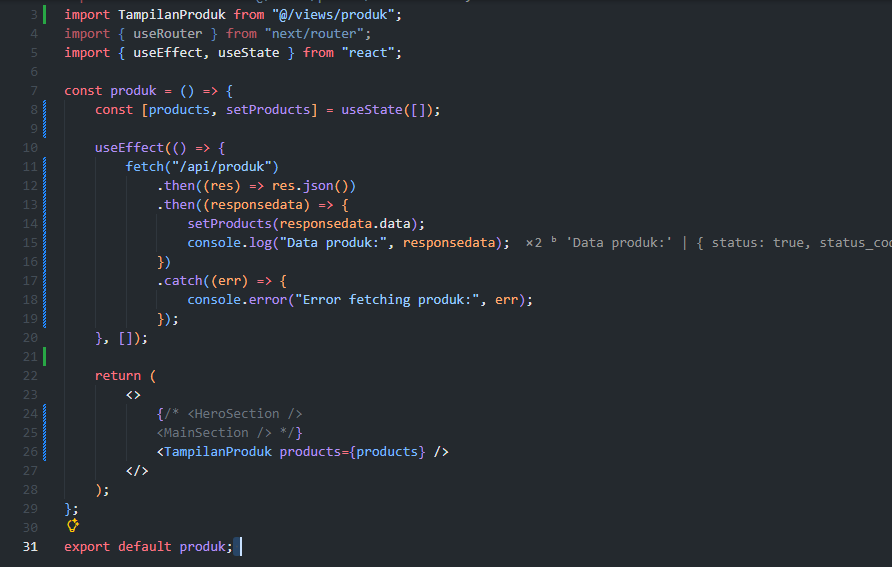 
5. Jalankan: `http://localhost:3000/produk` 
 
6. Buat file `produk.module.scss` di folder `produk` 
 
7. Modifikasi `produk.module.scss` 
 
 
8. Modifikasi `index.tsx` di `pages/views/produk` 
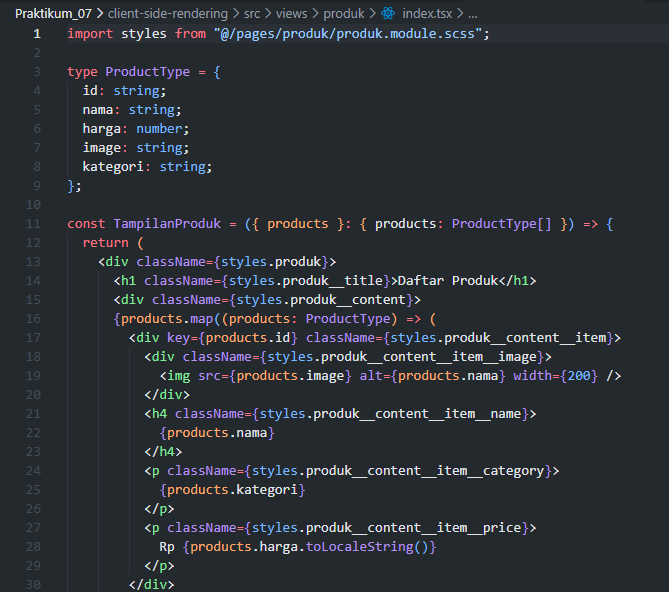 
9. Jalankan browser 
 

### Langkah 3: Implementasi Skeleton Loading
- Modifikasi `views/produk/index.tsx` 
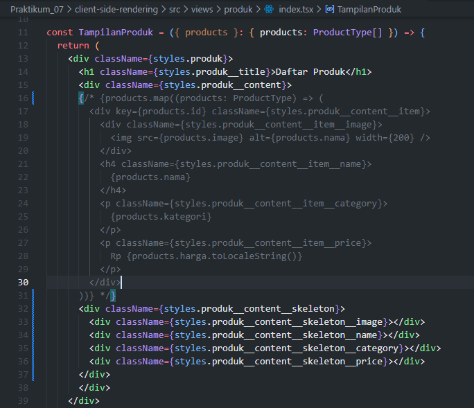 
- Modifikasi `product.module.scss` 
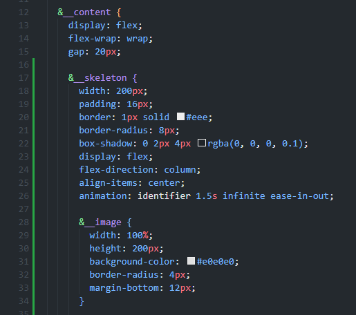 
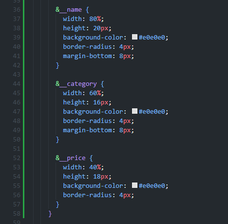 
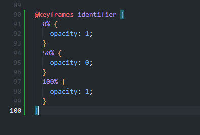 
- Jalankan browser untuk melihat skeleton dengan animasi blinking 
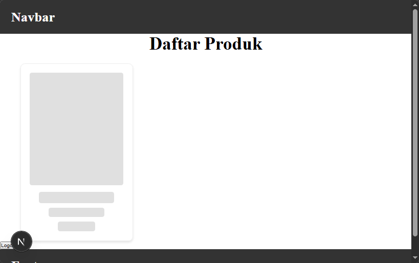 
- Modifikasi lagi `views/produk/index.tsx` 
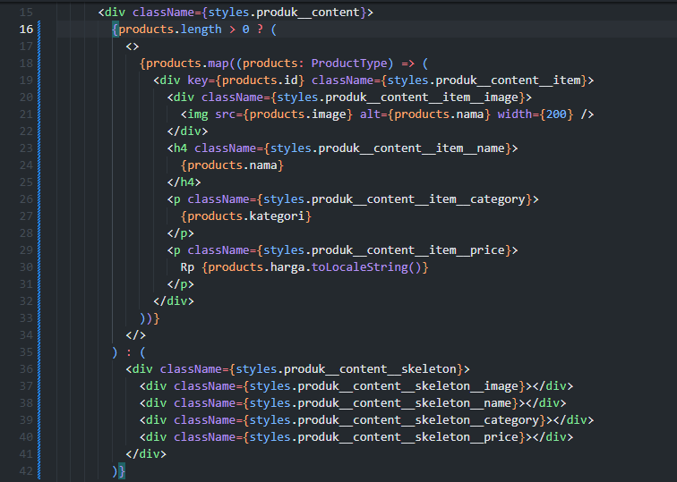 
- Skeleton akan ditampilkan terlebih dahulu, kemudian gambar dan data produk 
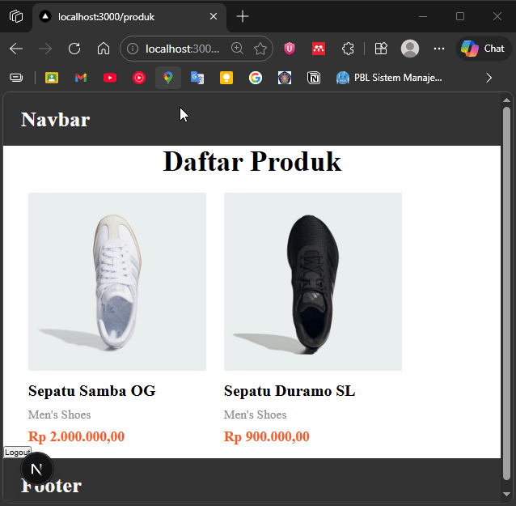 

### Langkah 5: Implementasi SWR
[SWR Documentation](https://swr.vercel.app/)

1. Install SWR: `npm install swr` 
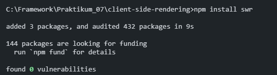 
2. Buat folder `utils/swr` dan file `fetcher.ts` 
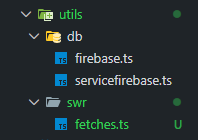 
3. Modifikasi `fetcher.ts` 
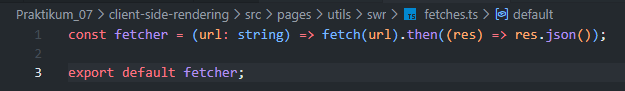 
4. Update `pages/produk/index.tsx` 
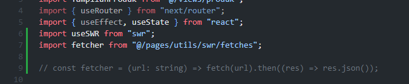 
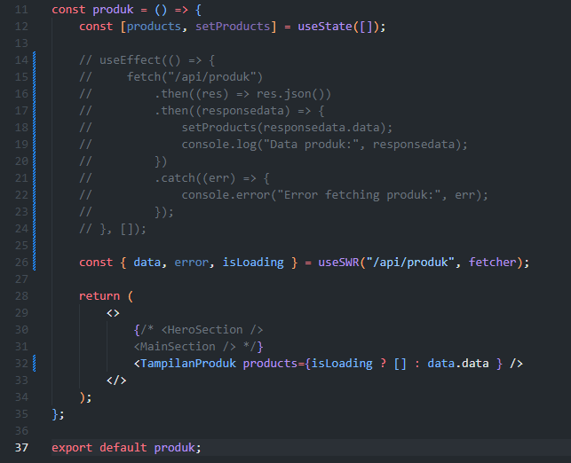 

### Hasil & Perbandingan
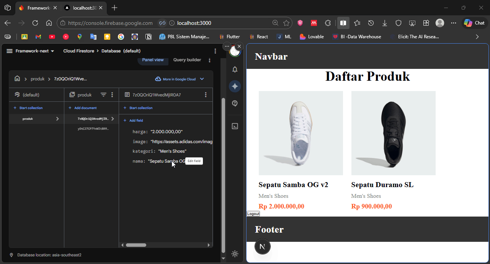 
> Disini ketika diupdate datanya dari firebase, maka dia langsung update pada saat buka tab `localhost:3000`, tanpa refresh.

| Aspek | useEffect Manual | SWR (State While Revalidate) |
|-------|-----------------|-----|
| Kode | Lebih panjang, state manual | Satu baris hook |
| Update Data | Hanya saat mount, perlu refresh manual | Otomatis revalidasi saat tab aktif/koneksi kembali |
| Cache | Tidak ada, fetch ulang setiap kali | Cache instant, fetch di background |
| Loading | Perlu handle manual | Otomatis ter-handle |

### Tugas Praktikum
1. Jelaskan perbedaan:
  - Client Side Rendering (CSR)
    > Rendering dilakukan di browser. Halaman dimuat kosong, kemudian JavaScript fetch data dan render konten. Lebih cepat untuk interaksi pengguna, tapi lebih lambat initial load.
  - Server Side Rendering (SSR)
    > Rendering dilakukan di server. HTML sudah berisi konten saat dikirim ke browser. Lebih SEO-friendly dan initial load lebih cepat, tapi server membeban lebih berat.
  - Static Site Generation (SSG)
    > Halaman di-generate saat build time menjadi file HTML statis. Tercepat untuk load dan serve, cocok untuk konten yang jarang berubah.

2. Buat halaman produk dengan skeleton loading dan animasi
   > sudah diterapkan pada langkah 3
 

3. Refactor dari useEffect menjadi SWR
   > sudah diterapkan pada langkah 5
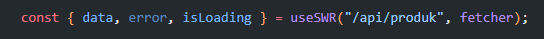 
 

