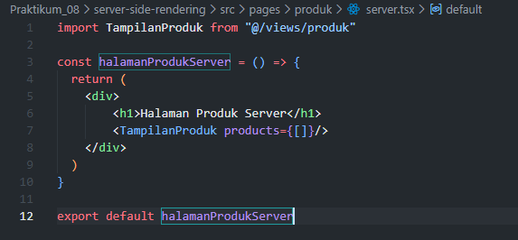
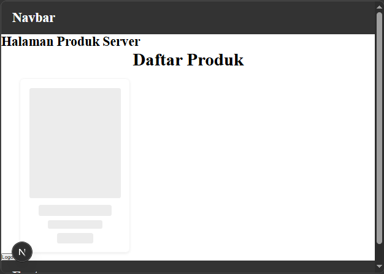
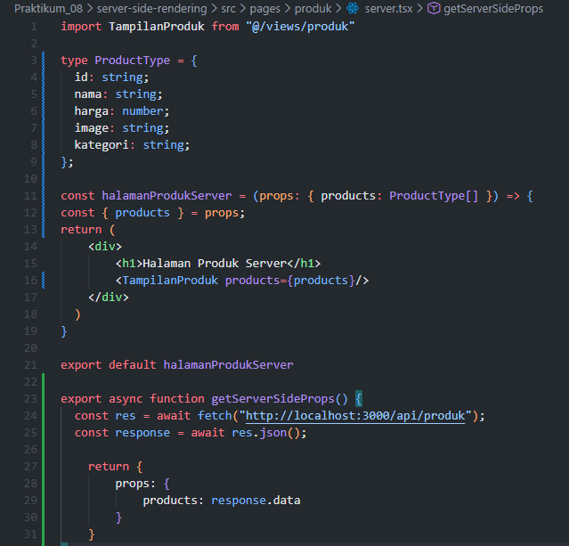
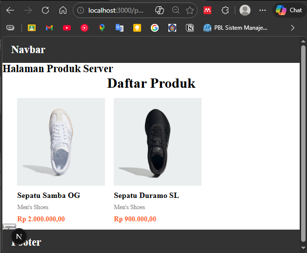
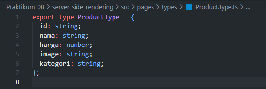
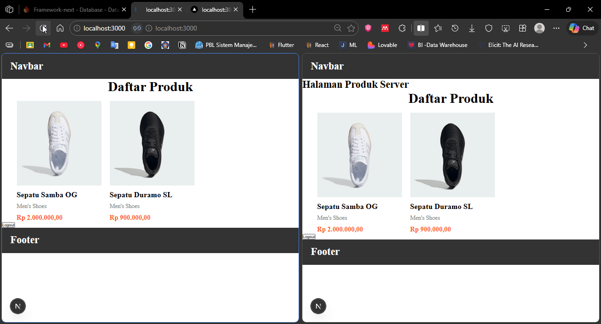
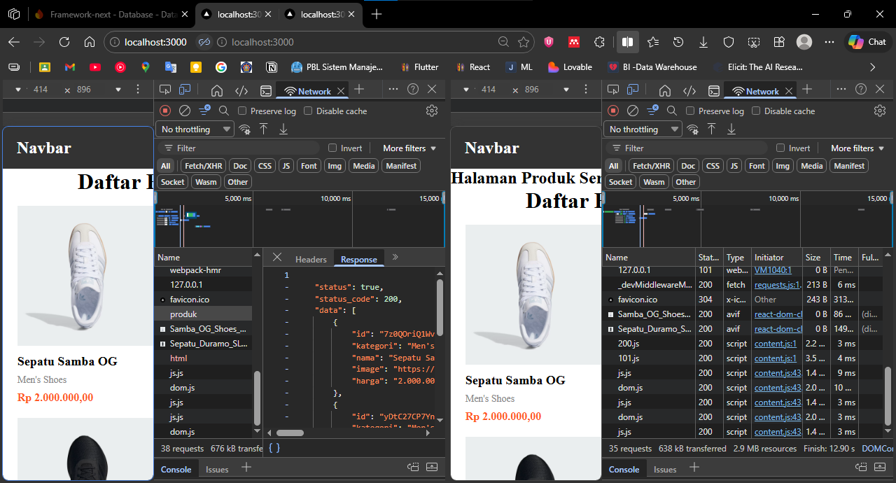

## Praktikum 08 - Server-Side Rendering

- **Nama:** Jiha Ramdhan
- **NIM:** 2341720043
- **Kelas:** TI-3D

## Daftar Isi
1. [Langkah 1 – Setup Halaman SSR](#langkah-1--setup-halaman-ssr)
2. [Langkah 2 – Implementasi getServerSideProps](#langkah-2--implementasi-getserversideprops)
3. [Langkah 3 – Refactor Type](#langkah-3--refactor-type)
4. [Langkah 4 – Uji Perbedaan SSR vs CSR](#langkah-4--uji-perbedaan-ssr-vs-csr)
5. [E. Studi Analisis](#e-studi-analisis)

### Langkah 1 – Setup Halaman SSR
1. Buat file baru pada `pages/products/server.tsx` 
 
2. Modifikasi file `server.tsx` 
 
3. Jalankan browser: `http://localhost:3000/produk/server` 
 

### Langkah 2 – Implementasi getServerSideProps
1. Tambahkan `getServerSideProps` pada `server.tsx` 
 
2. Jalankan browser: `http://localhost:3000/produk/server` 
 

**Catatan:**
- Skeleton tidak muncul dan data langsung tampil
- Harus menggunakan full URL
- Dipanggil setiap kali halaman di-request

### Langkah 3 – Refactor Type
1. Buat folder `types` pada folder `pages` dan file `Product.type.ts` 
 
2. Modifikasi `Product.type.ts` 
 
3. Update file `server.tsx` dengan tipe yang baru 
 

### Langkah 4 – Uji Perbedaan SSR vs CSR

**Uji 1 – Skeleton:**
- Halaman CSR: skeleton muncul saat refresh
- Halaman SSR: skeleton tidak muncul 

**Uji 2 – Network Tab:**
- CSR: request API terlihat di DevTools → Network → XHR
- SSR: request API tidak terlihat 

**Uji 3 – Response HTML:**
- CSR: HTML awal kosong (berisi skeleton)
- SSR: HTML sudah berisi data lengkap 

## E. Studi Analisis
1. Mengapa SSR lebih baik untuk SEO?
  > SSR mengirimkan HTML lengkap dengan data ke browser, sehingga search engine dapat langsung melihat dan mengindeks konten tanpa perlu menjalankan JavaScript. Halaman CSR hanya mengirim skeleton, sehingga search engine kesulitan membaca konten.

2. Kapan sebaiknya menggunakan SSR?
  > Gunakan SSR untuk halaman yang membutuhkan SEO (homepage, product pages), konten yang frequently indexing oleh search engine, atau ketika performa awal loading adalah prioritas utama.

3. Apa kekurangan SSR dibanding CSR?
  > SSR membutuhkan server untuk render setiap request, sehingga lebih beban server, lebih lambat response time, dan lebih kompleks dalam setup. Setiap user request memicu render baru di server.

4. Mengapa skeleton tidak muncul pada SSR?
  > Skeleton hanya muncul saat data sedang di-fetch di browser (CSR). Pada SSR, data sudah di-fetch di server sebelum HTML dikirim, sehingga halaman langsung menampilkan konten lengkap tanpa loading skeleton.

