## Praktikum 09 - Static Side Generation

**Nama:** Jiha Ramdhan  
**NIM:** 2341720043  
**Kelas:** TI-3D

## Daftar Isi
1. [Langkah 1 – Setup Halaman Static](#langkah-1--setup-halaman-static)
2. [Langkah 3 – Build Production Mode](#langkah-3--build-production-mode)
3. [Langkah 4 – Pengujian Perubahan Data](#langkah-4--pengujian-perubahan-data)
4. [Studi Analisis](#studi-analisis)

### Langkah 1 – Setup Halaman Static
1. Buat file baru pada `pages/products/static.tsx` 
 
2. Modifikasi file `static.tsx` 
 

**Catatan:**
- Mirip dengan SSR
- Perbedaan hanya pada nama method

> di Jobsheet tidak ada langkah 2

### Langkah 3 – Build Production Mode
1. Pindahkan folder `Views`, `utils`, dan `styles` ke luar folder `pages` 
  > Views, styles sudah ada di luar folder `pages`, jadi tinggal pindah `utils`, dan juga saya pindahkan folder `types` ke luar pages, karena sempat error.
   
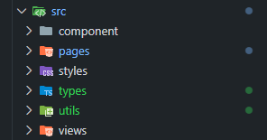 

2. Jalankan `npm run build` 
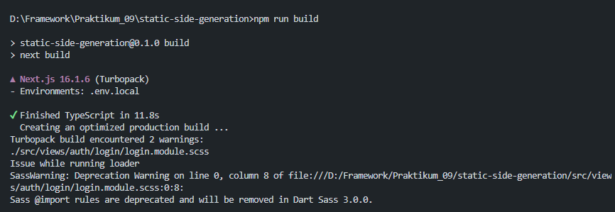 

3. Buka dua terminal:
  - **Terminal 1:** `npm run dev` 
  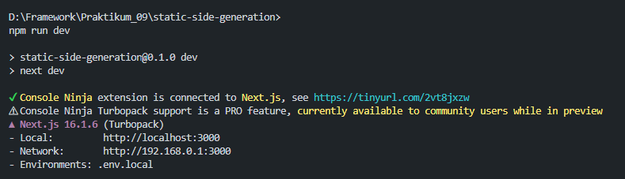 
  - **Terminal 2:** tunggu hingga build selesai 
   
4. Jalankan `npm run start` dan Verifikasi di `http://localhost:3000/produk/static` 
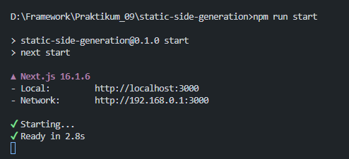 
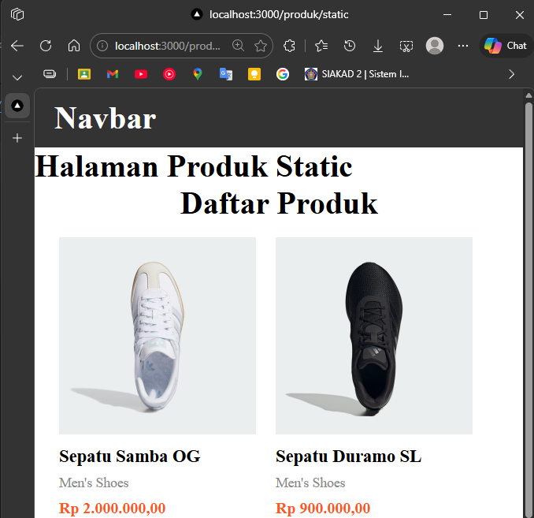 

**Jika Error:**
- Hapus folder `.next`: `Remove-Item -Recurse -Force .next`
- Jalankan: `npm run dev`

### Langkah 4 – Pengujian Perubahan Data

**Uji 1 – Tambah Data di Database:**
1. Buka database Firebase dan tambahkan produk baru
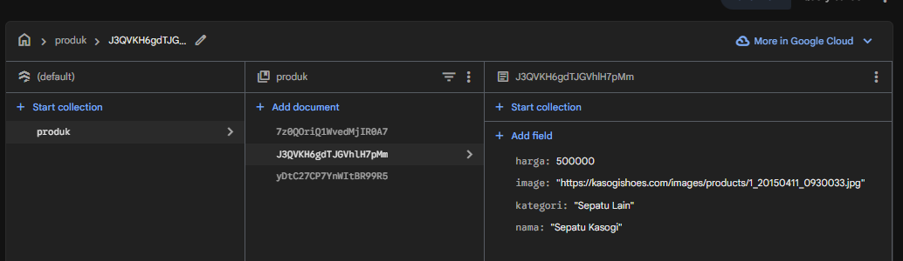 
2. Bandingkan hasil:
  - `/products` (CSR) → Data bertambah 
  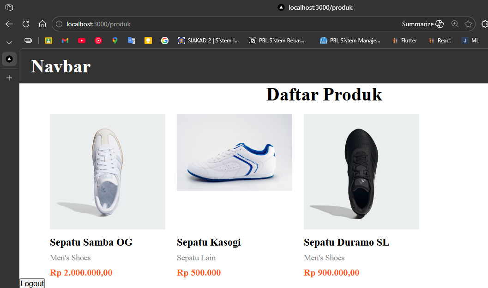 
  - `/products/server` (SSR) → Data bertambah 
  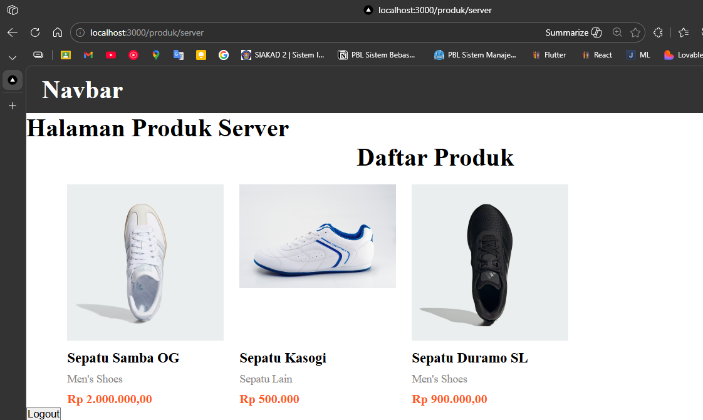 
  - `/products/static` (SSG) → Data tidak berubah 
  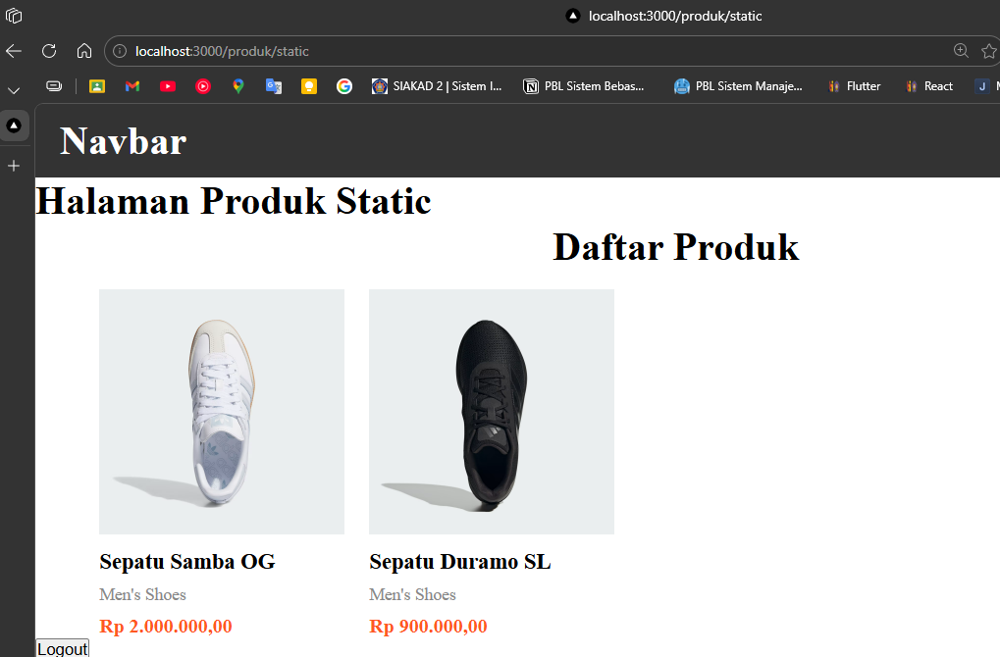 

**Uji 2 – Build Ulang:**
1. Jalankan `npm run build` dan `npm run dev` secara bersamaan 
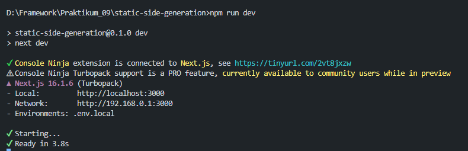 
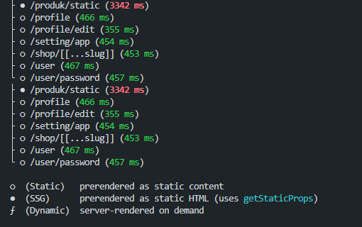 
2. Jalankan `npm run start` (hentikan `npm run dev` terlebih dahulu) 
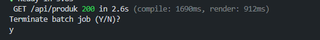 
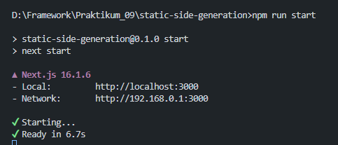 
3. Refresh halaman static → Data baru muncul 
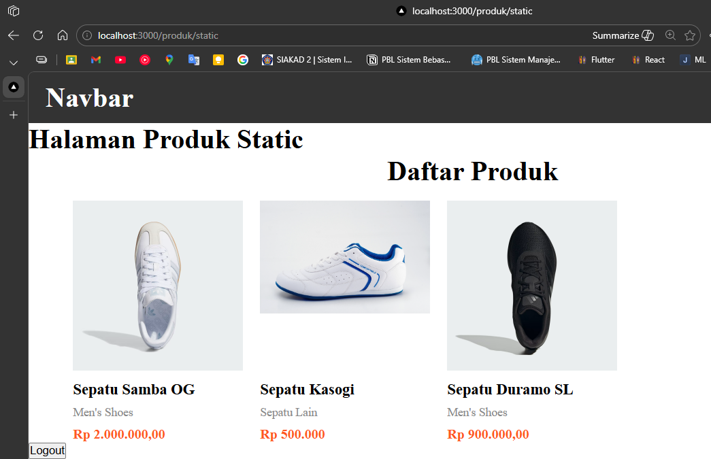 

### Studi Analisis
1. Mengapa SSG tidak menampilkan data terbaru?
  > SSG menghasilkan halaman saat build time, bukan saat runtime. Data hanya diperbarui jika melakukan build ulang.

2. Mengapa SSG lebih cepat?
  > Halaman sudah di-generate menjadi file HTML statis, tinggal dikirim ke browser tanpa proses server, sehingga lebih cepat.

3. Kapan SSG tidak cocok digunakan?
  > SSG tidak cocok untuk konten yang sering berubah, seperti real-time data, user-specific content, atau dashboard yang terupdate setiap saat.

4. Mengapa e-commerce tidak cocok menggunakan SSG murni?
  > E-commerce membutuhkan data produk, harga, dan stok yang selalu up-to-date. SSG tidak bisa menampilkan perubahan real-time tanpa build ulang.

5. Apa perbedaan build mode dan development mode?
  > Build mode menghasilkan file optimized untuk production. Development mode memungkinkan hot reload dan debugging, tapi lebih lambat.

