## Praktikum 12 - Middleware & Route Protection

- **Nama:** Jiha Ramdhan  
- **NIM:** 2341720043  
- **Kelas:** TI-3D  

## Daftar Isi
1. [Langkah 1 – Membuat Middleware](#langkah-1--membuat-middleware)  
2. [Langkah 2 – Struktur Dasar Middleware](#langkah-2--struktur-dasar-middleware)  
3. [Langkah 3 – Redirect Sederhana](#langkah-3--redirect-sederhana)  
4. [Langkah 4 – Batasi Route Tertentu](#langkah-4--batasi-route-tertentu)  
5. [Langkah 5 – Simulasi Sistem Login](#langkah-5--simulasi-sistem-login)  
6. [Langkah 6 – Pengujian](#langkah-6--pengujian)  
7. [Analisis Perbandingan](#analisis-perbandingan)  
8. [Pertanyaan Analisis](#pertanyaan-analisis)

### Langkah 1 – Membuat Middleware
- Modifikasi file `index.tsx` pada folder `src/pages/produk` 
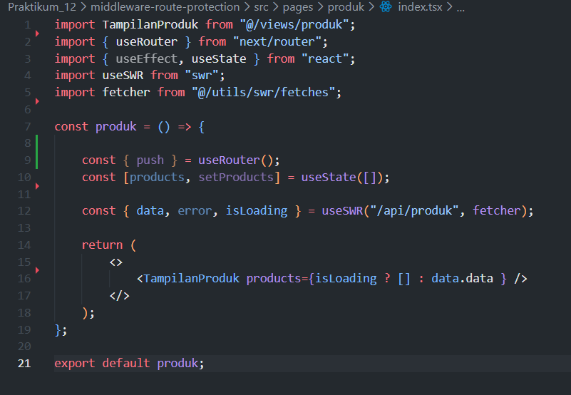 
- Buat file: `src/middleware.ts` sejajar dengan folder `pages` 
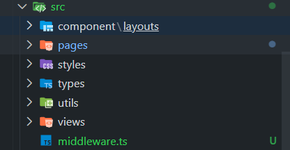 

### Langkah 2 – Struktur Dasar Middleware
- Jika menggunakan `NextResponse.next()` → tidak ada redirect 
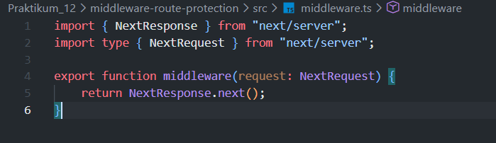 
- Masih bisa mengakses ke `http://localhost:3000/produk` 

### Langkah 3 – Redirect Sederhana
- Semua halaman akan redirect ke home 
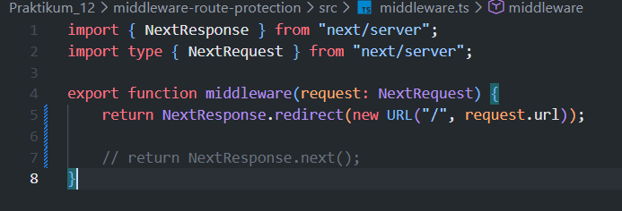 
- Error dikarenakan terus-menerus loading 
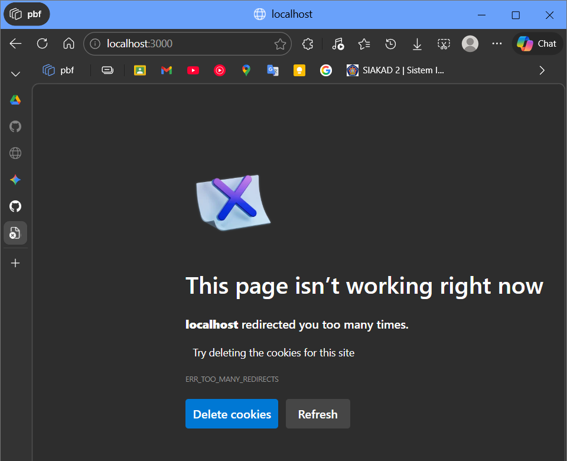 

### Langkah 4 – Batasi Route Tertentu
- Middleware hanya berlaku untuk `/produk` dan `/about` 
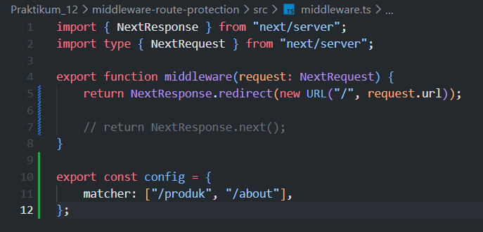 
- Halaman lain tetap normal 
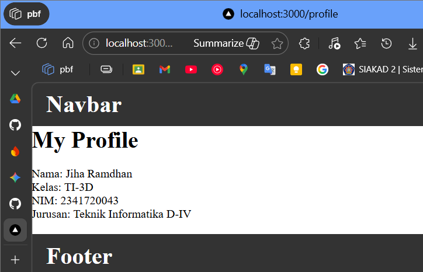 
- User yang mengakses produk dan about akan redirect ke home 
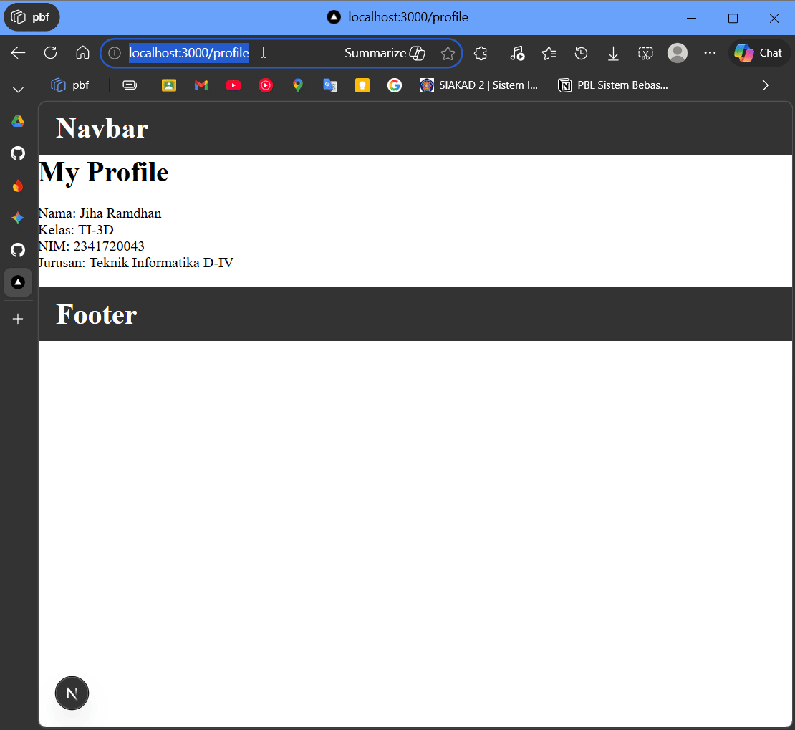 

### Langkah 5 – Simulasi Sistem Login
- Modifikasi file `middleware.ts` 
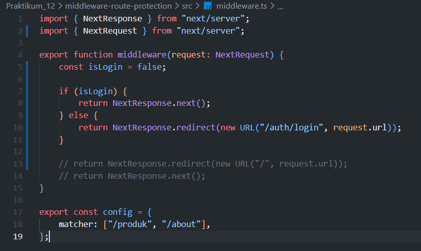 
- Jika user mengakses `http://localhost:3000/produk` tanpa login, akan diarahkan ke halaman login 
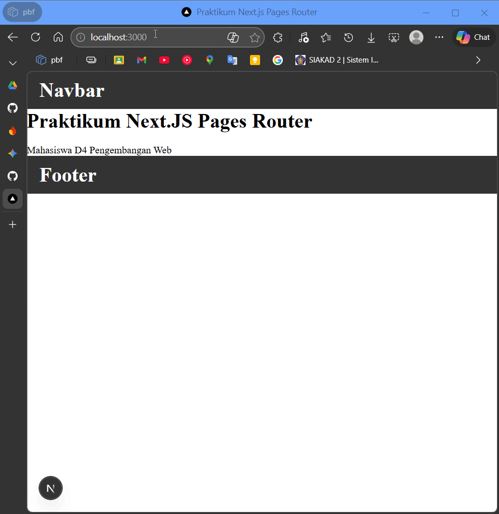 

### Langkah 6 – Pengujian
- **Uji 1:** `isLogin = false` → Akses `/produk` → Redirect ke `/login` 
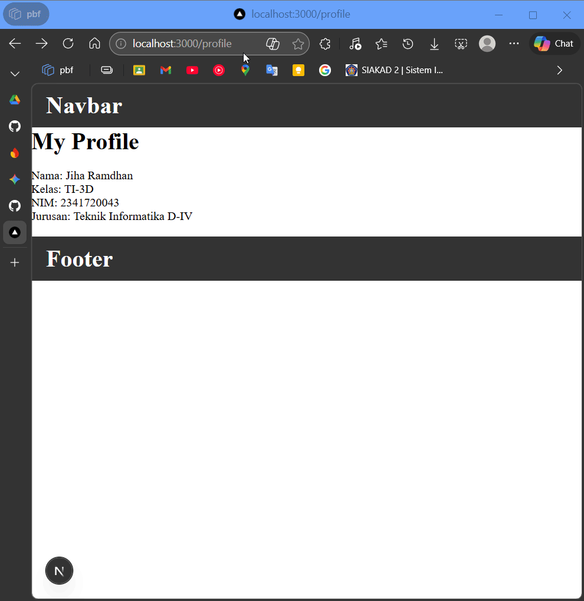 
- **Uji 2:** `isLogin = true` → Bisa mengakses `/produk` 
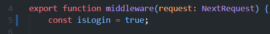 
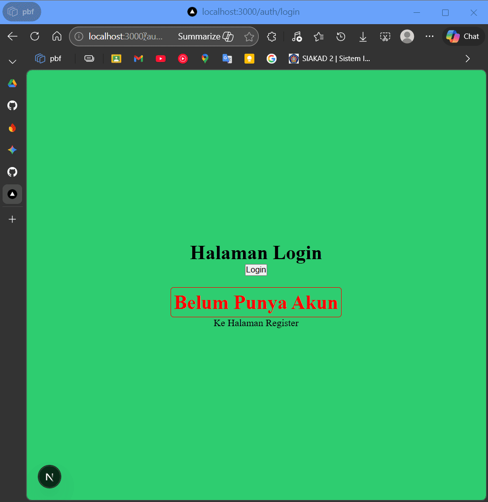 
- **Uji 3:** Tambahkan multiple route dengan matcher: `['/produk', '/about']` 
> sudah dilakukan di langkah 4 - 5, kondisi isLogin = false

 

### Analisis Perbandingan
| Aspek | useEffect | Middleware |
|-------|-----------|-----------|
| Timing | Setelah render | Sebelum render |
| Glitch | Ada | Tidak |
| Security | Lemah | Lebih aman |
| Skalabilitas | Per halaman | Sekali setup |

### Pertanyaan Analisis
1. Mengapa middleware lebih aman dibanding useEffect?
    > Middleware berjalan di server sebelum halaman dimuat, sehingga validasi tidak bisa dibypass di browser. useEffect berjalan di browser, data sensitif bisa dilihat di DevTools.

2. Mengapa middleware tidak menimbulkan glitch?
    > Middleware mengecek akses sebelum halaman render, sehingga user langsung diarahkan. useEffect menampilkan halaman dulu baru redirect, terlihat berkedip.

3. Apa risiko jika semua halaman diproteksi tanpa pengecualian?
    > User yang belum login tidak bisa akses halaman public (home, login), semua redirect ke login, aplikasi jadi tidak bisa digunakan.

4. Kapan middleware tidak diperlukan?
    > Untuk halaman publik seperti home, about, atau login yang boleh diakses siapa saja tanpa perlu validasi keamanan.

5. Apa perbedaan middleware dan API route?
    > Middleware mengecek setiap request ke halaman sebelum render. API route adalah endpoint untuk proses data, bisa dipanggil dari frontend atau external.

