## Praktikum 13 - Sistem Autentikasi & Proteksi Route

- **Nama**: Jiha Ramdhan  
- **NIM**: 2341720043  
- **Kelas**: TI-3D  

## Daftar Isi
1. [Langkah 1 – Install NextAuth](#langkah-1--install-nextauth)  
2. [Langkah 2 – Konfigurasi API Auth](#langkah-2--konfigurasi-api-auth)  
3. [Langkah 3 – Tambahkan Secret](#langkah-3--tambahkan-secret)  
4. [Langkah 4 – Tambahkan SessionProvider](#langkah-4--tambahkan-sessionprovider)  
5. [Langkah 5 – Tambahkan Tombol Login & Logout](#langkah-5--tambahkan-tombol-login--logout)  
6. [Langkah 6 – Menambahkan Data Tambahan (Full Name)](#langkah-6--menambahkan-data-tambahan-full-name)  
7. [Langkah 7 – Proteksi Halaman Profile](#langkah-7--proteksi-halaman-profile)  
8. [Pengujian](#pengujian)  
9. [Alur Login NextAuth](#alur-login-nextauth)  
10. [Pertanyaan Analisis](#pertanyaan-analisis)  

---

### Langkah 1 – Install NextAuth
1. Jalankan command: `npm install next-auth --force` 
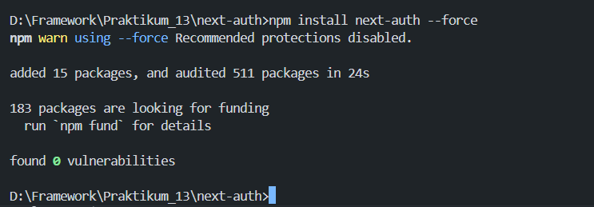 

### Langkah 2 – Konfigurasi API Auth
1. Buat file `pages/api/auth/[...nextauth].ts` 
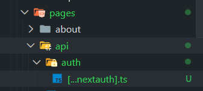 
2. Modifikasi file `[...nextauth].ts` dengan konfigurasi NextAuth 
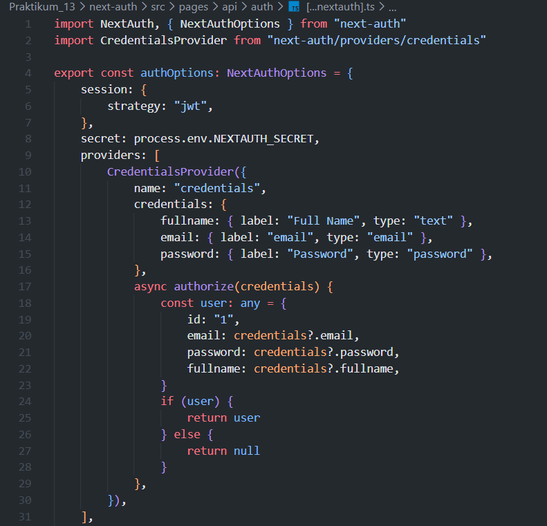 
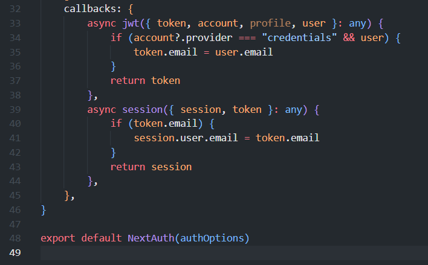 

### Langkah 3 – Tambahkan Secret
1. Buka file `.env.local`
2. Tambahkan pada line 12: `NEXTAUTH_SECRET=RANDOM_BASE64_STRING`
3. Generate RANDOM_BASE64_STRING menggunakan https://www.convertsimple.com/random-base64-generator/ 
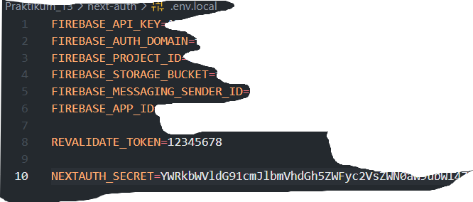 

### Langkah 4 – Tambahkan SessionProvider
1. Buka file `_app.tsx` 
2. Modifikasi dengan SessionProvider 
 

### Langkah 5 – Tambahkan Tombol Login & Logout
1. Buka `components/navbar/index.tsx` dan modifikasi line 10 dan 2 
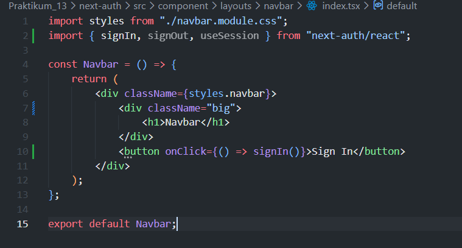 
2. Buka `navbar.module.css` dan tambahkan code pada line 9 
 
3. Jalankan `http://localhost:3000/` 
4. Klik Sign In, isikan credentials, dan klik Sign In 
5. Verifikasi session muncul setelah login 
 
6. Untuk dapat menangkap data pada session maka tambahkan code sebagai berikut : 
 
7. Uji coba sign in dan sign out 
 

### Langkah 6 – Menambahkan Data Tambahan (Full Name)
1. Buka `[...nextauth].ts` dan modifikasi callbacks 
 
2. Modifikasi `navbar.module.css` 
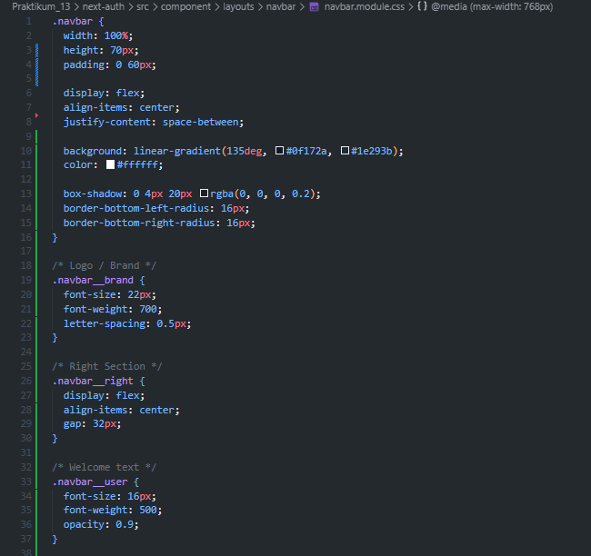 
 
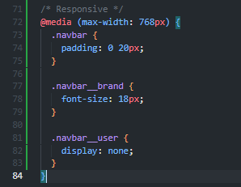 
3. Modifikasi `components/navbar/index.tsx` 
 
4. Jalankan browser dan lakukan Sign In 
 

### Langkah 7 – Proteksi Halaman Profile
1. Modifikasi `pages/profile/index.tsx` 
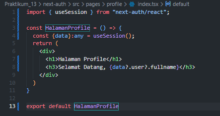 
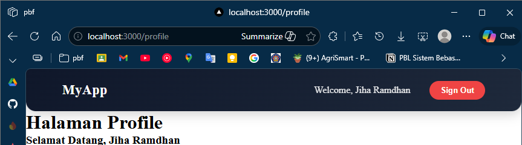 
2. Buat `src/middleware/withAuth.ts` dengan middleware authorization 
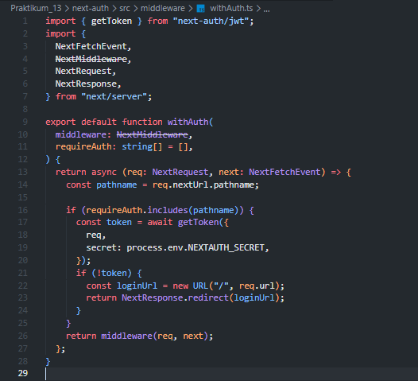 
3. Modifikasi `middleware.ts` 
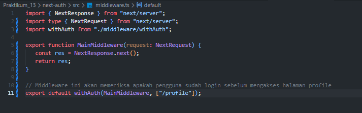 

### Pengujian
- **Uji 1**: Akses `/profile` tanpa login → Redirect ke home 
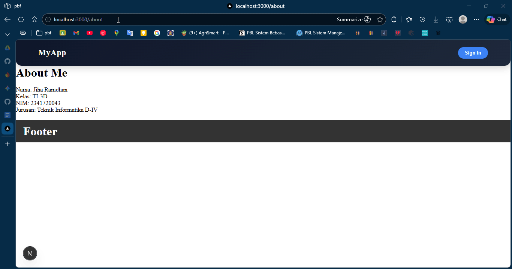 
- **Uji 2**: Login terlebih dahulu → Akses `/profile` → Berhasil masuk 
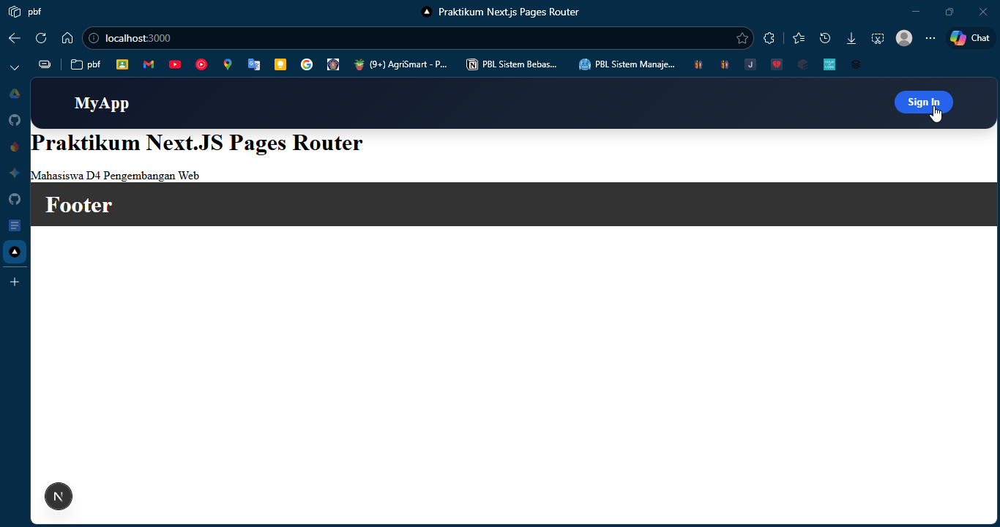 
- **Uji 3**: Logout → Akses `/profile` → Tidak bisa masuk 
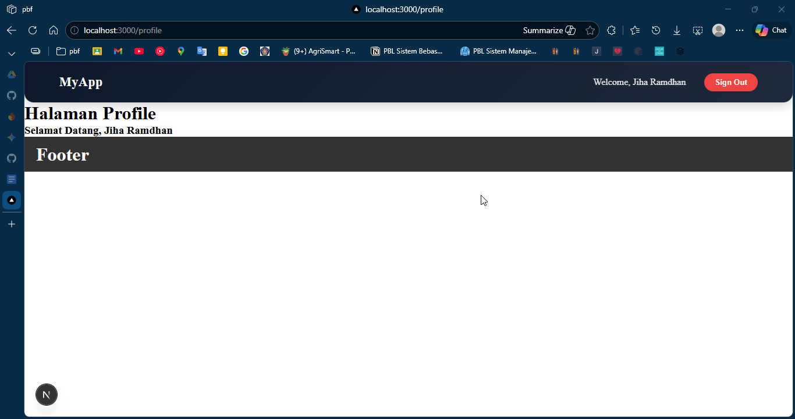 

### Alur Login NextAuth
> User klik Sign In -> NextAuth tampilkan form credentials -> Authorize() dijalankan -> JWT dibuat -> Session disimpan -> Frontend akses useSession()

### Pertanyaan Analisis

1. Mengapa session menggunakan JWT?
    > JWT stateless dan aman untuk menyimpan data session di client tanpa perlu database session di server, sehingga lebih scalable dan efisien.

2. Apa perbedaan authorize() dan callback jwt()?
    > authorize() memvalidasi username/password pengguna saat login, sedangkan callback jwt() memproses dan menambahkan data ke token JWT setelah autentikasi berhasil.

3. Mengapa middleware perlu getToken()?
    > getToken() digunakan middleware untuk membaca dan memverifikasi token JWT dari request, sehingga bisa menentukan apakah pengguna terautentikasi sebelum mengakses halaman yang dilindungi.

4. Apa risiko jika NEXTAUTH_SECRET tidak digunakan?
    > Token JWT tidak terenkripsi dan dapat dipalsukan oleh penyerang, sehingga data session tidak aman dan sistem autentikasi bisa dijebol.

5. Apa perbedaan autentikasi dan otorisasi dalam sistem ini?
    > Autentikasi adalah verifikasi identitas pengguna (username/password), sedangkan otorisasi adalah penentuan akses sumber daya (middleware proteksi `/profile` hanya untuk user terautentikasi).

