## Praktikum 14 - Implementasi Sistem Registrasi (Database Integration)

### Langkah 1 – Membuat Register View
- Buat folder pada views/auth dengan nama register dan tambahkan 2 file yaitu index.tsx dan register.module.scss 
 
- Buka file register.tsx pada folder auth/register.tsx dan Modifikasi file register.tsx (pada folder pages/auth/register.tsx) 
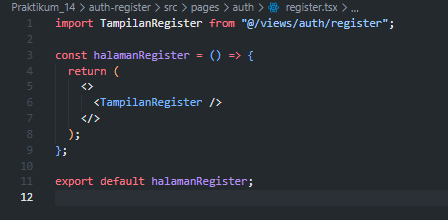 
- Modifikasi register.module.scss 
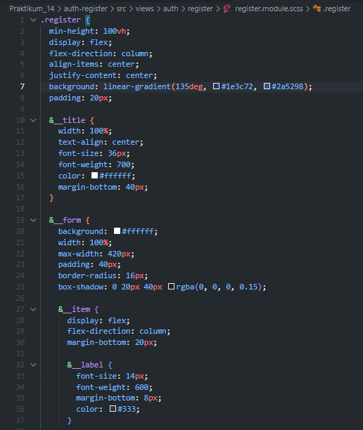 
 
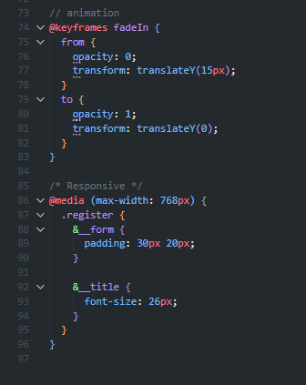 
- Tambahkan form inputan pada file index.tsx (pada folder views/auth/register/index.tsx) dengan field: 
    - Email 
    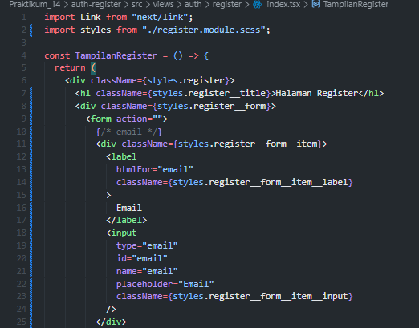 
    - Full Name 
    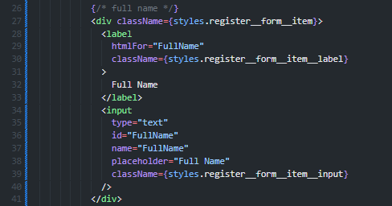 
    - Password 
     
    - Button Register 
    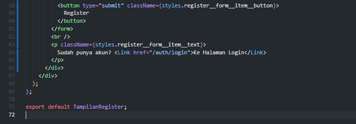 
- Jalankan browser di http://localhost:3000/auth/register 
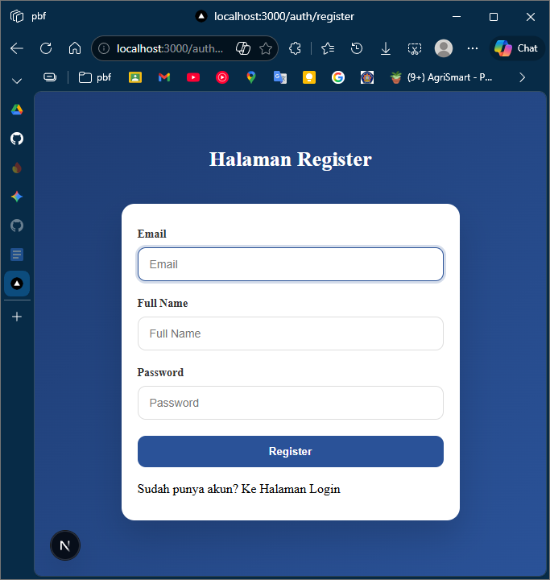 

### Langkah 2 – Membuat API Register
- Buka file servicefirebase.ts pada folder src/utils/db dan modifikasi 
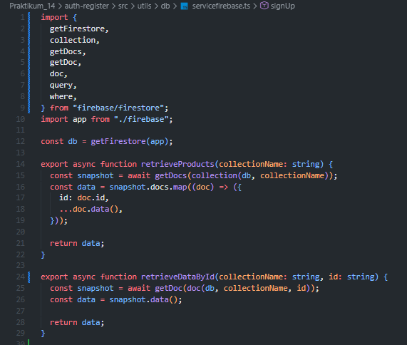 
> disini ada yang dibedakan dari jobsheet agar bisa saat klik register masuk ke menu login, soalnya kalo mengikuti jobsheet pasti tidak mengarah ke auth/login dan di error 400
 

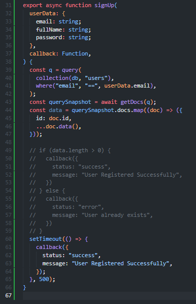 
- Buat file register.ts pada folder api 
 
- Modifikasi file register.ts 
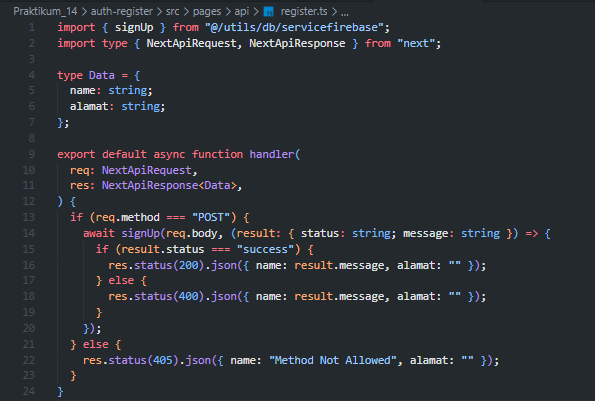 
- Modifikasi index.tsx pada folder register (tambahkan beberapa code) 
 
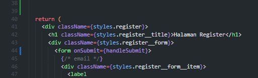 
- Buka browser http://localhost:3000/auth/register, isikan data dan klik register. Jika berhasil maka akan masuk ke menu login 
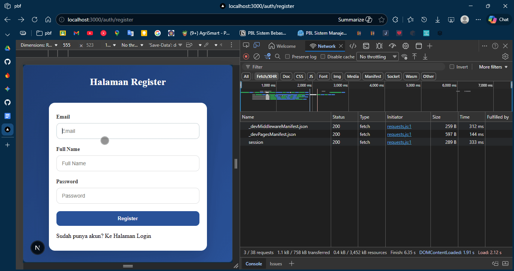 

### Langkah 3 – Install bcrypt
- npm install bcrypt --force 
 
- npm install --save-dev @types/bcrypt --force 
 
- Buka file servicefirebase.ts pada folder src/utils/db dan modifikasi 
 
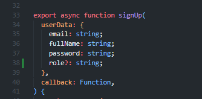 
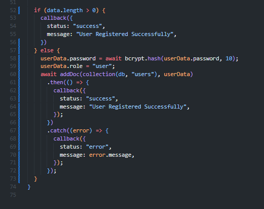 
- Jalankan browser http://localhost:3000/auth/register dan input data setelah itu klik register 
 
- Buka Firebase jika berhasil maka data register akan masuk 
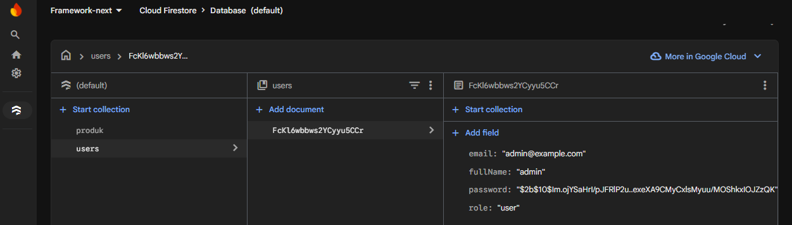 
- Tambahkan notifikasi error untuk email duplikat pada index.tsx 
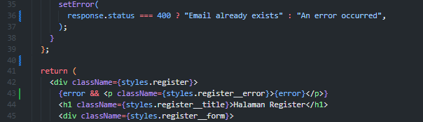 
- Tambahkan loading indicator saat klik register 
 
 
- Setelah ditambahkan 
 

### Langkah 4 – Pengujian

**Uji 1 – Register Baru**
- Input: Email baru
- Hasil: Data tersimpan di Firestore, password ter-hash, redirect ke login 
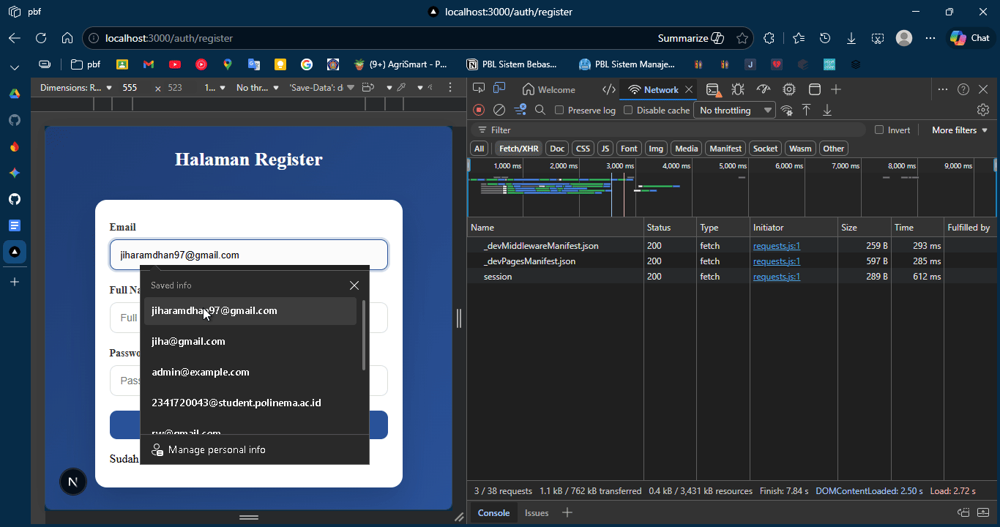 

**Uji 2 – Email Sudah Ada** 
- Input: Email yang sama 
- Hasil: Error 400 dengan message "Email already exists" 
 

**Uji 3 – Method GET** 
- Akses: /api/register 
- Hasil: 405 Method Not Allowed 
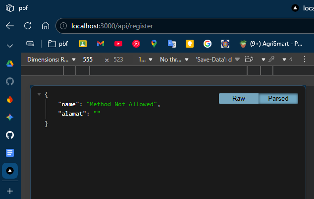 

### Tugas Praktikum
1. Implementasikan register terhubung database (Sudah Terhubung) 
2. Tambahkan validasi: Email wajib, Password minimal 6 karakter 
- modifikasi index.tsx 
 
- menambahkan field required dan minLength untuk password 
 
- hasil 
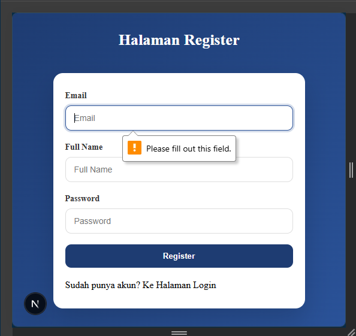 
 
3. Tambahkan role default "member" 
- modifikasi servicefirebase.ts 
 
4. Tampilkan pesan error di UI 
- bisa jika mematikan required dan minLength 
 
 
5. Screenshot hasil: Register sukses, Email sudah ada, Database Firestore 
- Register berhasil dan ada di firestore dengan role member 
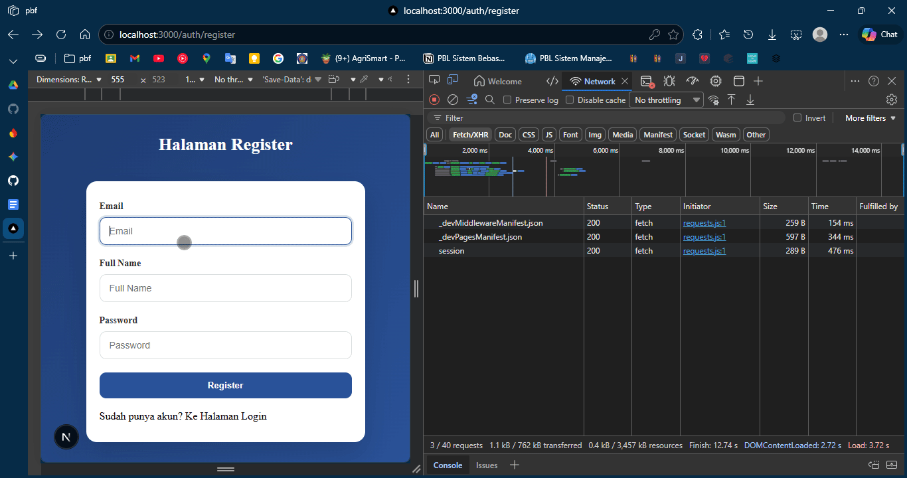 
- Register jika akun sudah ada 
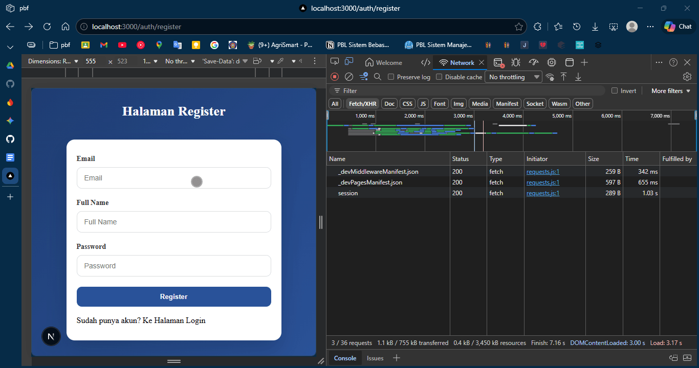 

### Pertanyaan Analisis

1. Mengapa password harus di-hash?
    > Password di-hash agar tidak tersimpan dalam bentuk teks biasa di database. Jika database diretas, hacker tidak dapat langsung menggunakan password tersebut karena sudah dienkripsi. Hash adalah proses satu arah, sehingga tidak bisa dikembalikan ke password asli.

2. Apa perbedaan addDoc dan setDoc?
    > `addDoc` membuat dokumen baru dengan ID otomatis yang di-generate oleh Firebase. `setDoc` membuat atau menimpa dokumen dengan ID spesifik yang kita tentukan sendiri. Gunakan `addDoc` ketika ID tidak penting, gunakan `setDoc` ketika ingin ID tertentu.

3. Mengapa perlu validasi method POST?
    > Validasi method POST memastikan API hanya menerima request POST dan menolak method lain seperti GET atau DELETE. Ini mencegah penyalahgunaan endpoint dan meningkatkan keamanan aplikasi.

4. Apa risiko jika email tidak dicek unik?
    > Jika email tidak dicek unik, user bisa mendaftar dengan email yang sama berkali-kali. Ini menyebabkan data duplikat di database dan user bisa login dengan banyak akun sekaligus, menimbulkan kebingungan dan masalah data integrity.

5. Apa fungsi role pada user?
    > Role menentukan level akses dan izin user dalam aplikasi. Misalnya "member" adalah user biasa, "admin" memiliki akses lebih tinggi. Ini membantu mengontrol apa yang boleh dilakukan setiap user.

