## Praktikum 15 - Implementasi Login Database & Multi-Role

**Nama:** Jiha Ramdhan  
**NIM:** 2341720043  
**Kelas:** TI-3D

## Daftar Isi
1. [Langkah 1 – Custom Login Page](#langkah-1--custom-login-page)
2. [Langkah 2 – Handle Login di Frontend](#langkah-2--handle-login-di-frontend)
3. [Langkah 3 – Authorize di NextAuth (Database Login)](#langkah-3--authorize-di-nextauth-database-login)
4. [Langkah 4 – Tambahkan Role ke Token](#langkah-4--tambahkan-role-ke-token)
5. [Langkah 5 – Callback URL Logic](#langkah-5--callback-url-logic)
6. [Langkah 6 – Membuat Halaman Admin dan Authorisasi](#langkah-6--membuat-halaman-admin-dan-authorisasi)
7. [Pengujian](#pengujian)
8. [Struktur Database Users](#struktur-database-users)
9. [Perbandingan Sistem](#perbandingan-sistem)
10. [Pertanyaan Analisis](#pertanyaan-analisis)

### Langkah 1 – Custom Login Page
- Tambahkan custom page di NextAuth line 51-53 
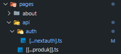 
 

- Jalankan browser http://localhost:3000/ dan klik sign in maka akan diarahkan ke login 
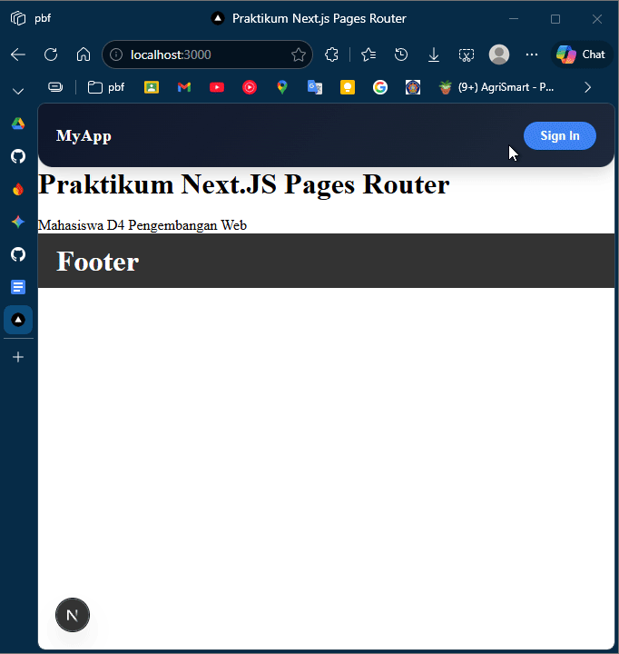 

### Langkah 2 – Handle Login di Frontend
- Copy paste isi dari register/index.tsx ke file login/index.tsx 
 
- Copy paste isi dari register/register.module.scss ke file login/login.module.scss 
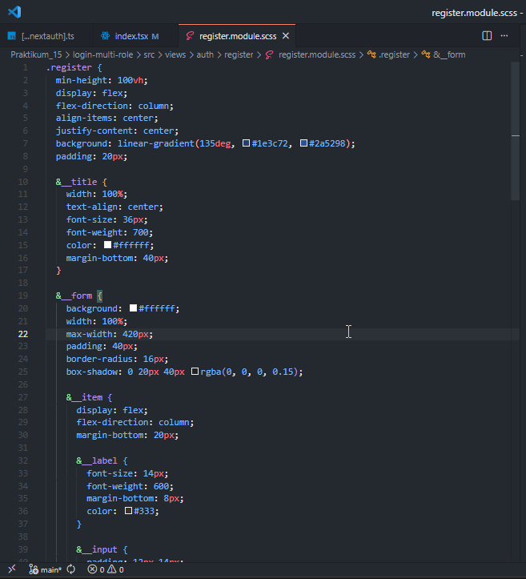 
- Semua text register pada file index.tsx pada folder login diubah menjadi login 
 
- Jangan lupa setting link hrefnya 
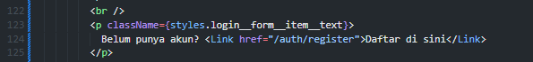 
- Lakukan hal yang sama pada file login.module.scss rubah text register menjadi login 
 
- Cek pada file login.tsx pada pages/auth 
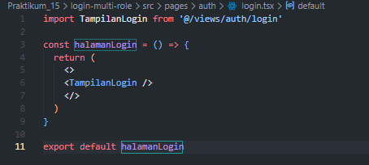 
- Jalankan browser localhost:3000/auth/login. Tampilannya akan sama dengan register 
 
- Pada tampilan register kita tidak perlu hapus fullname, jadi pada folder views/auth/login/index.tsx hapus fullname 
 
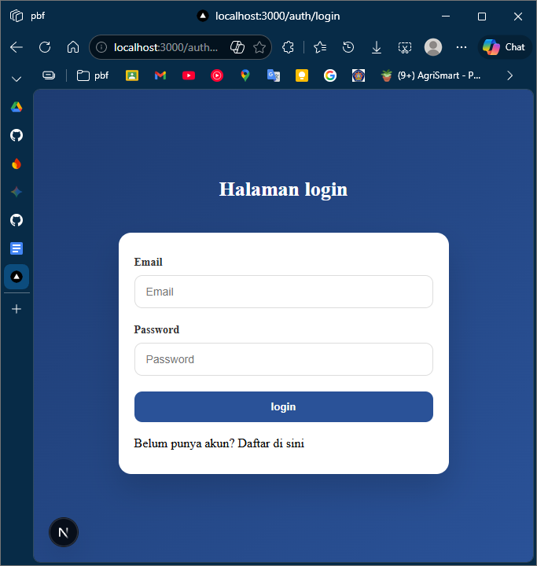 
- Buka file index.tsx pada folder views/auth/login dan modifikasi codenya seperti berikut (Untuk line 64 sampai kebawah tidak ada perubahan) 
- Note: pastikan tulisan password pada event.password.value pada line 48 sama dengan yang ada di database 
 
 
- Buka file servicefirebase.ts dan tambahkan code di line 25-38 
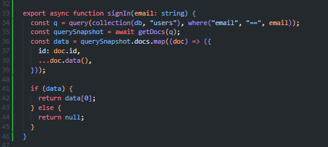 

### Langkah 3 – Authorize di NextAuth (Database Login)
- Buka file [...nextauth].ts modifikasi menjadi berikut (pada bagian providers) 
 

### Langkah 4 – Tambahkan Role ke Token
- JWT Callback pada file [...nextauth].ts Modifikasi menjadi 
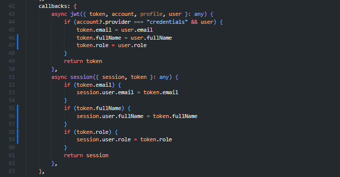 
- Jalankan browser http://localhost:3000/auth/login 
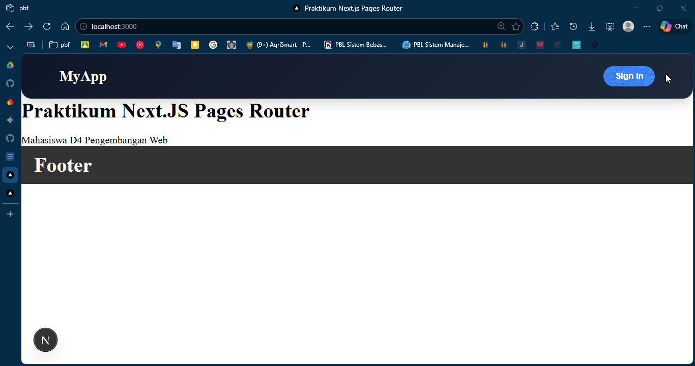 

**Note ERROR:** Jika terdapat error seperti "head tag is being rendered inside a div", buka file `src/views/auth/login/index.tsx` dan tambahkan `<> </>` pada line 81 dan 150. 
 
 
modifikasi index.tsx juga agar menggunakan Home milik next/head 
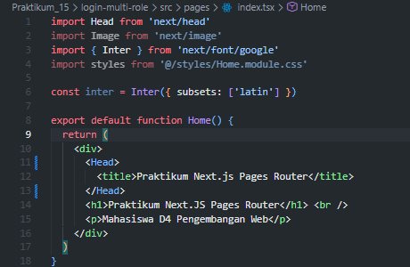 
hasil 
 

### Langkah 5 – Callback URL Logic
- Modifikasi withAuth.ts pada folder src/middleware 
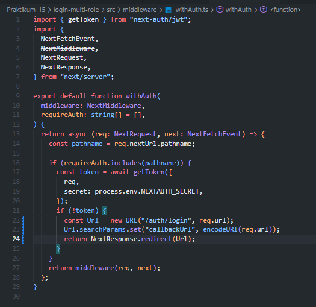 
 
- Tujuannya: Setelah login, user kembali ke halaman sebelumnya. 

### Langkah 6 – Membuat Halaman Admin dan Authorisasi
- Buat halaman admin 
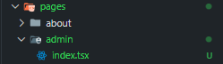 
- Pada index.tsx tambahkan code berikut 
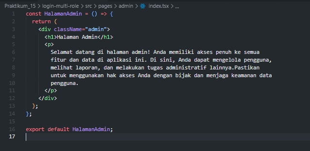 
- Modifikasi withAuth.ts 
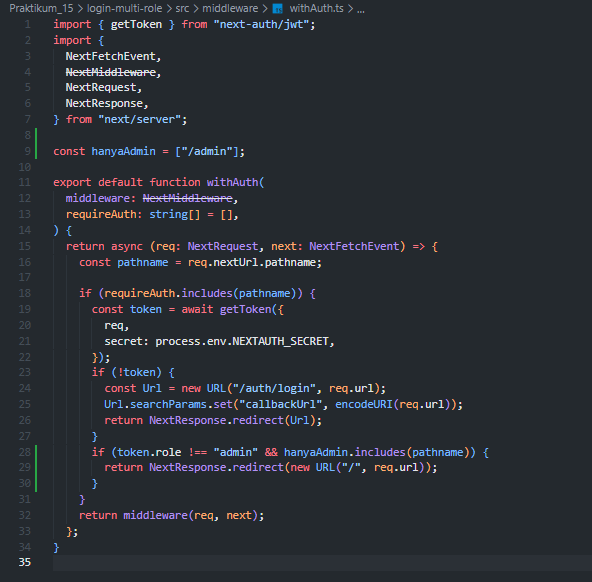 
- Modifikasi middleware.ts 
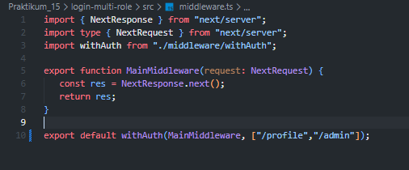 
- Jalankan browser localhost:3000/produk dan pada status sudah login. Rubah urlnya menjadi http://localhost:3000/admin maka user akan diarahkan ke localhost. Pada intinya role selain admin tidak bisa mengakses 
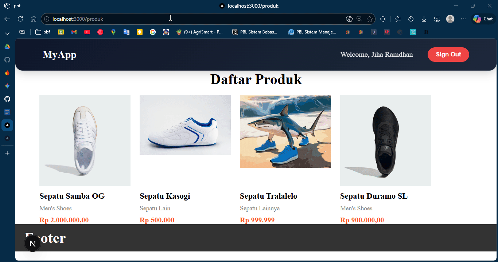 

 

- Untuk mencoba halaman admin rubah role pada firebase pada salah satu akun dan jalankan http://localhost:3000/admin 
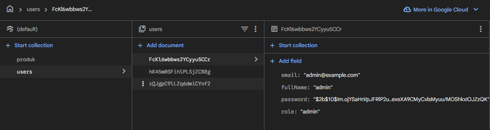 
 

## Pengujian

### Uji 1 – Login Valid
**Input:**
- Email benar
- Password benar

**Hasil:**
- Login berhasil
- Redirect sesuai callbackUrl
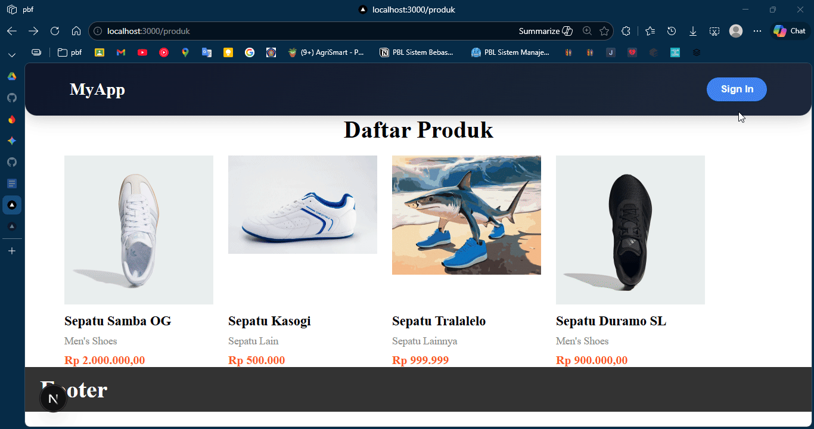

### Uji 2 – Password Salah
**Input:**
- Email benar
- Password salah

**Hasil:**
- Error message tampil
- Tidak login

### Uji 3 – Akses Admin sebagai User
**Login sebagai:**
- role: user

**Akses:** /admin

**Hasil:**
- Redirect ke home
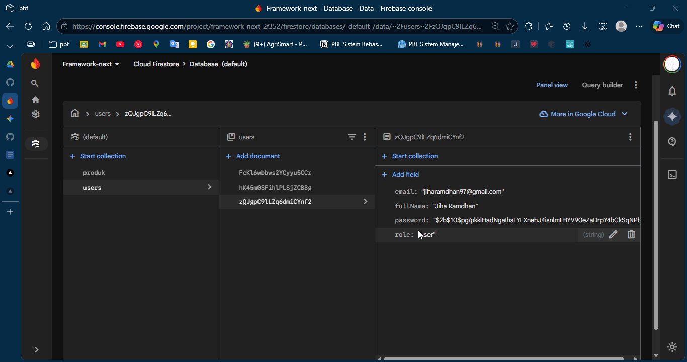

### Uji 4 – Akses Admin sebagai Admin
**Login sebagai:**
- role: admin

**Akses:** /admin

**Hasil:**
- Bisa masuk halaman admin
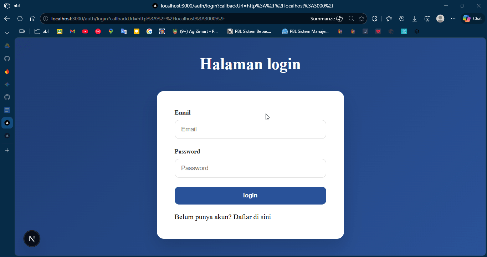

## Struktur Database Users
**Collection: users**

| Field | Tipe |
|-------|------|
| email | string |
| password | string (hashed) |
| role | string |
| fullName | string |

## Perbandingan Sistem

| Fitur | Sebelum | Sekarang |
|-------|---------|---------|
| Login | Hardcoded | Database |
| Password | Plaintext | Hashed |
| Role | Tidak ada | Ada |
| Redirect | Manual | Callback URL |
| Middleware | Basic | Role-based |

## Pertanyaan Analisis

1. Mengapa password harus diverifikasi dengan bcrypt.compare?
    > Karena password disimpan dalam bentuk hash (terenkripsi), bukan plaintext. bcrypt.compare membandingkan password input pengguna dengan hash yang tersimpan di database untuk memastikan kecocokan tanpa perlu menyimpan password asli.

2. Mengapa role disimpan di token?
    > Agar server tidak perlu query database setiap kali mengecek otorisasi user. Token yang sudah berisi role memudahkan pengecekan izin akses ke halaman tertentu dengan cepat.

3. Apa fungsi callbackUrl?
    > callbackUrl menyimpan URL halaman sebelumnya saat user login, sehingga setelah berhasil login, user akan diarahkan kembali ke halaman tersebut bukan selalu ke home.

4. Mengapa middleware penting untuk security?
    > Middleware berjalan di sisi server dan melakukan pengecekan autentikasi & otorisasi sebelum user bisa mengakses halaman. Ini mencegah akses tidak sah ke halaman tertentu seperti admin.

5. Apa risiko jika role tidak dicek di middleware?
    > User dengan role biasa bisa langsung mengakses halaman admin hanya dengan mengubah URL, karena pengecekan hanya terjadi di frontend yang mudah dimanipulasi.

