## Praktikum 16 - Implementasi Login Google Provider dengan NextAuth.js + Firebase

**Nama:** Jiha Ramdhan  
**NIM:** 2341720043  
**Kelas:** TI-3D

## Daftar Isi
1. [Langkah 1 – Masuk ke Google Cloud Console](#langkah-1--masuk-ke-google-cloud-console)
2. [Langkah 2 – Buat Project Baru](#langkah-2--buat-project-baru)
3. [Langkah 3 – Konfigurasi OAuth Consent Screen](#langkah-3--konfigurasi-oauth-consent-screen)
4. [Langkah 4 – Buat OAuth Credentials](#langkah-4--buat-oauth-credentials)
5. [Langkah 5 – Tambahkan Environment Variables](#langkah-5--tambahkan-environment-variables)
6. [Langkah 6 – Konfigurasi Google Provider di NextAuth](#langkah-6--konfigurasi-google-provider-di-nextauth-dan-handle-callback-jwt--session)
7. [Langkah 7 – Tambahkan Button Login Google](#langkah-7--tambahkan-button-login-google)
8. [Langkah 8 – Menampilkan Image dari Google](#langkah-8--menampilkan-image-dari-google)
9. [Langkah 9 – Simpan Data Google ke Database](#langkah-9--simpan-data-google-ke-database)
10. [Langkah 10 – Pengujian](#langkah-10--pengujian)
11. [Analisis & Diskusi](#analisis--diskusi)
12. [Tugas Mandiri](#tugas-mandiri)
13. [Kesimpulan](#kesimpulan)

### Langkah 1 – Masuk ke Google Cloud Console
- Buka: https://console.cloud.google.com/apis/credentials

### Langkah 2 – Buat Project Baru
- Klik **New Project** 
- Nama project: `MyAppNext` 
- Klik **Create** 
 
- Setelah berhasil, pastikan project adalah `MyAppNext` di https://console.cloud.google.com/apis/credentials 
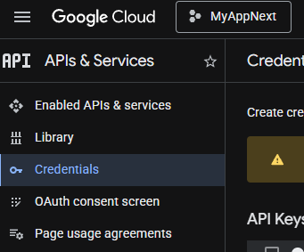 

### Langkah 3 – Konfigurasi OAuth Consent Screen
1. Pilih **OAuth consent screen** 
 
2. Pilih **Get Started** 
3. Isikan form yang muncul 
4. Klik **create** 
 

### Langkah 4 – Buat OAuth Credentials
- Klik **create client** pada Clients 
 
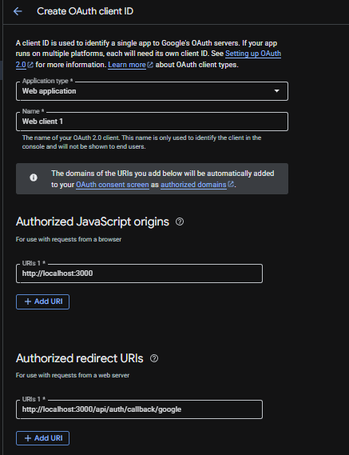 

### Langkah 5 – Tambahkan Environment Variables
 
- Copy dan paste Client ID dan Client Secret ke `.env` 
 

### Langkah 6 – Konfigurasi Google Provider di NextAuth dan Handle Callback JWT & Session
- Buka file `[...nextauth].ts` pada folder `api/auth` dan modifikasi sesuai konfigurasi 
 
 
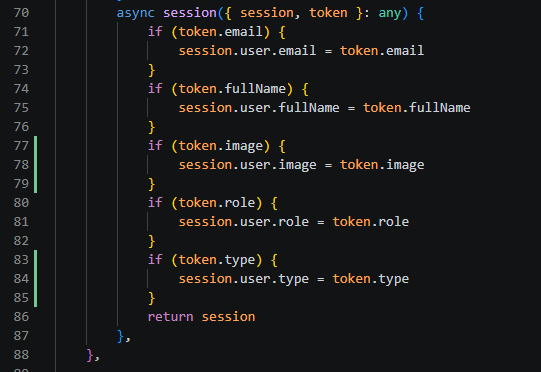 

### Langkah 7 – Tambahkan Button Login Google
1. Modifikasi file `index.tsx` pada folder `views/auth/login` 
 
2. Jalankan browser `localhost:3000/auth/login` dan masuk melalui **Sign in with Google** 
3. Jika berhasil, akan terhubung dengan akun Google 
 

**Note:** Data akun Google tidak tersimpan dalam database

### Langkah 8 – Menampilkan Image dari Google
- Buka file `index.tsx` dan tambahkan code untuk menampilkan image 
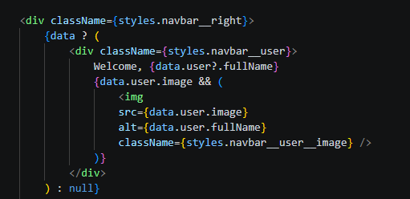 
- Buka file `navbar.module.css` dan tambahkan styling 
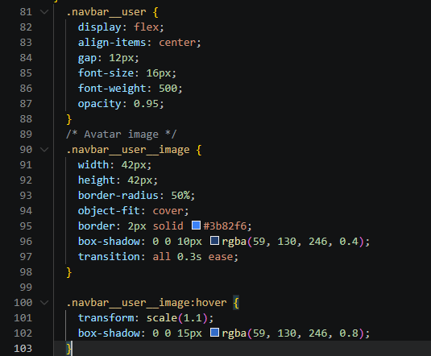 
- Jika berhasil, tampilan akan menampilkan avatar dari Google 
 

### Langkah 9 – Simpan Data Google ke Database
- Buka file `servicefirebase.ts` pada folder `src/utils/db/` dan tambahkan beberapa kode 
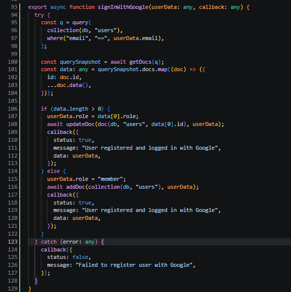 
- Panggil Service di JWT Callback di file `[...nextAuth].ts` 
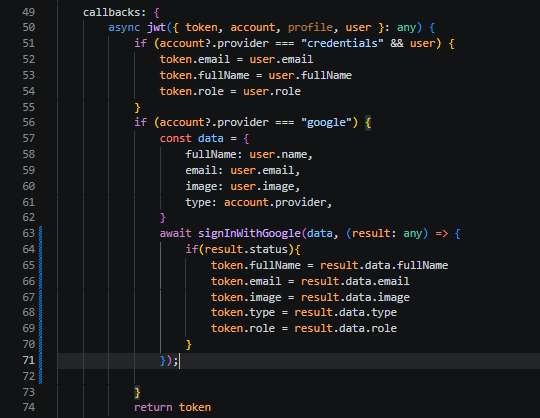 
- Jalankan browser dan login menggunakan akun Google, cek di Firebase untuk verifikasi 
 

### Langkah 10 – Pengujian
**Testing Checklist:**
1. Login Google pertama kali – Data tersimpan di Firestore 
    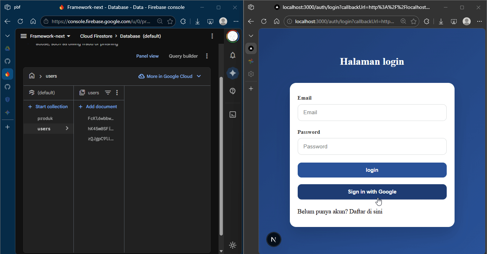 
2. Login Google kedua kali – Data diupdate 
   > hapus isi image di firebase, lalu login ulang untuk melihat data image terupdate atau tidak

    

     
3. User role member akses /admin – Redirect 
     
4. User role admin akses /admin – Bisa masuk 
     
5. Avatar tampil – Ya 
    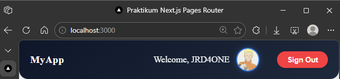 

### Analisis & Diskusi
1. Apa perbedaan login credential dan login Google?
   > **Login Credential** pakai username dan password sendiri yang tersimpan di database aplikasi. **Login Google** langsung pake akun Google yang sudah ada, jadi tidak perlu buat password baru, Google yang jaga keamanannya.

2. Mengapa data Google tetap perlu disimpan ke database?
   > Supaya aplikasi bisa mengenali siapa yang login, bisa nyimpen data khusus tentang user, dan bisa ngeset role (admin atau member). Kalau tidak disimpan, aplikasi akan anggap setiap kali login itu orang baru.

3. Apa fungsi JWT callback?
   > JWT callback itu fungsi yang jalan saat bikin token login. Gunanya untuk memasukkan informasi tambahan ke token (seperti role atau ID user), jadi informasi itu tersedia di mana-mana tanpa perlu tanya database berkali-kali.

4. Mengapa perlu multi-role?
   > Biar bisa bedain hak akses tiap user. Admin bisa masuk halaman `/admin`, tapi member tidak boleh. Ini bikin aplikasi lebih aman dan terstruktur.

5. Apa risiko jika tidak menyimpan user ke database?
   > Aplikasi tidak bisa membedakan user mana yang siapa, tidak bisa tracking apa yang dilakukan user, tidak bisa ngeset role, dan tidak bisa simpan data custom. Setiap login dianggap orang baru, fitur aplikasi jadi terbatas dan tidak aman.

## Tugas Mandiri
### 1. Tambahkan role editor 
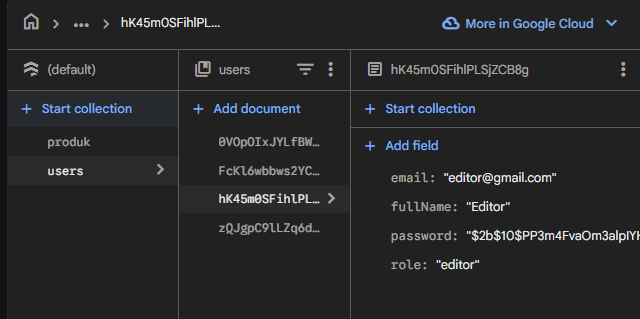 
### 2. Buat halaman khusus editor 
- Buat file index.ts di folder pages/editor 
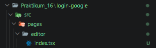 
- Modifikasi index.ts 
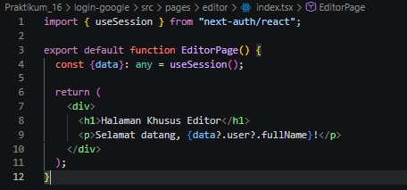 
- Modifikasi withAuth.ts 
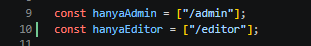 
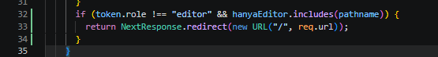 
- Modifikasi middleware.ts 
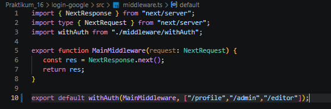 
- Hasil 
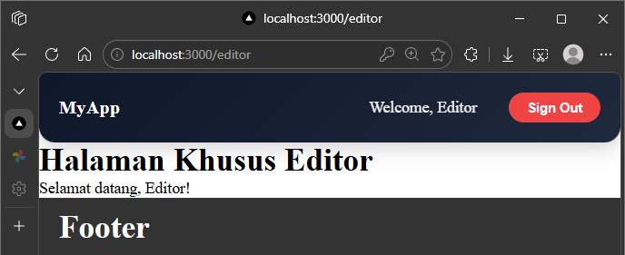 
### 3. Tambahkan provider GitHub 
- Daftar OAuth Github, di Setting > Developer Settings > OAuth Apps > New OAuth App 
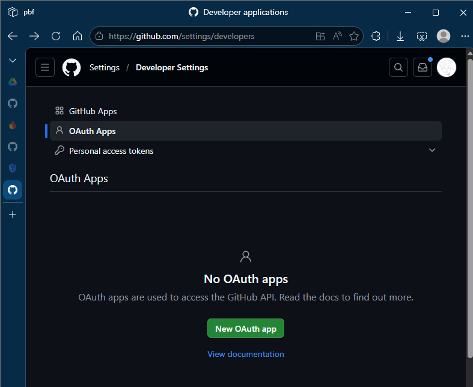 
- Isi Homepage URL dengan http://localhost:3000 
- Isi Authorization callback URL dengan http://localhost:3000/api/auth/callback/github 
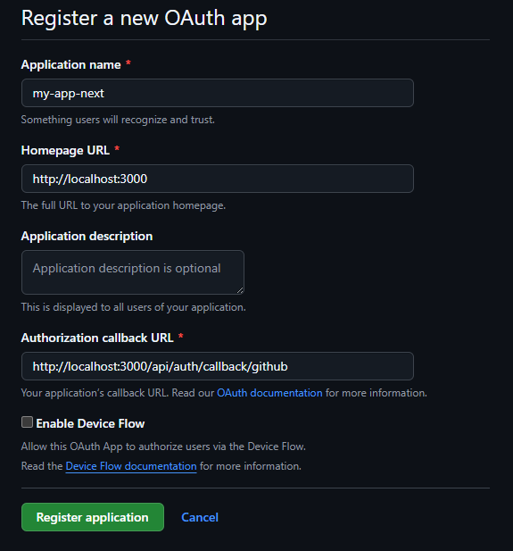 
- lalu Generate a new client secret 
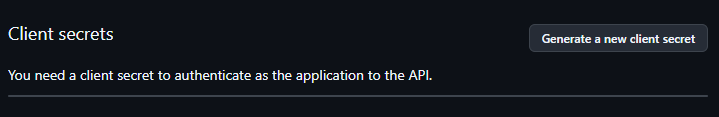 
- Update .env: Copy Client ID dan Client Secret dari Github dan masukkan ke file .env.local 
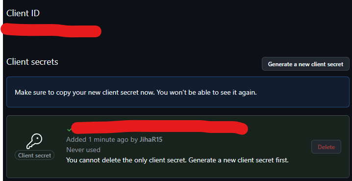 
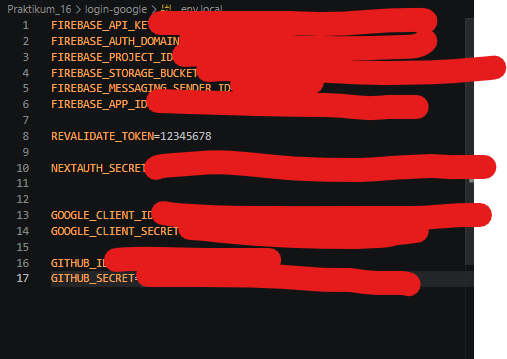 
- Update [...nextauth].ts tambahkan GithubProvider 
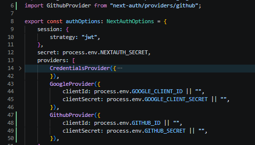 
- Modifikasi index.tsx pada views/auth/login 
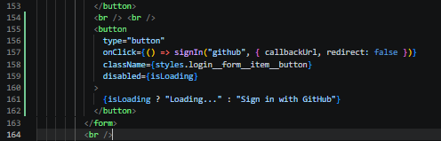 
- Hasil 
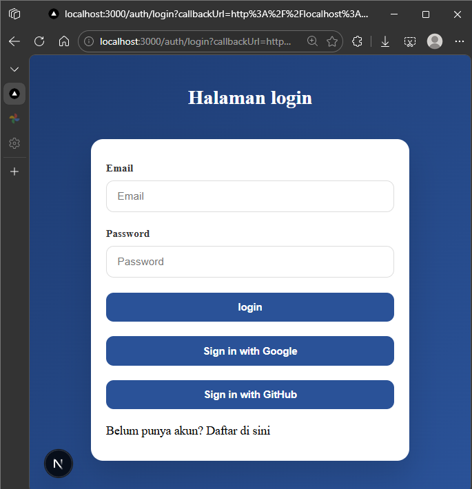 
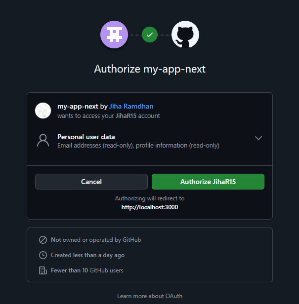 
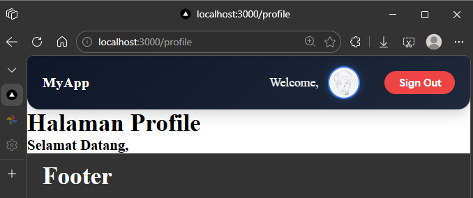 
### 4. Refactor service agar reusable 
- Modifikasi servicefirebase.ts 
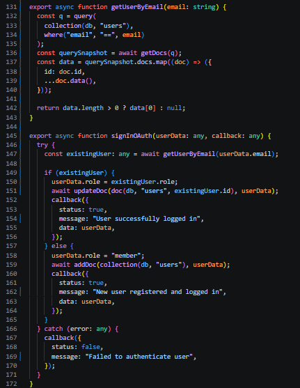 
- Modifikasi [...nextauth].ts 
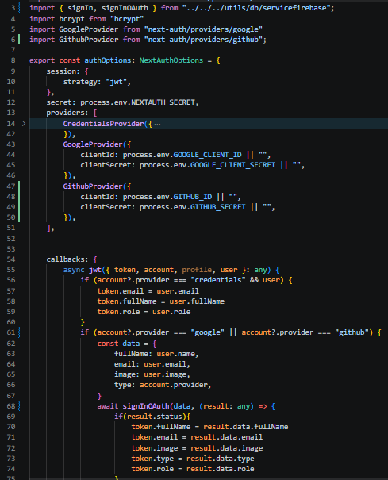 
- Hasil 
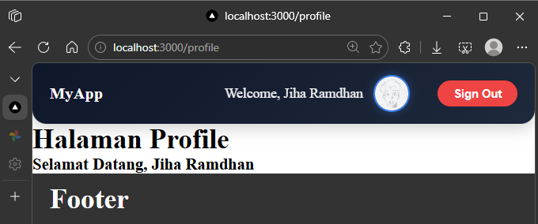 
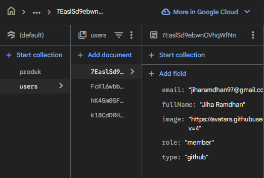 
### 5. Gunakan `next/image` untuk optimasi avatar 
- Ganti tag di index.tsx di navbar 
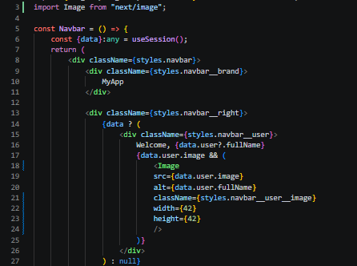 
- Konfigurasi next.config.js agar tidak error 
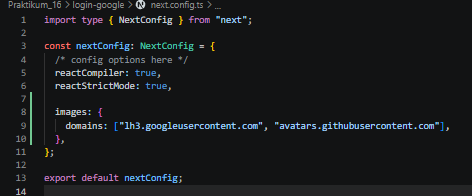 

### Kesimpulan
Pada praktikum ini saya telah:
- Mengimplementasikan Google OAuth
- Mengintegrasikan dengan NextAuth.js
- Menyimpan user ke Firestore
- Mengelola JWT dan Session
- Mengimplementasikan Multi-Role
- Menampilkan avatar profil

