## Praktikum 17 - Optimize

### Langkah 1 – Image Optimization

#### A. Optimasi Gambar Lokal (Public Folder)
- Studi kasus:
   - Mengganti tag `` pada halaman 404 dengan `next/image`.
- Langkah:
   - Buka file `src/pages/404.tsx`.
   - Modifikasi seperti berikut: 
   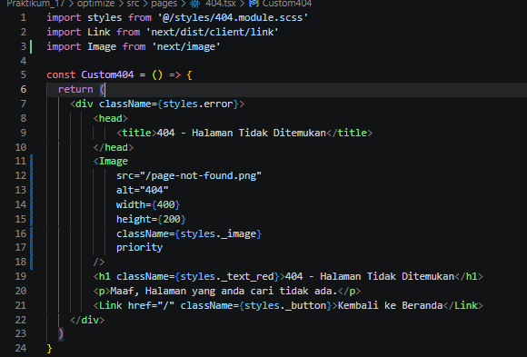 

**Hasil:** 

- Warning hilang
- Image dioptimasi otomatis
- Mengurangi bandwidth
- Mendukung lazy loading otomatis

#### B. Optimasi Gambar Remote (External URL)
- Buka file `views/product/index.tsx`.
- Modifikasi file `index.tsx`. 
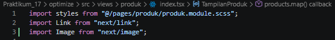 
 
**Note:** Dikarenakan gambar diambil dari URL tertentu maka konfigurasi berbeda. 
- Buka file `next.config.js`. 
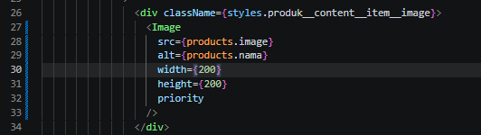 

**Hasil:** 
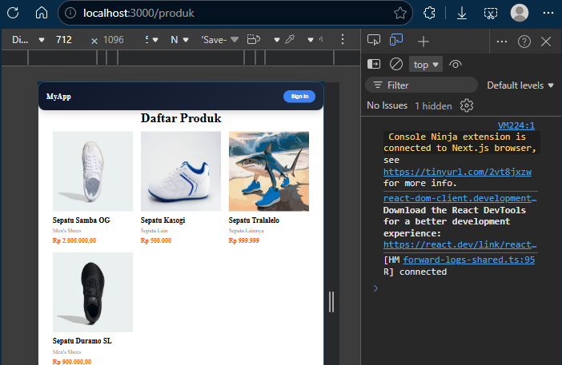
- Gambar di-proxy melalui `/_next/image`
- Performa lebih optimal
- Kompresi otomatis

### Langkah 2 – Font Optimization

#### A. Menggunakan `next/font`
- Buka file `index.tsx` pada folder `Appshell/index.tsx` dan modifikasi. 
 
- Jalankan browser `localhost:3000/produk`, maka font akan berubah menjadi Roboto.
- Untuk mengecek font, bisa menggunakan extension FontFinder.

**Hasil:** 
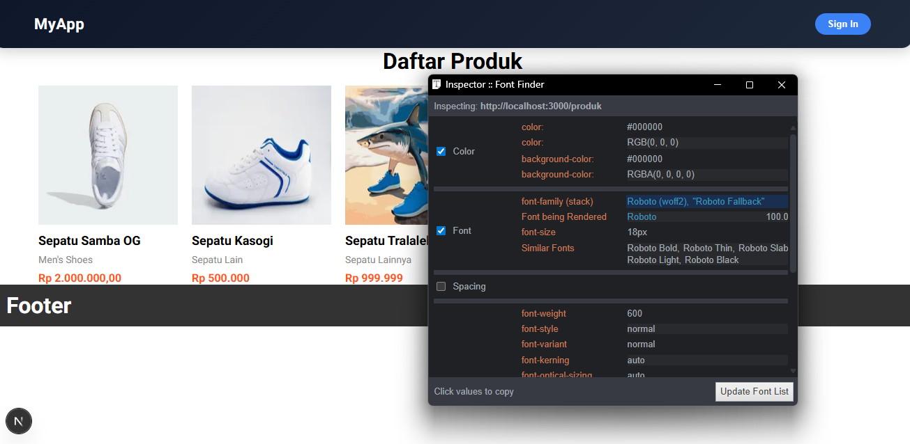 
- Tidak perlu load dari CDN manual
- Tidak blocking render
- Performance meningkat
- Tidak terjadi FOUT (Flash of Unstyled Text)

### Langkah 3 – Script Optimization

#### B. Menggunakan `next/script`
- Buka file `index.tsx` pada folder `layouts/Navbar` dan modifikasi. 
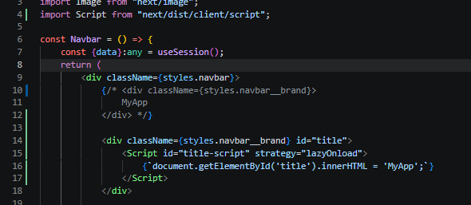 
- Pada kasus di atas, kita mengubah line 10 menggunakan model TypeScript, dapat terlihat ketika kita refresh web produk tulisan `MyApp` akan terlihat berkedip. 
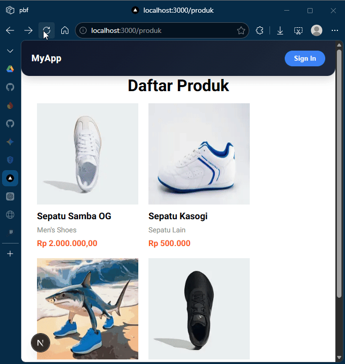 
- Perbedaan mendasar antara line 10–12 dan line 14–18 pada file `index.tsx` Anda terletak pada metode rendering teks dan interaksi dengan DOM (Document Object Model). Berikut adalah rincian perbedaannya:

**I. Metode Rendering**
a. **Line 10–12 (Standard React/JSX):** Ini adalah cara standar React.  
Teks `"MyApp"` ditulis langsung di dalam tag `div`. React akan langsung merender teks ini ke dalam HTML saat komponen dimuat.  

b. **Line 14–18 (Next.js Script & Manual DOM):** Menggunakan komponen `<Script>` dari Next.js dengan strategi `lazyOnload`.  
Teks tidak ada di dalam HTML saat awal dimuat, melainkan baru "disuntikkan" secara manual menggunakan perintah JavaScript:  
`document.getElementById('title').innerHTML = 'MyApp';`  
setelah script tersebut diunduh di latar belakang.

**II. Performa dan SEO**
a. **Line 10–12:** Sangat baik untuk SEO karena teks `"MyApp"` langsung terbaca oleh robot pencari (crawler) dalam kode sumber HTML.  

b. **Line 14–18:** Kurang baik untuk SEO untuk konten penting karena teks baru muncul setelah JavaScript dijalankan. Strategi `lazyOnload` berarti script ini dijalankan paling akhir setelah semua sumber daya utama selesai dimuat, sehingga mungkin ada jeda waktu (delay) sebelum teks muncul di layar.

**III. Keamanan (XSS)**
a. **Line 10–12:** Aman karena React secara otomatis melakukan escape pada string untuk mencegah serangan Cross-Site Scripting (XSS).  

b. **Line 14–18:** Memiliki risiko keamanan lebih tinggi karena menggunakan `.innerHTML`. Jika data yang dimasukkan berasal dari input user, ini bisa dimanfaatkan untuk menyuntikkan skrip berbahaya.

#### C. Strategi Script

| Strategy            | Fungsi                              |
|---------------------|-------------------------------------|
| `beforeInteractive` | Sebelum halaman interaktif          |
| `afterInteractive`  | Setelah halaman interaktif          |
| `lazyOnload`        | Setelah semua selesai               |
| `worker`            | Web worker                          |

**Hasil:**
- Script tidak blocking
- Cocok untuk Google Analytics
- Performa lebih ringan

### Langkah 4 – Optimasi Avatar dengan `next/image`

- Buka file `index.tsx` pada folder `layouts/navbar` dan modifikasi. 
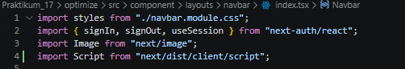 
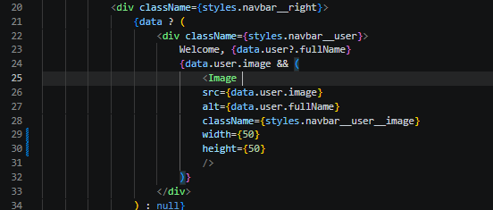 
- Tambahkan hostname Google. 
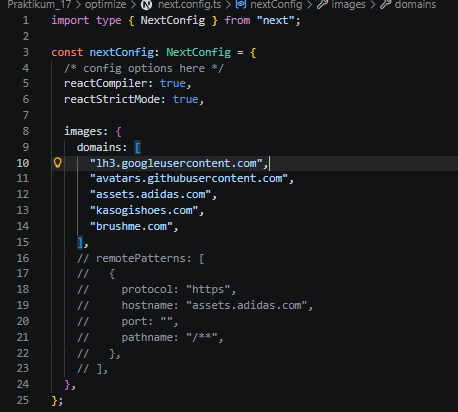 

### Tugas Praktikum
1. Optimasi semua image di project menggunakan `next/image`.
 > Sudah diterapkan di halaman 404, produk dan navbar (avatar).
2. Gunakan minimal 1 font dari `next/font`.
 > Sudah diterapkan pada file `Appshell/index.tsx` dengan font Roboto.
3. Tambahkan script Google Analytics menggunakan `next/script`.
 - index.tsx pada folder `Appshell/index.tsx` 
 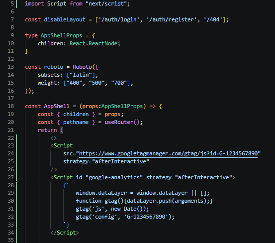 
 > diterapkan strategy afterInteractive untuk memastikan script GA tidak menghambat rendering utama.
4. Terapkan dynamic import pada minimal 1 komponen.
   - Pada file `Appshell/index.tsx`, komponen Footer di-load secara dinamis dengan `next/dynamic`. 
   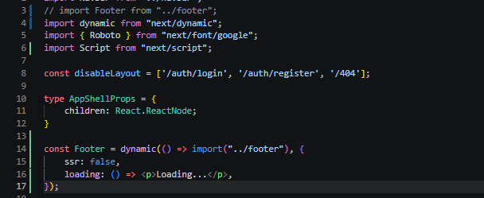
   > Dengan opsi `ssr: false` untuk memastikan Footer hanya di-render di sisi klien, dan menambahkan fallback loading untuk pengalaman pengguna yang lebih baik.
5. Dokumentasikan perubahan performa (screenshot Lighthouse).
   - localhost:3000 
   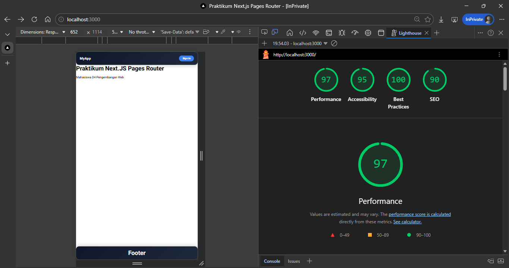
   - localhost:3000/produk 
   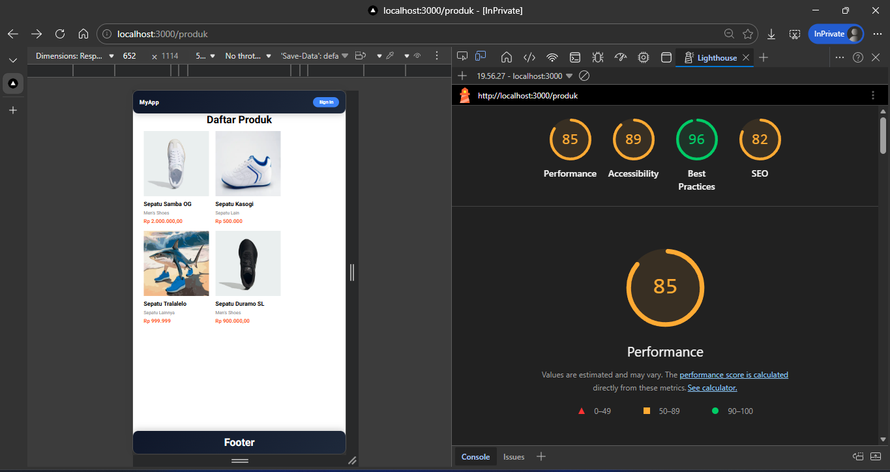
   - localhost:3000/produk/static 
   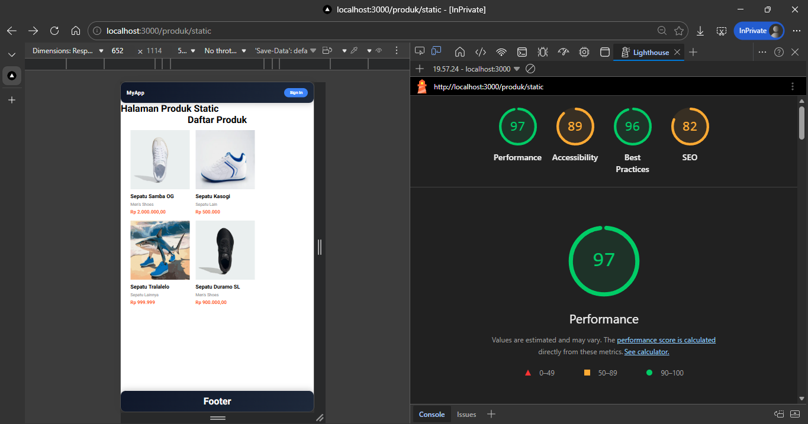
   - localhost:3000/404 
   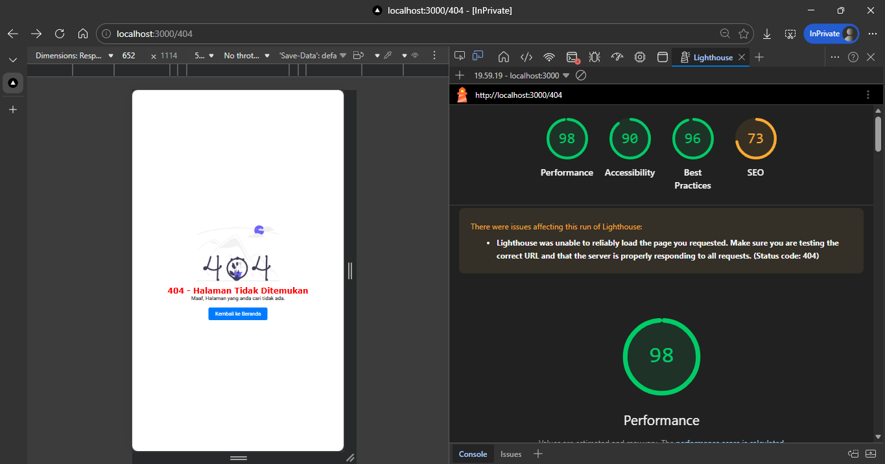

### Refleksi & Diskusi
1. Mengapa `` biasa tidak optimal?  
   > Karena `` memuat gambar apa adanya tanpa optimasi otomatis. Akibatnya ukuran file bisa besar, loading lebih lama, dan boros kuota/bandwidth. Di Next.js, `next/image` bisa otomatis kompres, resize sesuai perangkat, dan lazy load, jadi halaman terasa lebih cepat.

2. Apa perbedaan font CDN dan `next/font`?  
   > Font CDN diambil dari server luar saat halaman dibuka, jadi tergantung koneksi ke pihak ketiga dan bisa menambah waktu loading. `next/font` mengelola font langsung di aplikasi (self-hosted), sehingga lebih stabil, lebih cepat, dan mengurangi efek teks "kedip" saat font belum siap.

3. Mengapa script bisa membuat website lambat?  
   > Karena browser harus download, baca, lalu jalankan script. Jika script terlalu banyak atau dijalankan terlalu awal, proses tampilnya halaman bisa tertunda. Itulah kenapa strategi seperti `afterInteractive` atau `lazyOnload` dipakai agar script tidak mengganggu tampilan utama.

4. Kapan harus menggunakan dynamic import?  
   > Gunakan saat komponen tidak harus tampil di awal, misalnya chart, map, editor, atau widget tambahan. Dengan dynamic import, komponen dimuat saat dibutuhkan saja, sehingga loading awal halaman lebih ringan dan cepat.

5. Apa dampak bundle size terhadap UX?  
   > Bundle size adalah total ukuran JavaScript/CSS yang dikirim ke browser. Jika terlalu besar, halaman lebih lama muncul, terasa berat, dan pengguna lebih cepat meninggalkan situs. Bundle yang kecil biasanya memberi pengalaman lebih responsif dan nyaman.

### Kesimpulan
Dalam praktikum ini saya telah mempelajari:
- Image Optimization
- Remote Image Configuration
- Font Optimization
- Script Optimization
- Dynamic Import
- Lazy Loading

Semua fitur ini merupakan keunggulan utama Next.js dalam meningkatkan performa aplikasi modern.

