## Praktikum 18 - Unit Testing

### Langkah 1 – Setup Jest di Next.js

**Install Dependencies**

Jalankan:
```bash
npm install jest jest-environment-jsdom @testing-library/react @testing-library/jest-dom --save-dev --force
```

<br>

<br>

**Buat File Konfigurasi**

Dokumentasi: https://nextjs.org/docs/pages/guides/testing/jest

Buat file: `jest.config.mjs`<br>
<br>

**Tambahkan Script di package.json**<br>
<br>

---

### Langkah 2 – Struktur Folder Testing

Buat folder: `src/__test__/`<br>
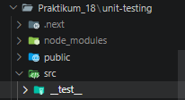<br>

---

### Langkah 3 – Testing Halaman About

**Buat File Testing**

File: `src/__test__/pages/about.spec.tsx`


Contoh Testing Snapshot. Pada `about.spec.tsx` tambahkan code berikut:<br>

<br>

**Jalankan Testing**

```bash
npm run test
```

Jika berhasil: `PASS about.spec.tsx`<br>

<br>

---

### Langkah 4 – Coverage Report

Jalankan:
```bash
npm run test:coverage
```

Akan muncul folder: `coverage/`<br>

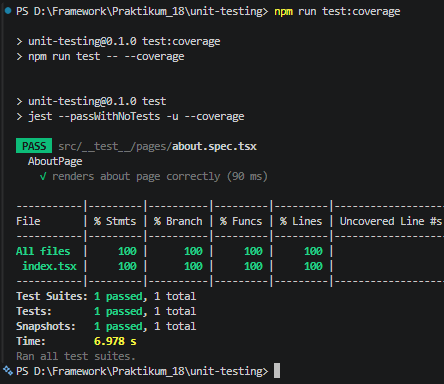<br>

Buka: `coverage/lcov-report/index.html` (buka melalui explorer)<br>
<br>

**Target perusahaan biasanya:** Minimum 80% coverage

---

### Langkah 5 – Konfigurasi Coverage Lengkap

Update `jest.config.mjs`<br>

<br>

Jalankan `npm run test:coverage`<br>

<br>
<br>

<br>

---

### Langkah 6 – Testing dengan getByTestId

1. Tambahkan pada About Page:
```jsx
<h1 data-testid="title">About Page</h1>
```
<br>

<br>

2. Update Testing pada `about.spec.tsx`<br>
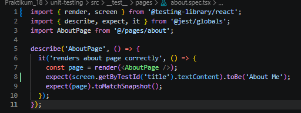<br>
<br>

3. Coba jika dibuat salah (ubah menjadi `toBe("About")`):<br>
<br>
```
FAIL
Expected: "About"
Received: "About Me"
```
<br>
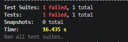<br>
---

### Langkah 7 – Testing Page dengan Router (Mocking)

Melakukan testing pada halaman produk.

1. Buat file `product.spec.tsx`<br>
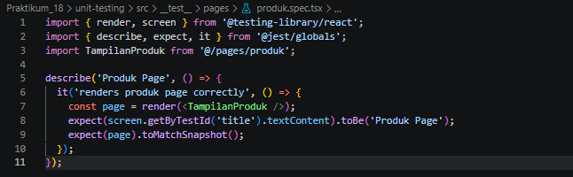<br>

2. Ketika testing halaman Product, sering muncul error: `NextRouter was not mounted`<br>
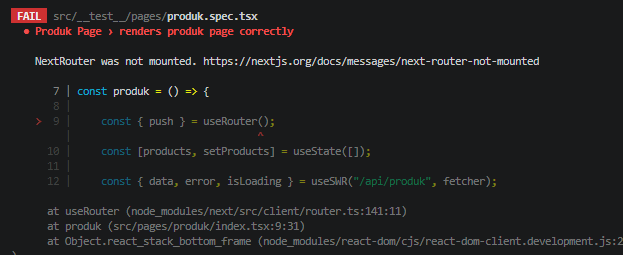<br>

**Solusi:** Mock Next Router dengan menambahkan kode di file `product.spec.tsx`<br>

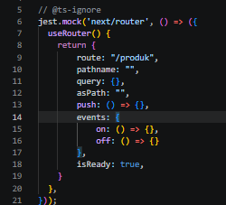
---

### Langkah 8 – Menangani Undefined Data

Jalankan `npm run test:coverage`<br>
<br>
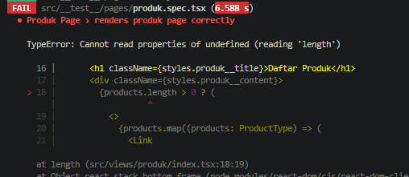<br>

Jika muncul error `Cannot read properties of undefined`, perbaiki di komponen pada file `index.tsx` pada folder `pages/produk`<br>
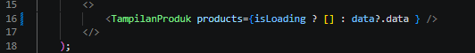<br>
<br>
**Note:** Pastikan comment pada code yang ditunjukkan di 2 code testing<br>
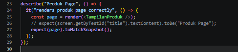<br>

**Analisis Coverage**<br>
<br>

Perhatikan bagian:
- Statement
- Branch
- Function
- Lines

**Contoh:**
| Metric | Hasil |
|--------|-------|
| Statements | 85% |
| Branch | 60% |
| Functions | 90% |
| Lines | 88% |

Branch biasanya paling sulit karena perlu menguji kondisi if/else.

---

### Standar Industri

- ≥ 80% → boleh production
- < 80% → harus diperbaiki
- Semua critical feature wajib dites

---

### Tugas Praktikum

1. Buat unit test untuk:
   - Halaman Product <br>
   > Sudah pada Praktikum 7
   - 1 Komponen<br>
      - buat file `src/__test__/components/footer.spec.tsx`<br>
      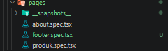<br>
      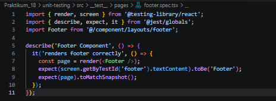<br>
      - Modifikasi index.tsx pada folder `component/layouts/footer` untuk menambahkan `data-testid="footer"`<br>
      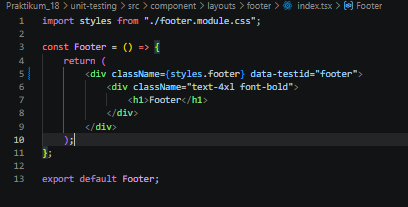<br>
      - hasil:<br>
      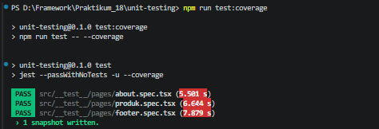<br>

2. Gunakan minimal:
   - 1 Snapshot test
   - 1 toBe()
   - 1 getByTestId()

   > Semua sudah diterapkan pada About dan Product

3. Buat coverage minimal 50%
   - file unit test yang sudah dibuat agar coverage diatas 50%<br>
   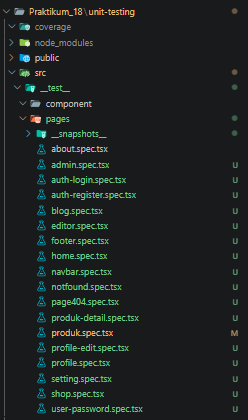<br>
   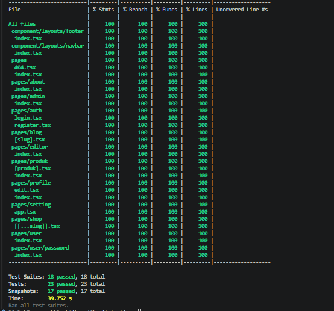<br>
   - pada index.html coverage<br>
   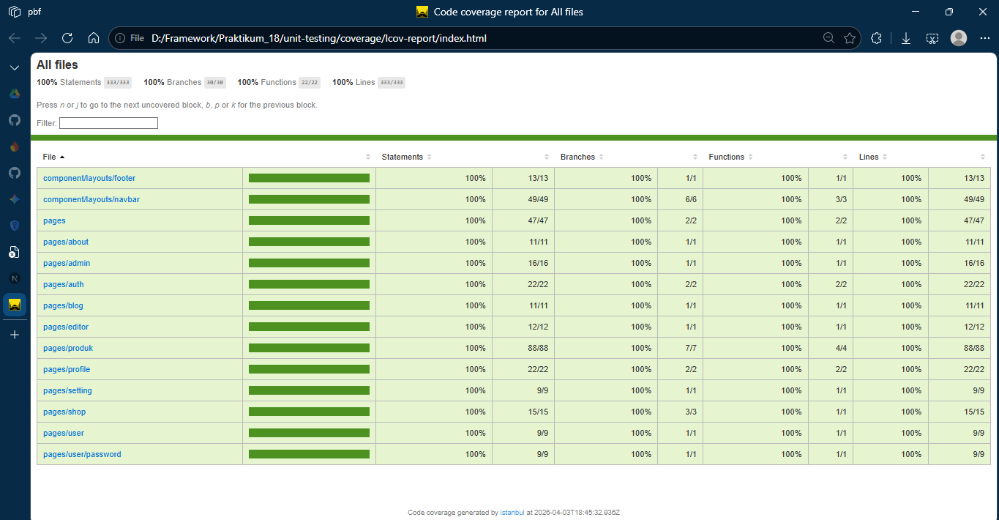<br>

4. Lakukan mocking untuk router
   > sudah dilakukan pada praktikum 7

5. Dokumentasikan hasil coverage
   > Yang dilakukan pada Praktikum ini merupakan dokumentasi dari hasil coverage

---

### Diskusi & Refleksi

1. Mengapa unit testing penting sebelum production?  
   > Unit testing membantu menemukan bug lebih awal, mencegah regresi saat ada perubahan kode, dan meningkatkan kepercayaan bahwa fitur berjalan sesuai kebutuhan sebelum dirilis.

2. Mengapa branch coverage sulit mencapai 100%?  
   > Karena setiap kemungkinan jalur logika (if/else, switch, error handling, edge case) harus diuji, termasuk kondisi langka yang tidak selalu mudah direproduksi.

3. Apa itu mocking?  
   > Mocking adalah teknik mengganti dependensi asli (misalnya router, API, database) dengan versi tiruan saat testing agar pengujian terkontrol, cepat, dan tidak bergantung sistem eksternal.

4. Kapan snapshot test digunakan?  
   > Snapshot test digunakan saat ingin memverifikasi output UI tetap konsisten dari waktu ke waktu, terutama untuk mendeteksi perubahan tampilan yang tidak disengaja.

5. Apakah semua file harus dites?  
   > Tidak harus semua file, tetapi file yang berisi logika penting, fitur kritikal, dan area berisiko tinggi wajib diprioritaskan untuk diuji.

---

### Kesimpulan

Dalam praktikum ini saya telah:

- Menginstal dan mengkonfigurasi Jest
- Menggunakan React Testing Library
- Membuat unit test pada pages
- Menghasilkan coverage report
- Melakukan mocking router
- Memahami pentingnya testing di industri