## Praktikum 19 - Deploy

> Disini saya menggunakan Repo yang sudah dibuat saja, tanpa membuat Repo baru.

### Langkah 1 – Deployment ke Vercel

**Import Project**
> Disini saya sudah menghubungkan project dengan GitHub, jadi tinggal import saja.
1. Klik **Import**.<br>
<br>

**Catatan**
- Sebelum di-import, lakukan konfigurasi terlebih dahulu.

### C. Mengatasi Error Saat Deployment
- Dikarenakan pada code masih terdapat code static-site generation.

**Masalah: Static Site Generation Gagal**
- Hapus file `static.tsx`.
- Comment pada line 46 pada file `[produk].tsx` yang berhubungan dengan static-site generation.<br>
<br>

**Solusi**
1. Gunakan SSR (Server Side Rendering).
    - SSR yang sebelumnya di-comment dibuka comment-nya pada file `[produk].tsx`.<br>
    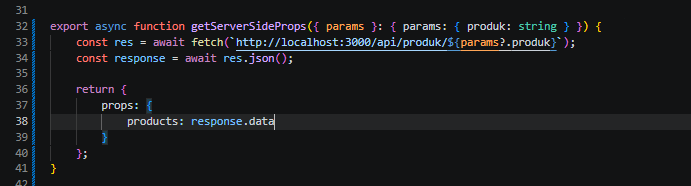<br>

2. Gunakan Environment Variable
    - Buat di `.env.local`:
        ```env
        NEXT_PUBLIC_API_URL=http://localhost:3000
        ```
    - Ganti semua hardcoded URL menjadi:
        ```bash
        process.env.NEXT_PUBLIC_API_URL
        ```
    - Contoh:
        ```bash
        fetch(`${process.env.NEXT_PUBLIC_API_URL}/api/product`)
        ```
    - Terapkan pada file `[produk].tsx` dan `server.tsx`.<br>
    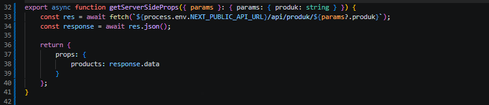<br>
    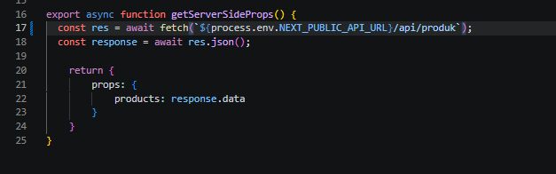<br>

3. Commit dan push kembali.<br>
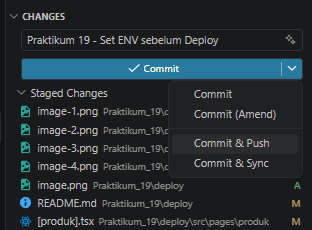<br>

4. Selanjutnya import dan lakukan pengaturan sesuai kebutuhan.<br>
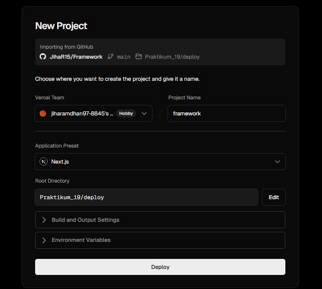<br>
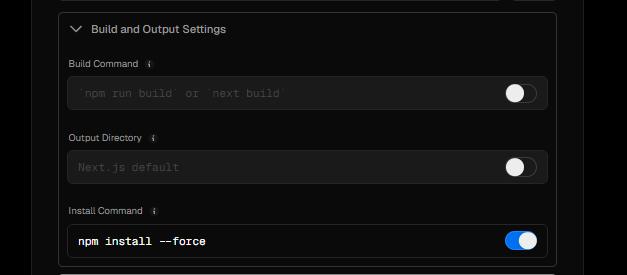<br>

5. Setelah itu klik **Deploy**. Jika berhasil, hasilnya akan muncul.<br>
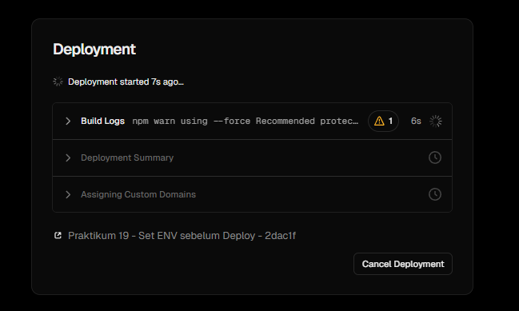<br>
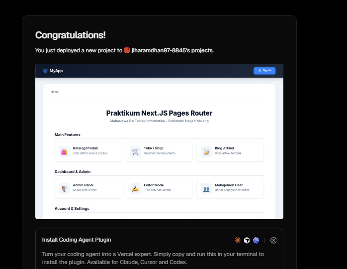<br>
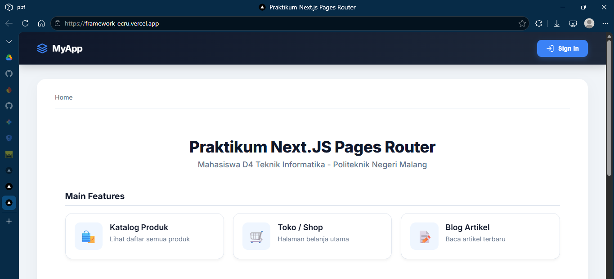<br>

### Langkah 3 – Menambahkan Environment Variable di Vercel

**Buka Project di Vercel**<br>
- Masuk ke **Settings → Environment Variables**.<br>
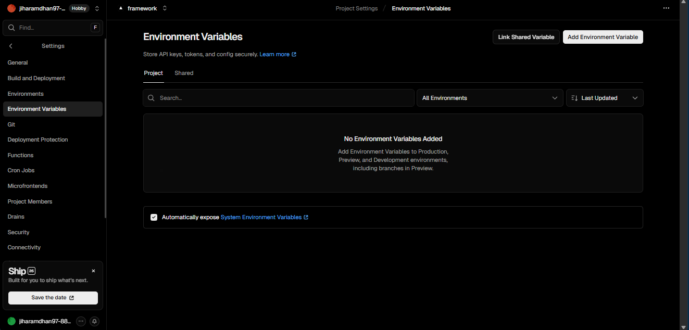<br>

**Import dari `.env.local`**<br>
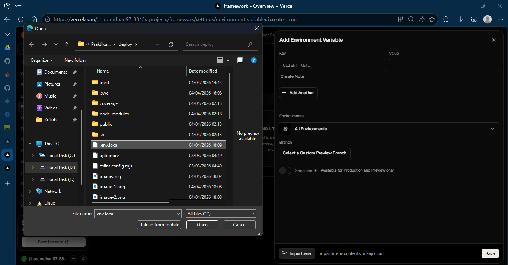<br>
- Klik **Import .env** dan sesuaikan `NEXT_PUBLIC_API_URL` dengan URL project Vercel.<br>
- Atau isi manual:
    ```env
    NEXT_PUBLIC_API_URL=https://namaproject.vercel.app
    ```
    <br>

    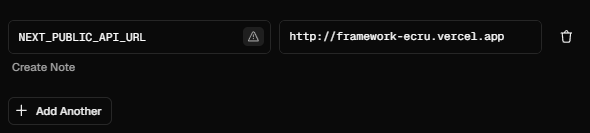

**Catatan**
- Tanpa tanda `/` di belakang URL.

**Redeploy**
- Deployment → **Redeploy**.<br>
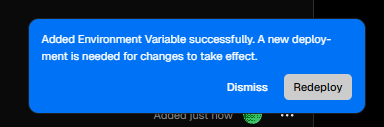


### Langkah 4 – Konfigurasi Google OAuth Production

**Masuk ke Google Cloud Console**
- Buka Google Developer Console.
- Masuk ke **Credentials**.
- Pilih **OAuth Client**.

**Tambahkan Authorized Origins**
- Tambahkan **Redirect URI**.<br>
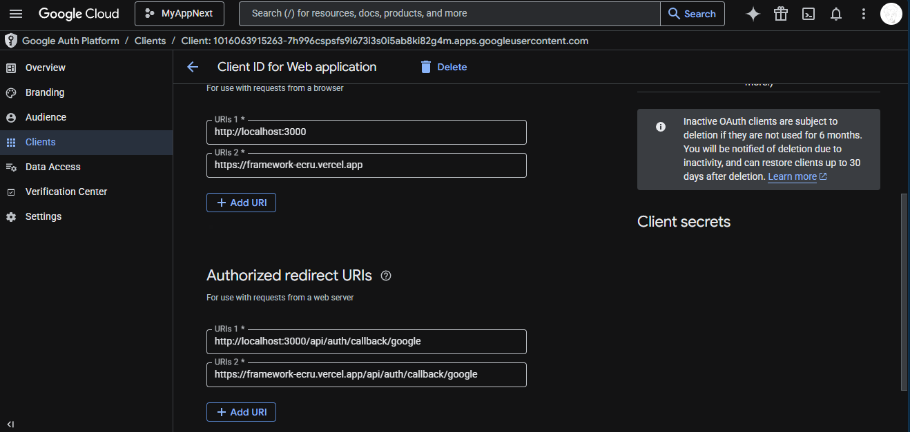<br>

**Simpan perubahan.**


### Langkah 5 – Pengujian Setelah Deployment

Coba akses:
- `/`<br>
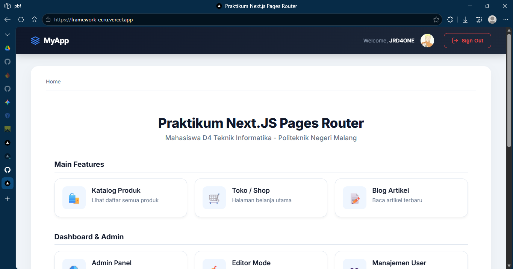<br>
- `/about`<br>
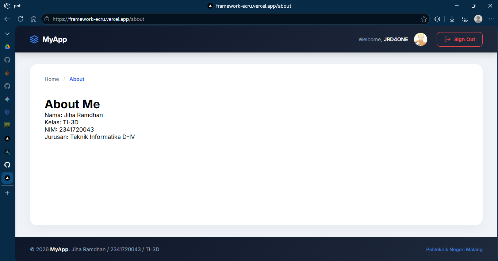<br>
- `/produk`<br>
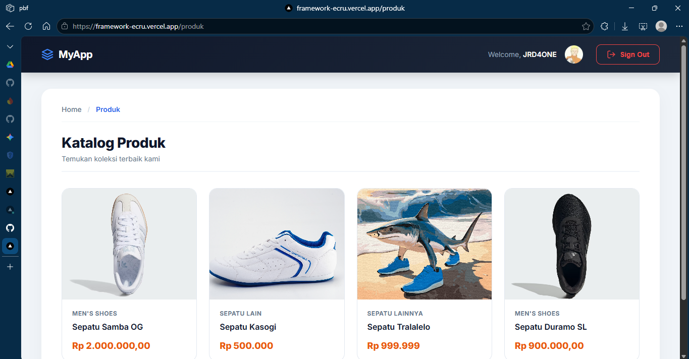<br>
- `/profile`<br>
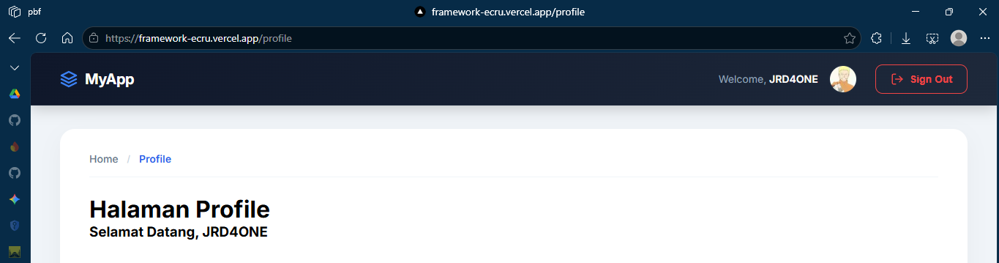<br>
- Login Google<br>
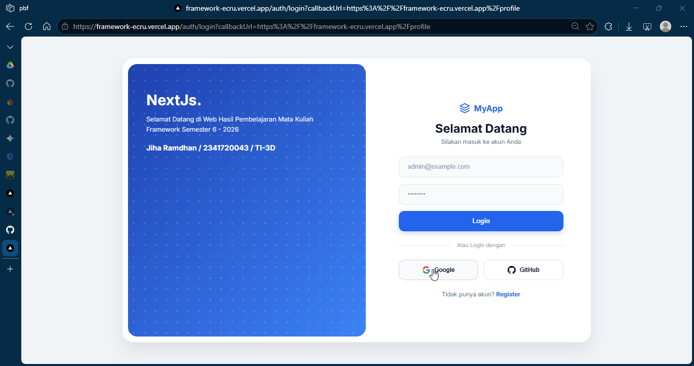<br>
- Login credential biasa<br>
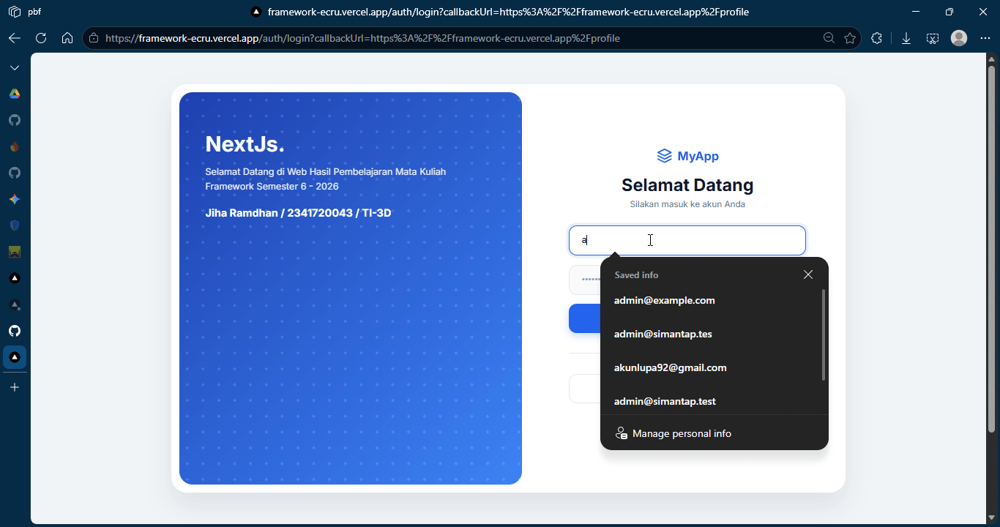<br>

Pastikan:
- SSR berjalan
- API tidak lagi `localhost`
- Database terkoneksi
- Google login berhasil

### Analisis Konsep

| Konsep | Penjelasan |
|---|---|
| SSG | Data diambil saat build |
| SSR | Data diambil saat request |
| CSR | Data diambil di browser |
| Environment Variable | Variabel rahasia/configuration |
| Redeploy | Build ulang setelah perubahan |
| OAuth Production | Harus update origin & callback |

### Refleksi & Diskusi
1. Mengapa `localhost` tidak boleh digunakan di production?  
    > Karena `localhost` hanya menunjuk ke komputer/server lokal. Di production, aplikasi harus mengakses URL publik agar bisa diakses pengguna dan layanan lain.

2. Mengapa SSG bisa gagal saat build?  
    > SSG mengambil data saat proses build. Jika API belum tersedia, URL salah, butuh autentikasi, atau terjadi error jaringan, maka build bisa gagal.

3. Apa perbedaan SSR dan SSG saat deployment?  
    > SSG membuat halaman saat build (cepat saat diakses, tapi data bisa tidak terbaru). SSR membuat halaman saat request (data lebih fresh, tetapi ada beban server tiap request).

4. Mengapa perlu redeploy setelah menambahkan environment?  
    > Karena environment variable dibaca saat proses build/runtime tertentu. Redeploy diperlukan agar konfigurasi baru ikut diterapkan ke deployment.

5. Apa fungsi redirect URI pada OAuth?  
    > Redirect URI adalah alamat tujuan setelah login OAuth berhasil. URI ini memvalidasi callback agar hanya diarahkan ke endpoint aplikasi yang sah dan aman.

### Kesimpulan
Pada praktikum ini Saya telah:
- Menghubungkan project dengan GitHub
- Melakukan deployment ke Vercel
- Mengelola environment variable
- Mengatasi error SSG
- Mengonfigurasi OAuth production
- Menguji aplikasi hasil deployment