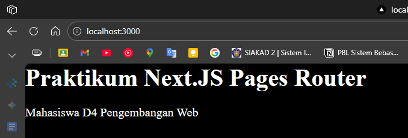
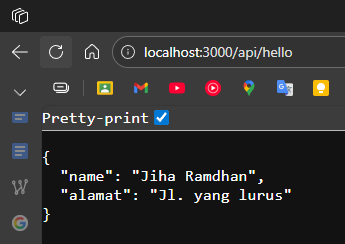
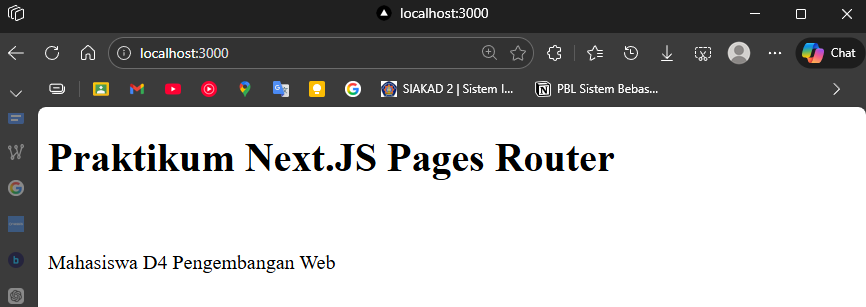
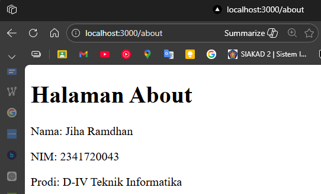
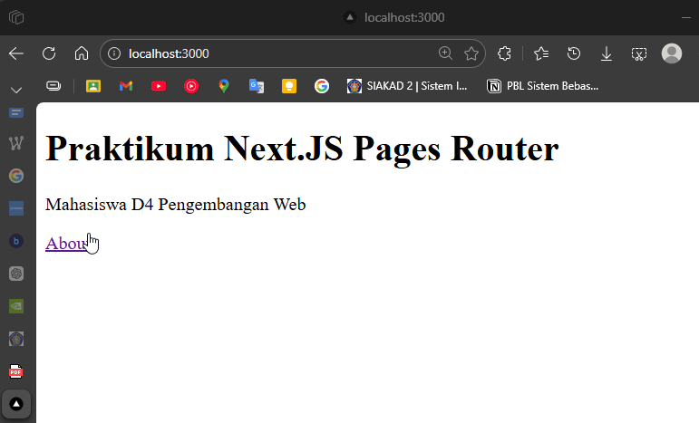

## Praktikum 01 - My-app  

### 1. Pengecekan Lingkungan

### 2. Membuat Project Next.JS

### 3. Menjalankan Server Development
 

### 4. Struktur Folder

### 5. Modifikasi Halaman Utama
  

### 6. Modifikasi API
  
  

### 7. Modifikasi Background
  

## Tugas Praktikum

### 1. Wajib

- Halaman baru about.js di folder pages
- Tampilkan:
  - Nama
  - NIM
  - Prodi
   

 

### 2. Pengayaan
- Tambahkan minimal 1 link navigasi dari halaman utama ke halaman about.  

 

## Pertanyaan
1. **Mengapa Pages Router disebut sebagai routing berbasis file?**
   > Karena setiap file yang ditambahkan ke dalam folder `pages` secara otomatis akan menjadi rute tanpa perlu konfigurasi manual.

2. **Apa perbedaan Next.js dengan React standar (CRA)?**
   > Next.js itu Framework dari React, sedangkan React standar (CRA) itu library nya JavaScript. Next.js mendukung Server-Side Rendering (SSR) dan Static Site Generation (SSG) secara bawaan, namun bisa juga menggunakan Client-Side Rendering (CSR), sedangkan React standar (CRA) umumnya hanya menggunakan Client-Side Rendering (CSR).

3. **Apa fungsi perintah npm run dev?**
   > Menjalankan aplikasi dalam mode pengembangan (development mode) yang menyertakan fitur *hot reloading* untuk melihat perubahan kode secara langsung tanpa refresh manual. berjalan di localhost:3000

4. **Apa perbedaan npm run dev dan run build?**
   > `npm run dev` digunakan untuk proses pengembangan lokal, sedangkan `npm run build` digunakan untuk mengompilasi dan mengoptimalkan aplikasi menjadi versi produksi yang siap dideploy. perubahan kode tidak akan terlihat sampai di-build ulang.