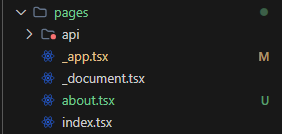
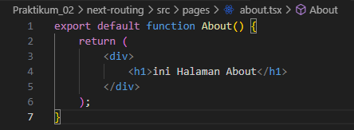
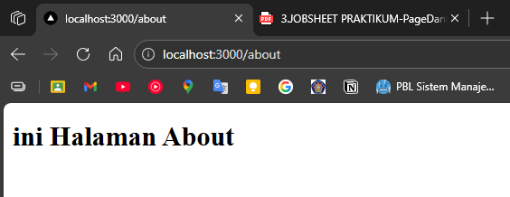
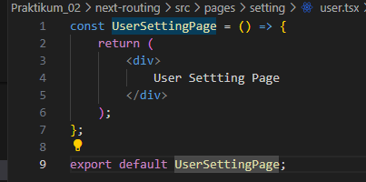
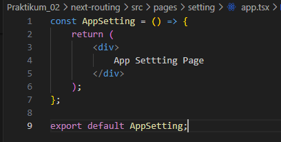
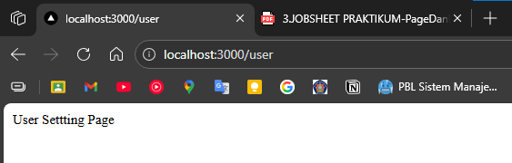
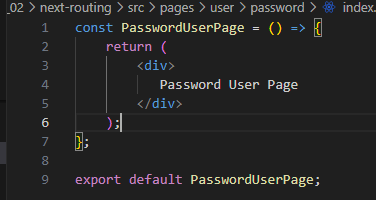

## Praktikum 02 - Next Routing  

### 1. Routing Dasar (Static Routing)
- membuat File baru about.tsx di dalam folder pages  
  
  
- matikan css pada file _app.tsx  
  

### 2. Routing Menggunakan Folder
- membuat folder about di dalam folder pages, lalu pindah about.tsx ke dalam folder tersebut dan rename menjadi index.tsx  
  

### 3. Nested Routing
- membuat folder setting di dalam folder pages berisi user.tsx dan app.tsx  
  
- user.tsx  
  
  
- app.tsx  
  
  

- Modifikasi struktur folder pages dengan menambahkan folder user dan user.tsx pada setting 
dipindah ke folder user dan mengubah file user.tsx menjadi index.tsx  
  
  

- Nested Lebih Dalam  
- menambah folder password pada folder user, dan tambahkan file index.tsx  
  
  
  

