## Praktikum 02 - Next Routing  

### 1. Routing Dasar (Static Routing)
- membuat File baru about.tsx di dalam folder pages  
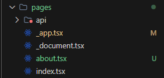  
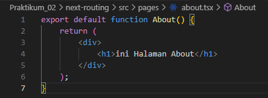  
- matikan css pada file _app.tsx  
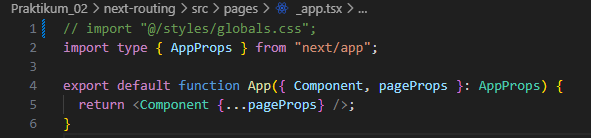  
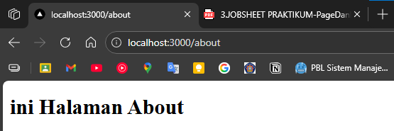

### 2. Routing Menggunakan Folder
- membuat folder about di dalam folder pages, lalu pindah about.tsx ke dalam folder tersebut dan rename menjadi index.tsx  
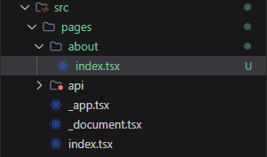  
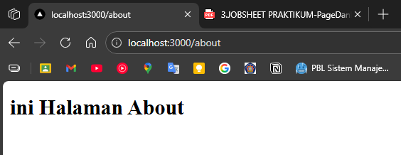

### 3. Nested Routing
- membuat folder setting di dalam folder pages berisi user.tsx dan app.tsx  
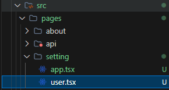  
- user.tsx  
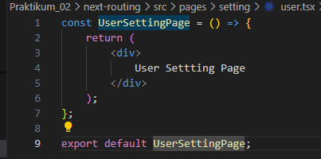  
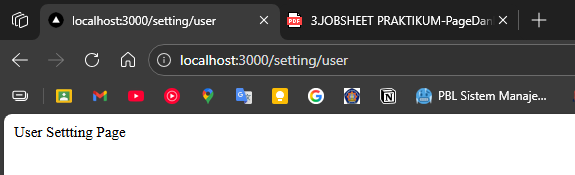  
- app.tsx  
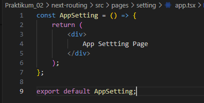  
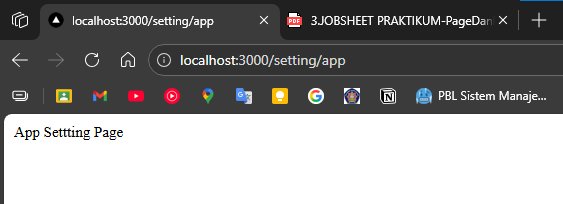  

#### Modifikasi struktur folder pages dengan menambahkan folder user, lalu user.tsx yang ada pada setting, itu dipindah ke folder user. kemudian ubah nama file user.tsx menjadi index.tsx  
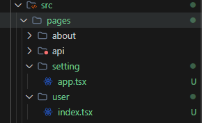  
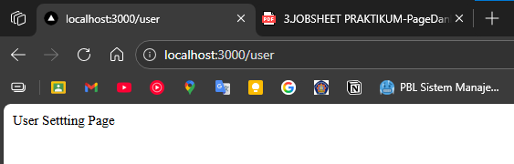  

#### Nested Lebih Dalam  
- menambah folder password pada folder user, dan tambahkan file index.tsx  
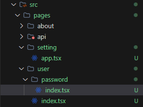  
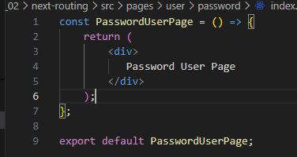  
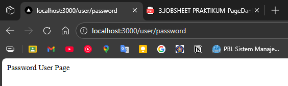  

### 4. Dynamic Routing
- membuat folder produk di dalam folder pages, lalu tambahkan file index.tsx dan [id].tsx  
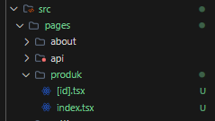 
- index.tsx  
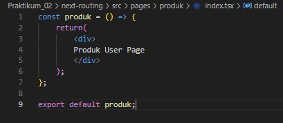 
- [id].tsx bersama console.log menggunakan extension Console Ninja 
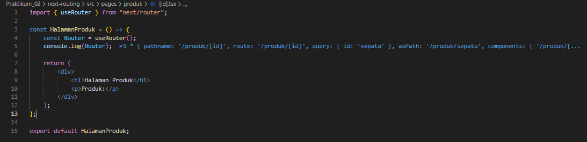  
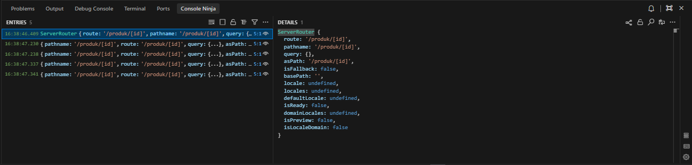
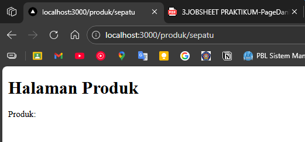

#### modifikasi [id].tsx agar dapat mengambil nilai dari id
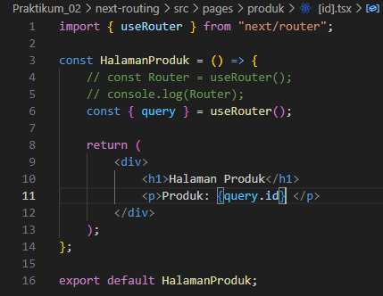  
- produk/sepatu  
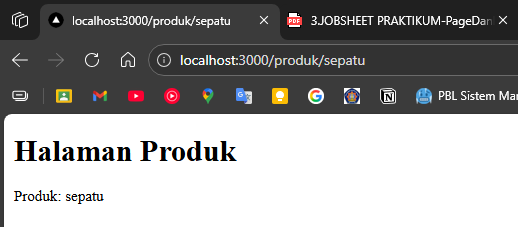  
- produk/baju  
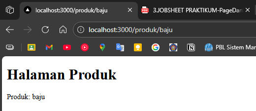  
- produk/helm-baru  
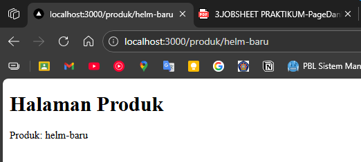  

### 5. Membuat Component Navbar
- membuat file index.tsx di dalam folder component/layouts/navbar  
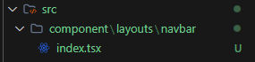  
- component/layouts/navbar/index.tsx  
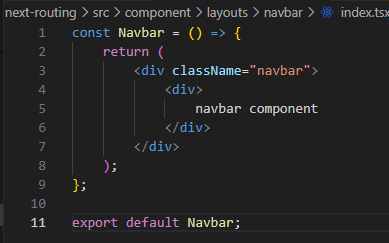  
- style/globals.css  
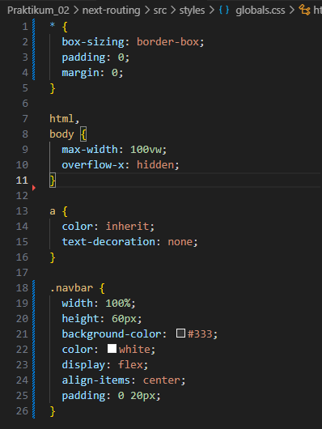  
- pages/index.tsx  
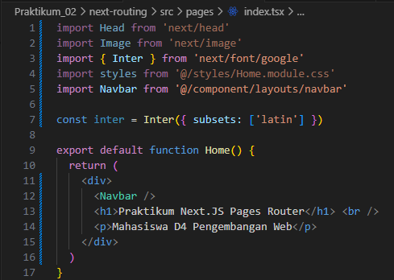  
- pages/app.tsx  
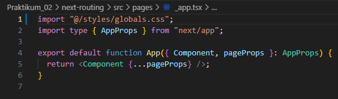  
- navbar muncul dan hanya tampil di index page awal, karena yang ditambahkan hanya di page tersebut
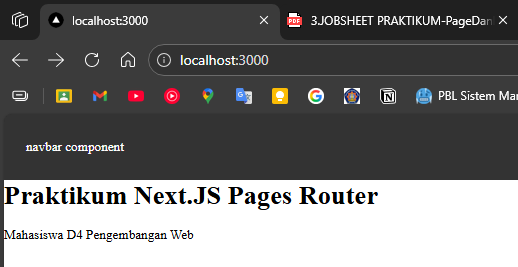 

#### Modifikasi Navbar agar muncul di semua page  
- hapus navbar pada file index.tsx 
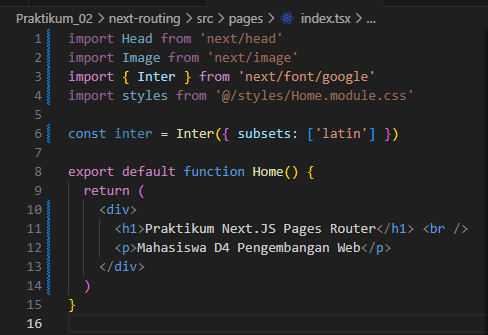  
- tambahkan pada app.tsx  
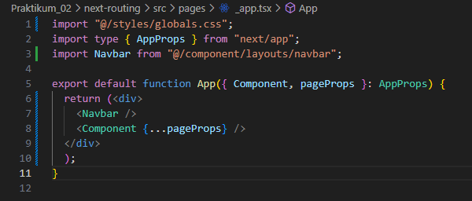  
- hasil  
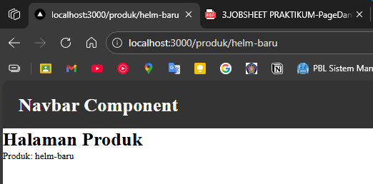
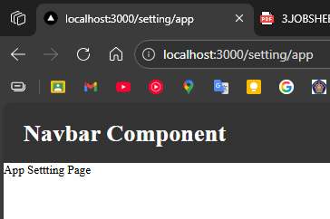
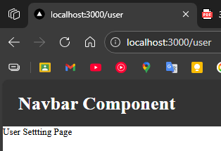
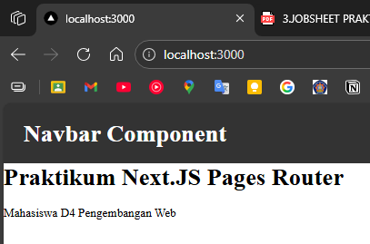

### 6. Membuat Layout Global (App Shell)
- buat folder appshell di dalam folder component/layouts  
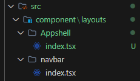  
- component/layouts/appshell/index.tsx  
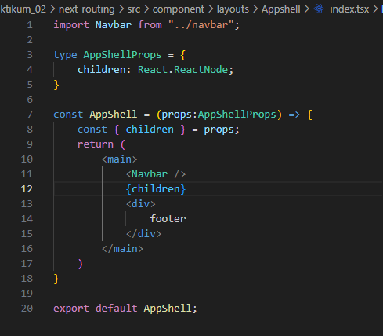  

### 7. Implementasi Layout di _app.tsx
- pages/_app.tsx  
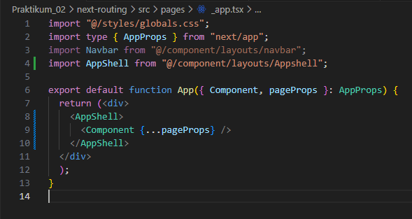  

#### Sebelum AppShell
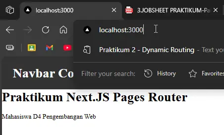  
#### Sesudah AppShell
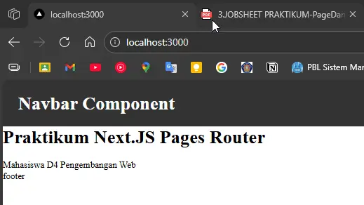  

## Tugas Praktikum

### Tugas 1 - Routing
1. buat Routing:  
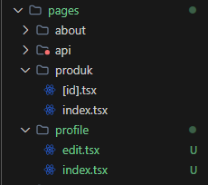  
    - /profile  
    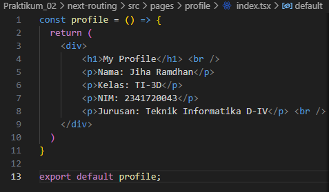  
    - /profile/edit  
    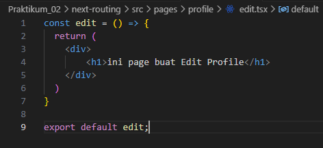

output:  
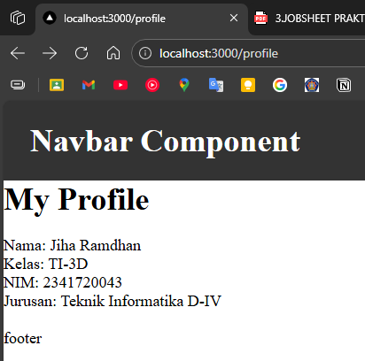  
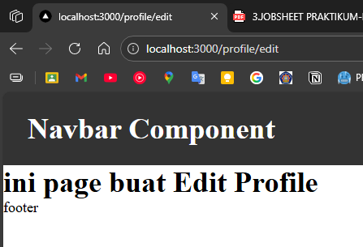  

### Tugas 2 - Dynamic Routing
1. buat routing /blog/[slug]  
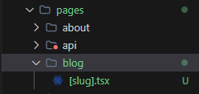  
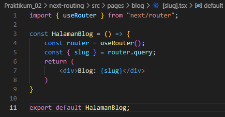  

output:  
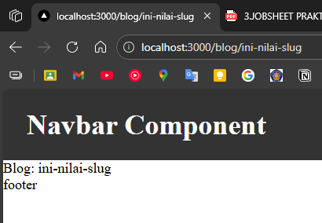  

### Tugas 3 - Layout
1. Tambahkan Footer pada AppShell dan tampil di semua halaman.  

- Sudah dilakukan pada Langkah ke 7, disini saya hanya mengubah style nya saja.
- style/globals.css  
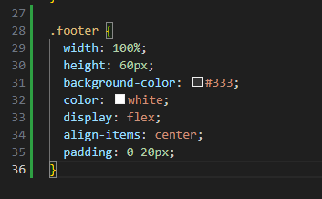  
- component/layouts/Appshell/index.tsx  
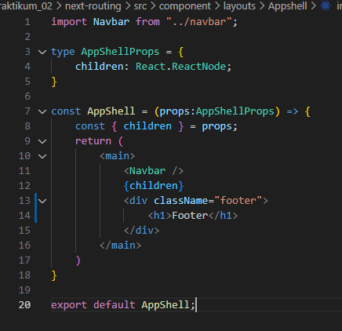  

Output:  
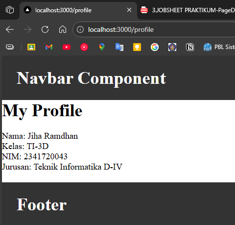  

## Pertanyaan Refleksi
1. **Apa perbedaan routing berbasis file dan routing manual?**
    > Routing berbasis file secara otomatis memetakan struktur folder dan file menjadi jalur URL (contohnya seperti yang sudah dilakukan pada praktikum ini dengan Next.js), sedangkan routing manual memerlukan pendefinisian setiap rute secara eksplisit di dalam kode (seperti di React Router, atau saat menggunakan laravel).

2. **Mengapa dynamic routing penting dalam aplikasi web?**
    > Karena memungkinkan aplikasi untuk menangani konten yang bersifat variabel atau berjumlah banyak (seperti ID produk atau slug blog) hanya dengan satu template file, sehingga lebih efisien dan skalabel.

3. **Apa keuntungan menggunakan layout global dibanding memanggil komponen satu per satu?**
    > Menjamin agar UI di seluruh halaman konsisten, dan  mempermudah pemeliharaan kode karena perubahan cukup dilakukan di satu file (App Shell), terus juga mencegah render ulang komponen yang sama (seperti Navbar/Footer) saat navigasi.

