## Praktikum 03 - Link Navigation  

### 1. Test Run Project
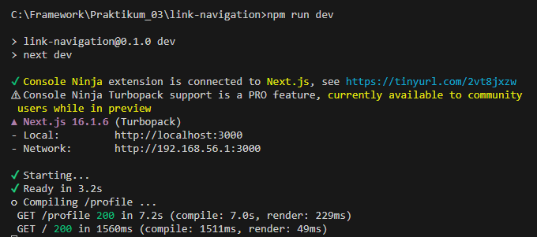  
  

### 2. Membuat Catch-All Route
- pada folder pages, Buat folder shop dan file […slug].tsx  
  
- Isi file  […slug].tsx
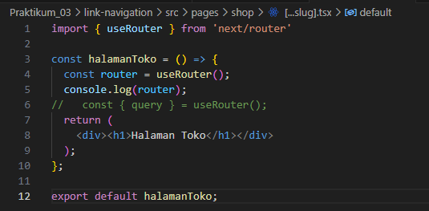  
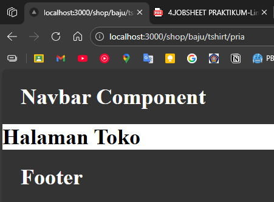  
- Cek menggunakan console.log 
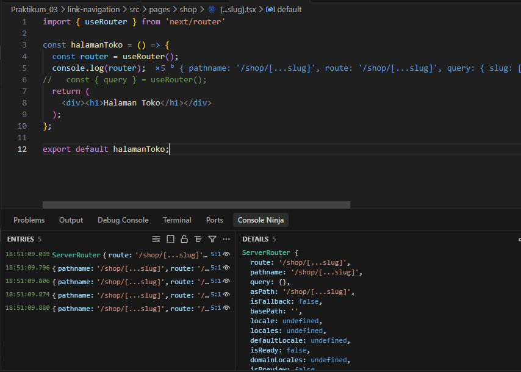  
- Modifikasi [...slug].tsx untuk menampilkan nilai query 
  

### 3.  Pengujian Catch-All Route
- /shop/clothes 
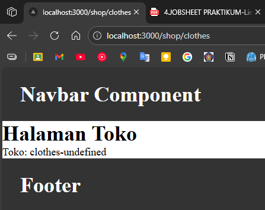  
- /shop/clothes/tops  
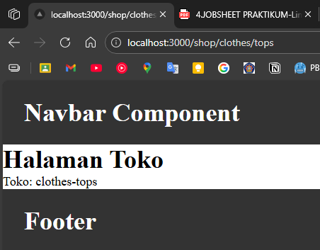 
- /shop/clothes/tops/t-shirt  
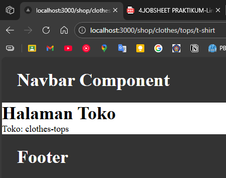 
ada yang tidak terbaca ini dikarenakan segmennya dibatasi Cuma array[0] dan array[1]. 
- Modifikasi […slug].tsx  
  
- Berapapun banyaknya segment tetap terbaca  
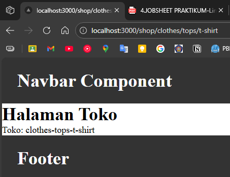  
  

### 4. Optional Catch-All Route 
- jika mengakses /shop saja maka akan terjadi error
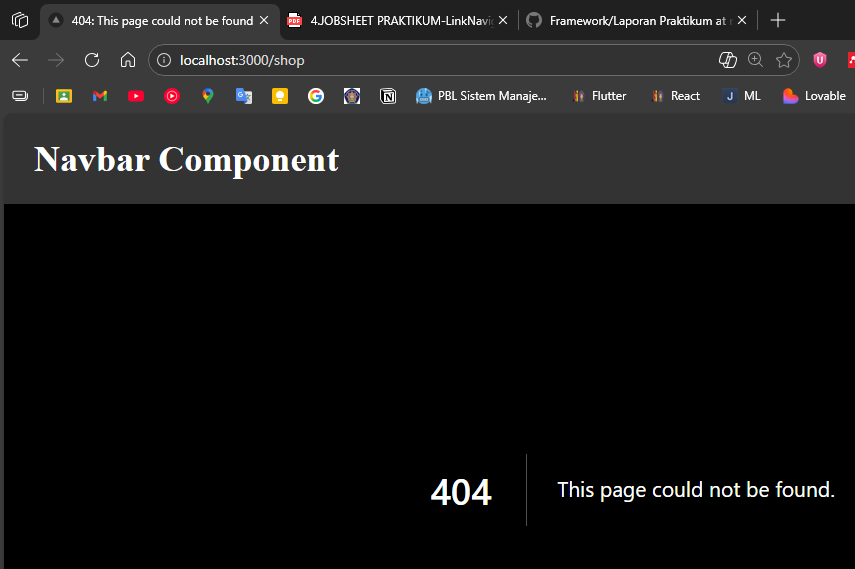  
-  Rename file: [...slug].js → [[...slug]].js agar tidak error saat hanya mengakses /shop 
  
- hasil
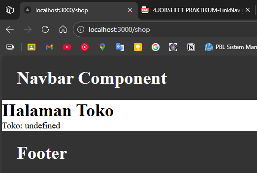  

### 5. Validasi Parameter
- Menambah validasi agar tidak error saat slug kosong  
  
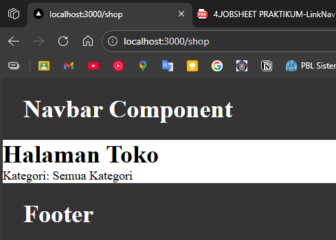  

### 6. Membuat Halaman Login & Register
- pada folder pages, buat folder auth, lalu buat file login.jsx dan register.jsx 
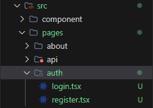  
- login.jsx  
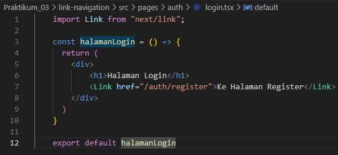 
- register.jsx  
 
- hasil
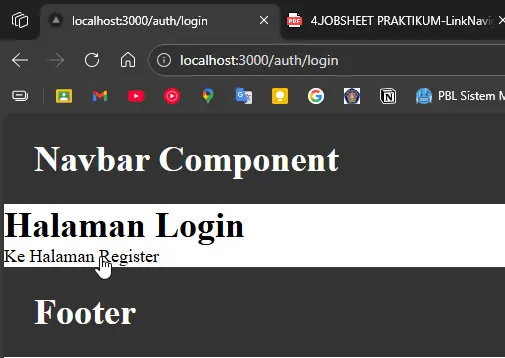  

### 7. Navigasi Imperatif (router.push) 
- tambah button login: mengarah ke /produk  
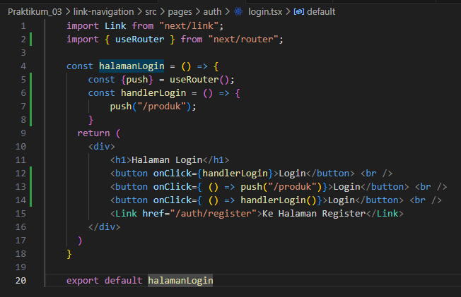  
- Hasil  
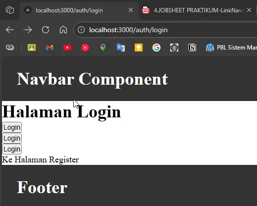  
#### Perbandingan Penggunaan onClick di React
| Kode | Cara Kerja | Dipanggil Saat | Kelebihan | Kekurangan | Rekomendasi |
|------|------------|---------------|-----------|------------|-------------|
| `onClick={handlerLogin}` | Mengirim referensi fungsi | Tombol diklik | Bersih, efisien, best practice | Tidak bisa kirim parameter langsung | ✅ Sangat direkomendasikan |
| `onClick={() => push('/produk')}` | Arrow function memanggil fungsi | Tombol diklik | Praktis untuk navigasi sederhana | Kurang reusable jika logika bertambah | ✅ Cocok untuk navigasi sederhana |
| `onClick={() => handlerLogin()}` | Arrow function membungkus fungsi | Tombol diklik | Fleksibel kirim parameter | Redundant jika tanpa parameter | ⚠ Gunakan jika perlu argumen |
| `onClick={handlerLogin()}` | Fungsi langsung dieksekusi | Saat render | - | ❌ Bug: tidak menunggu klik | 🚫 Tidak direkomendasikan |

### 8. Simulasi Redirect (Belum Login)
- pada index.tsx tambahkan beberapa code
- Jika Akses /product → otomatis diarahkan ke login.

## Tugas Praktikum

### Tugas 1 (Wajib)
- Buat catch-all route: 
    - /category/[...slug].js 
    - Tampilkan seluruh parameter URL dalam bentuk list. 

### Tugas 2 (Wajib)
- Buat navigasi: 
    - Login → Product (imperatif) 
    - Login ↔ Register (Link) 

### Tugas 3 (Pengayaan)
- Terapkan redirect otomatis ke login jika user belum login

## Pertanyaan Refleksi
1. **Apa perbedaan [id].js dan [...slug].js?**
    >
2. **Mengapa slug berbentuk array?**
    >
3. **Kapan sebaiknya menggunakan Link dan router.push()?** 
    >
4. **Mengapa navigasi Next.js tidak me-refresh halaman?**
    >

