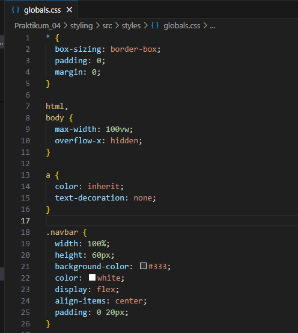
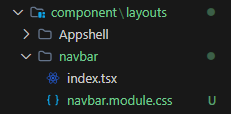
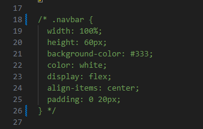
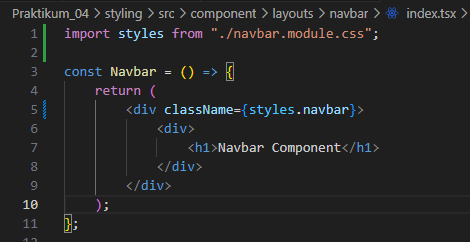

## Praktikum 04 - Styling  

### 1. Global CSS
- `styles/globals.css`  
  
- `pages/_app.tsx`  
 

### 2. CSS Module (Local Scope)
**a. Struktur Komponen Navbar**  
`src/components/layout/Navbar/`  
├── `index.tsx`  
└── `Navbar.module.css`  
  
**b. File CSS Module**  
- Modifikasi `global.css`  
  
- Modifikasi `navbar.module.css`  
 
**c. Pemanggilan di Komponen**  
- Modifikasi kode pada `index.tsx` pada folder navbar  
 
- Jalankan browser  
 

### 3. Styling Untuk Pages (CSS Module)
### 4. Conditional Rendering Navbar (Tanpa Navbar di Login)
### 5. Refactoring Struktur Project (Best Practice)
### 6. Inline Styling (CSS-in-JS)
### 7. Kombinasi Global CSS + CSS Module
### 8. SCSS (SASS)
### 9. Tailwind CSS

## Tugas Praktikum

### Tugas 1
- Buat halaman Register
- Gunakan CSS Module

### Tugas 2
- Refactor halaman Produk ke folder views
- Pisahkan Hero Section dan Main Section

### Tugas 3
- Terapkan Tailwind CSS
- Gunakan minimal 5 utility class

## F. Pertanyaan Refleksi
1. **Kapan sebaiknya menggunakan CSS Module dibanding Global CSS?**
    >
2. **Apa kelemahan inline styling?**
    >
3. **Mengapa SCSS cocok untuk project skala besar?**
    >
4. **Apa keunggulan Tailwind dibanding CSS tradisional?**
    >

