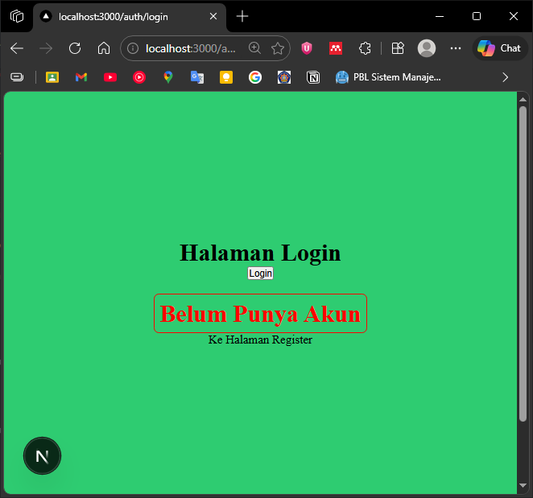
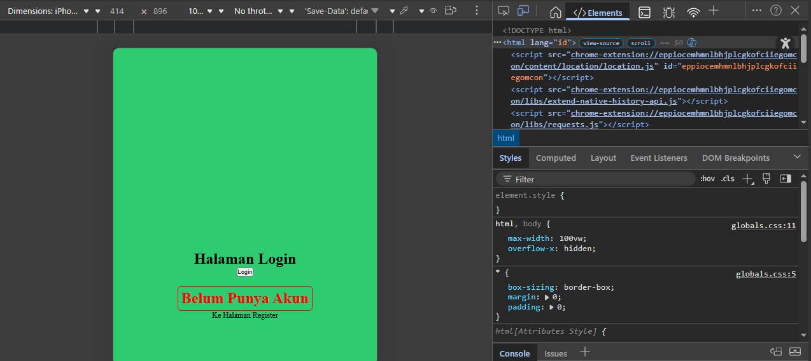

## Praktikum 05 - Custom Error & Document

### 1. Menjalankan Project
1. Buka folder project
2. Jalankan: `npm run dev`
3. Akses: `http://localhost:3000` 
 

**Jika ada kendala tampilan:**
- Uninstall Tailwind: `npm uninstall tailwindcss postcss autoprefixer`
- Hapus file konfigurasi:
    - `tailwind.config.js`
    - `postcss.config.js` 
disini saya kembalikan ke sebelum memakai tailwind  
 

### 2. Membuat Custom Document
- Masuk ke folder `pages/_document.js`
- Modifikasi dengan kode yang sesuai
  
- Periksa di Inspect Element bahwa atribut `lang="id"` sudah berubah  
  

### 3. Pengaturan Title per Halaman
1. Buka `pages/index.js`
2. Tambahkan title halaman
3. Refresh dan perhatikan judul tab browser

### 4. Membuat Custom Error Page (404)
- Buat file `pages/404.tsx`
- Akses URL yang tidak ada, misalnya: `/dashboard`

### 5. Styling Halaman 404
1. Buat file `styles/404.module.scss`
2. Modifikasi `pages/404.tsx` dengan style yang dibuat
3. Untuk menghilangkan navbar, tambahkan `/404` pada daftar disable navbar

### 6. Menampilkan Gambar dari Folder Public
1. Download gambar 404 dari https://undraw.co/
2. Simpan sebagai `public/page-not-found.png`
3. Modifikasi `404.tsx`: ``

### E. Tugas Praktikum

**Tugas 1 (Wajib)**
- Tambahkan judul halaman, deskripsi, dan gambar ilustrasi

**Tugas 2 (Wajib)**
- Custom warna, font, dan layout halaman 404
- Navbar tidak tampil di halaman 404

**Tugas 3 (Pengayaan)**
- Tambahkan tombol "Kembali ke Home" dengan Next.js Link

### F. Pertanyaan Evaluasi
1. Apa fungsi utama `_document.js`?
    >
2. Mengapa `<title>` tidak disarankan di `_document.js`?
    >
3. Apa perbedaan halaman biasa dan halaman `404.js`?
    >
4. Mengapa folder public tidak perlu di-import?
    >
