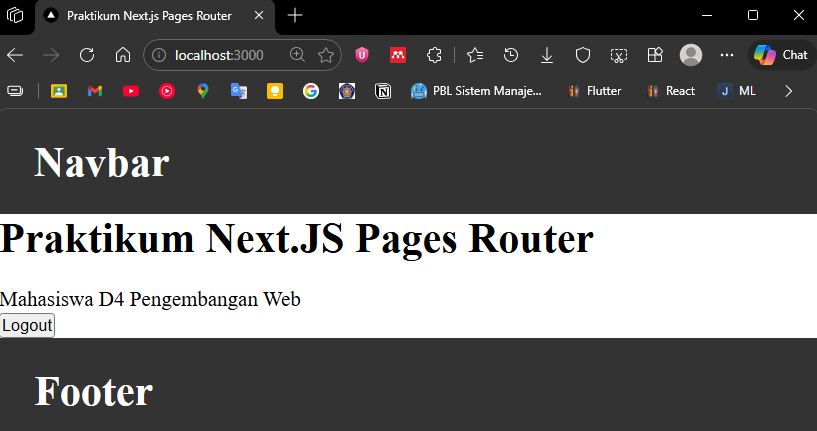

## Praktikum 06 - API Routes

### Langkah 1 – Menjalankan Project
- `npm run dev`
- Akses: http://localhost:3000<br>
<br>

### Langkah 2 – Membuat API Produk
1. Buat file `pages/api/produk.js`
2. Tambahkan data statis
3. Akses: http://localhost:3000/api/produk

### Langkah 3 – Fetch Data API di Frontend
1. Buka `pages/product/index.tsx`
    - Modifikasi kode
    - Tambahkan `useEffect()` dan comment useEffect untuk isLogin
2. Jalankan browser: http://localhost:3000/produk

## Integrasi Firebase

### Langkah 5 – Setup Firebase
1. Buka Firebase Console (login dengan Google)
    - **Note:** Jangan lupa select parent resource
    - **Note:** Klik create project dan disable Google Analytics
    - **Note:** Klik add app dan pilih web
    - **Note:** Klik register app
    - **Note:** Klik continue to console

2. Aktifkan Firestore Database
    - Klik create database
    - Ubah rules menjadi `true` dan klik publish

3. Buat collection: `products`
    - Gunakan auto-id

### Langkah 6 – Install Firebase
1. `npm install firebase`
2. Buat folder dan file: `pages/utils/db/firebase.ts`
3. Copy paste konfigurasi ke file `firebase.ts`

### Langkah 7 – Konfigurasi Environment Variable
1. Buat file: `.env.local`
2. Modifikasi file `.env`:
    ```
    FIREBASE_API_KEY=xxxx
    FIREBASE_AUTH_DOMAIN=xxxx
    FIREBASE_PROJECT_ID=xxxx
    FIREBASE_STORAGE_BUCKET=xxxx
    FIREBASE_MESSAGING_SENDER_ID=xxxx
    FIREBASE_APP_ID=xxxx
    ```

### Langkah 8 – Konfigurasi Firebase
- Modifikasi `firebase.ts`

### Langkah 9 – Ambil Data dari Firestore
1. Buat file: `utils/db/servicefirebase.js`
2. Modifikasi file `servicefirebase.js`

### Langkah 10 – API Mengambil Data Firebase
1. Edit `pages/api/product.js`
2. Jalankan browser: http://localhost:3000/api/produk
3. Modifikasi `index.ts` pada produk sesuaikan nama type dan database

## E. Tugas Praktikum

### Tugas 1 (Wajib)
- Tambahkan minimal 3 data produk di Firestore
- Pastikan data tampil di halaman produk

### Tugas 2 (Wajib)
- Tambahkan field baru: `category`
- Tampilkan category di frontend

### Tugas 3 (Pengayaan)
- Tambahkan tombol Refresh Data
- Gunakan fetch ulang tanpa reload halaman

## F. Pertanyaan Evaluasi
1. Apa fungsi API Routes pada Next.js?
2. Mengapa `.env.local` tidak boleh di-push ke repository?
3. Apa perbedaan data statis dan data dinamis?
4. Mengapa Next.js disebut framework fullstack?
