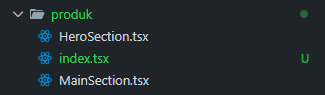
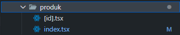
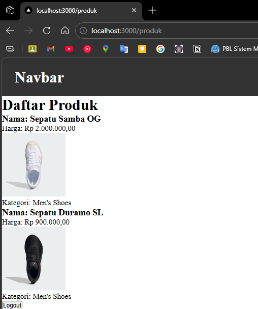
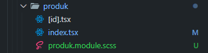
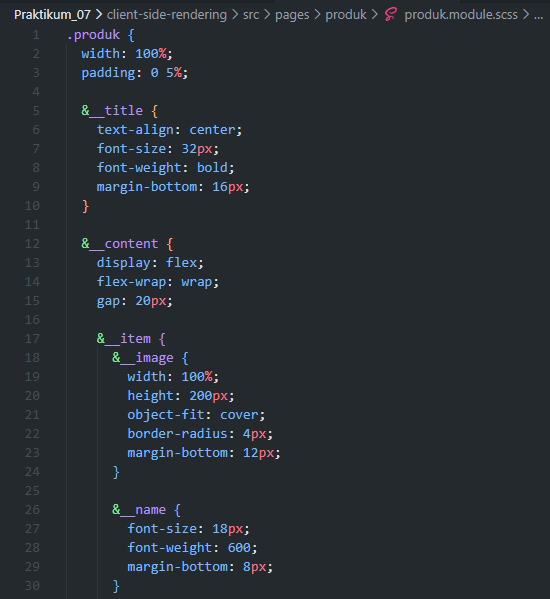
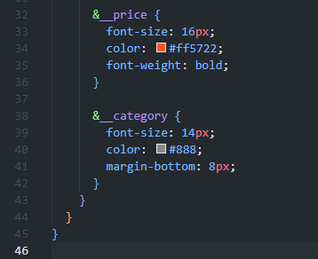
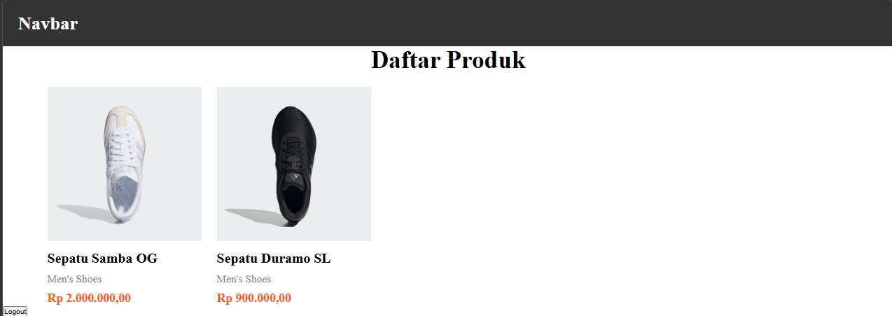

## Praktikum 07 - Client-Side Rendering

### Langkah 1: Setup Data Produk
1. Siapkan project Next.js
2. Buat endpoint API `/api/produk`
3. Pastikan data memiliki struktur:
    - `id`
    - `nama`
    - `kategori`
    - `harga`
    - `image`
4. Jalankan: `http://localhost:3000/api/products` 
 

### Langkah 2: Implementasi CSR dengan useEffect
1. Buat file `index.tsx` di folder `views/produk` 
 
2. Modifikasi `index.tsx` 
 
3. Buka file `index.tsx` di `pages/produk/` 
 
4. Modifikasi `index.tsx` 
 
5. Jalankan: `http://localhost:3000/produk` 
 
6. Buat file `produk.module.scss` di folder `produk` 
 
7. Modifikasi `produk.module.scss` 
 
 
8. Modifikasi `index.tsx` di `pages/views/produk` 
 
9. Jalankan browser 
 

### Langkah 3: Implementasi Skeleton Loading
- Modifikasi `views/produk/index.tsx`
- Modifikasi `product.module.scss`
- Jalankan browser untuk melihat skeleton dengan animasi blinking
- Skeleton akan ditampilkan terlebih dahulu, kemudian gambar dan data produk

### Langkah 5: Implementasi SWR
[SWR Documentation](https://swr.vercel.app/)

1. Install SWR: `npm install swr`
2. Buat folder `utils/swr` dan file `fetcher.ts`
3. Modifikasi `fetcher.ts`
4. Update `pages/produk/index.tsx`

### Perbandingan
- useEffect manual vs SWR

### Tugas Praktikum
1. Jelaskan perbedaan:
    - Client Side Rendering (CSR)
    - Server Side Rendering (SSR)
    - Static Site Generation (SSG)
2. Buat halaman produk dengan skeleton loading dan animasi
3. Refactor dari useEffect menjadi SWR

### Troubleshooting
Jika error saat mengakses `http://localhost:3000/produk/server`, modifikasi file `index.tsx` di folder `views/product/`
