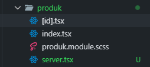
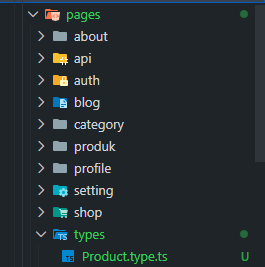
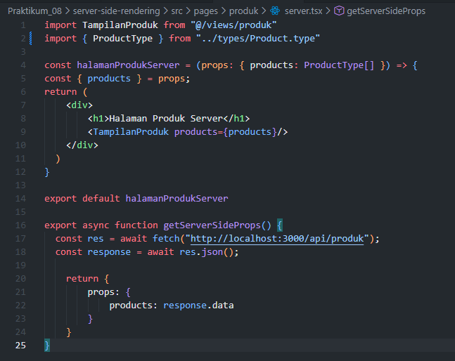

## Praktikum 08 - Server-Side Rendering

### Langkah 1 – Setup Halaman SSR
1. Buat file baru pada `pages/products/server.tsx` 
 
2. Modifikasi file `server.tsx` 
 
3. Jalankan browser: `http://localhost:3000/produk/server` 
 

### Langkah 2 – Implementasi getServerSideProps
1. Tambahkan `getServerSideProps` pada `server.tsx` 
 
2. Jalankan browser: `http://localhost:3000/produk/server` 
 

**Catatan:**
- Skeleton tidak muncul dan data langsung tampil
- Harus menggunakan full URL
- Dipanggil setiap kali halaman di-request

### Langkah 3 – Refactor Type
1. Buat folder `types` pada folder `pages` dan file `Product.type.ts` 
 
2. Modifikasi `Product.type.ts` 
 
3. Update file `server.tsx` dengan tipe yang baru 
 

### Langkah 4 – Uji Perbedaan SSR vs CSR

**Uji 1 – Skeleton:**
- Halaman CSR: skeleton muncul saat refresh
- Halaman SSR: skeleton tidak muncul 

**Uji 2 – Network Tab:**
- CSR: request API terlihat di DevTools → Network → XHR
- SSR: request API tidak terlihat 

**Uji 3 – Response HTML:**
- CSR: HTML awal kosong (berisi skeleton)
- SSR: HTML sudah berisi data lengkap 

## D. Tugas Praktikum

**Tugas Individu:**
1. Buat 2 halaman: `/products` (CSR) dan `/products/server` (SSR)
2. Dokumentasikan dengan screenshot dan analisis perbedaan Network tab dan View Source
3. Buat laporan analisis minimal 2 halaman

## E. Studi Analisis
1. Mengapa SSR lebih baik untuk SEO?
2. Kapan sebaiknya menggunakan SSR?
3. Apa kekurangan SSR dibanding CSR?
4. Mengapa skeleton tidak muncul pada SSR?
