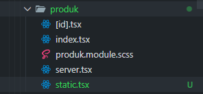
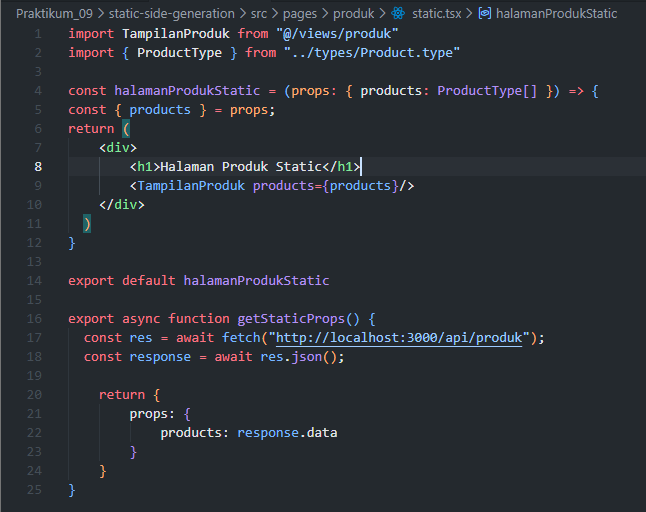
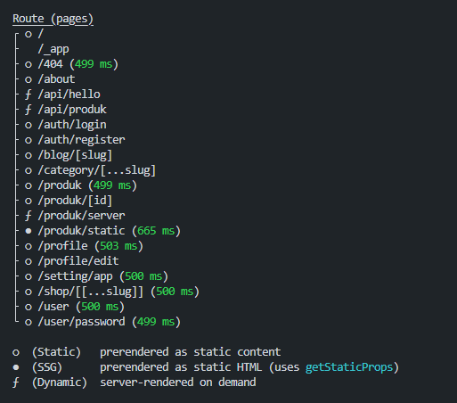

## Praktikum 09 - Static Side Generation

### Langkah 1 – Setup Halaman Static
1. Buat file baru pada `pages/products/static.tsx` 
 
2. Modifikasi file `static.tsx` 
 

**Catatan:**
- Mirip dengan SSR
- Perbedaan hanya pada nama method

> di Jobsheet tidak ada langkah 2

### Langkah 3 – Build Production Mode
1. Pindahkan folder `Views`, `utils`, dan `styles` ke luar folder `pages` 
> Views, styles sudah ada di luar folder `pages`, jadi tinggal pindah `utils`, dan juga saya pindahkan folder `types` ke luar pages, karena sempat error.
 
 

2. Jalankan `npm run build` 
 

3. Buka dua terminal:
  - **Terminal 1:** `npm run dev` 
   
  - **Terminal 2:** tunggu hingga build selesai 
   
4. Jalankan `npm run start` dan Verifikasi di `http://localhost:3000/produk/static` 
 
 

**Jika Error:**
- Hapus folder `.next`: `Remove-Item -Recurse -Force .next`
- Jalankan: `npm run dev`

### Langkah 4 – Menjalankan Production
1. Pastikan `npm run dev` sudah dihentikan
2. Jalankan `npm run start`
3. Akses: `http://localhost:3000/products/static`

### Langkah 5 – Pengujian Perubahan Data

**Uji 1 – Tambah Data di Database:**
1. Buka database Firebase dan tambahkan produk baru
2. Bandingkan hasil:
  - `/products` (CSR) → Data bertambah
  - `/products/server` (SSR) → Data bertambah
  - `/products/static` (SSG) → Data tidak berubah

**Uji 2 – Build Ulang:**
1. Jalankan `npm run build` dan `npm run dev` secara bersamaan
2. Jalankan `npm run start` (hentikan `npm run dev` terlebih dahulu)
3. Refresh halaman static → Data baru muncul

### Tugas Praktikum
1. Buat 3 halaman: CSR, SSR, dan SSG
2. Lakukan pengujian: tambah data, hapus data, dan bandingkan hasil
3. Buat laporan analisis minimal 3 halaman

### Studi Analisis
1. Mengapa SSG tidak menampilkan data terbaru?
2. Mengapa SSG lebih cepat?
3. Kapan SSG tidak cocok digunakan?
4. Mengapa e-commerce tidak cocok menggunakan SSG murni?
5. Apa perbedaan build mode dan development mode?
