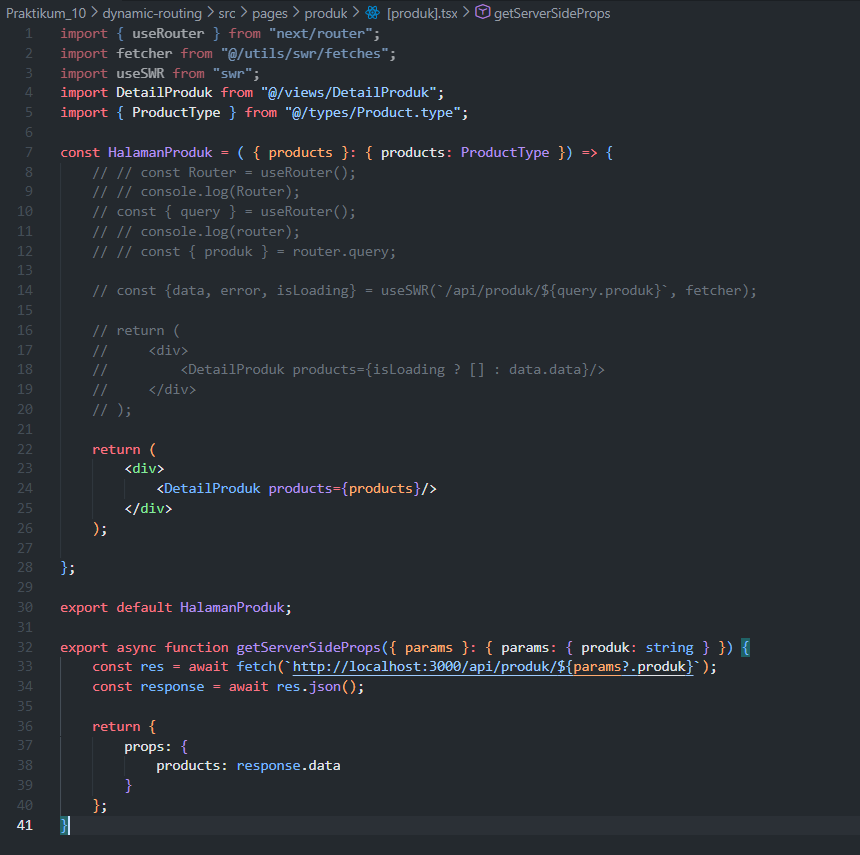
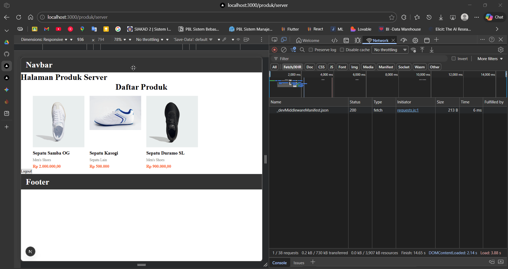
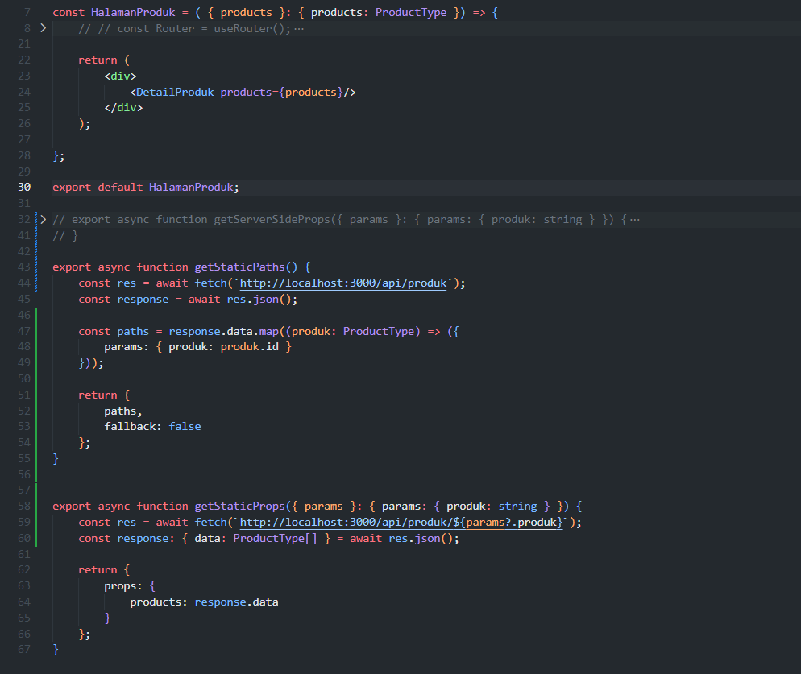
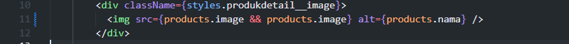
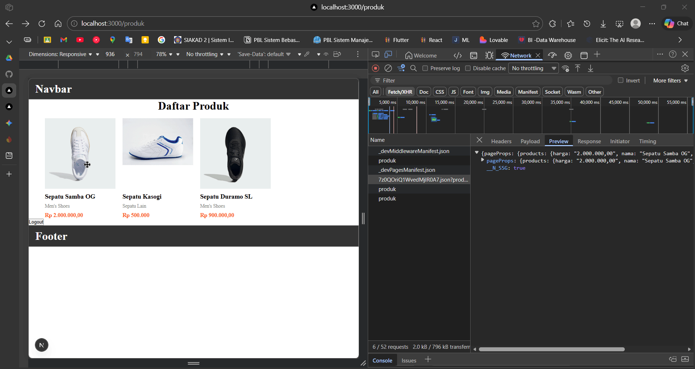
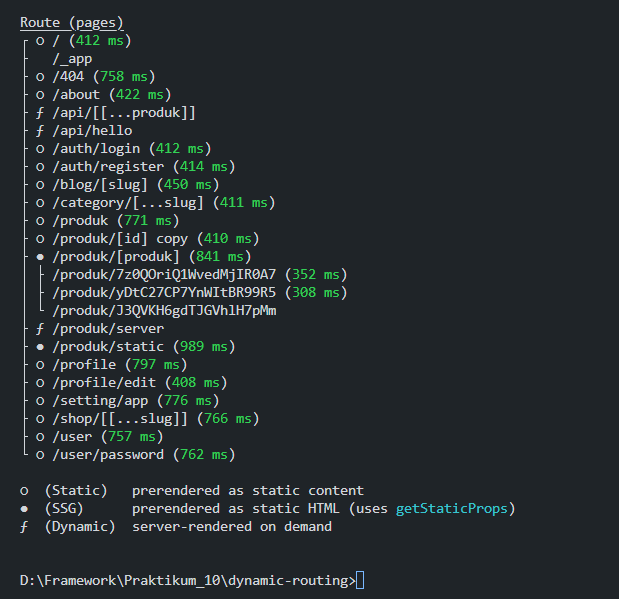
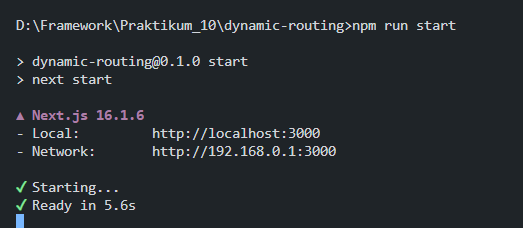

## Praktikum 10 - Dynamic Routing

### Langkah 1 – Membuat Dynamic Route
1. Buka file `pages/products/[product].tsx` dan modifikasi sesuai (line 20) 
 
2. Jalankan browser di `http://localhost:3000/produk`
3. Klik salah satu gambar untuk menuju halaman detail
 

### Langkah 2 – Implementasi CSR (Client-Side Rendering)
1. Modifikasi file `[produk].tsx` di folder `src/pages/produk/`
 
2. Rename file `produk.ts` (folder `pages/api/`) menjadi `[[...produk]].ts` 
  
3. Update file `servicefirebase.ts`

4. Update file `[[...produk]].ts` 
 
 
 
5. Buat file `index.tsx` di folder `views/DetailProduk` dan `detailProduk.module.scss`
 
- `detailProduk.module.scss` 
 
 
 
- `index.tsx` 
 
6. Modifikasi `[produk].tsx` di `src/pages/produk/` 
 
7. Test: `http://localhost:3000/produk/` → klik produk → `http://localhost:3000/produk/"id produk"` 
 
- update style center title 
 

### Langkah 3 – Implementasi SSR (Server-Side Rendering)
1. Comment line 9-20 di `[produk].tsx` dan tambahkan kode SSR 
 
2. Test: `http://localhost:3000/produk/server` 
 
3. Catatan: Tidak ada loading state karena data sudah tersedia sebelum render 

### Langkah 4 – Implementasi SSG (Static Site Generation)
1. Modifikasi `[produk].tsx` dengan `getStaticPaths` dan `getStaticProps` 
 
2. Update `index.tsx` di `src/views/DetailProduct` 
 
3. Test: `http://localhost:3000/produk` 
 

### Pengujian

| Metode | Tindakan | Hasil |
|--------|----------|-------|
| **CSR** | Refresh halaman → Periksa Network XHR | Ada loading; API request terlihat |
| **SSR** | Refresh halaman | Tidak ada loading; fetch tidak terlihat |
| **SSG** | Build → Start → Tambah produk → Refresh | Produk baru tidak muncul sampai build ulang |

### Tugas Praktikum

**Tugas Individu:**
1. Implementasikan halaman detail dengan CSR, SSR, dan SSG
2. Buat tabel perbandingan CSR vs SSR vs SSG (Loading, Build Required, SEO, Perubahan Data)
3. Dokumentasikan: Screenshot, Network tab, Build result

### Implementasi dan Dokumentasi
### CSR
 
### SSR
 
### SSG
 
 
- Setelah Build 

 

### Tabel Perbandingan
| Aspek | CSR (Client-Side Rendering) | SSR (Server-Side Rendering) | SSG (Static Site Generation) |
| :--- | :--- | :--- | :--- |
| **Loading** | Tampilan dasar cepat muncul, tapi data butuh jeda waktu (*loading*) untuk tampil karena di-fetch dari browser. | Tampilan awal mungkin sedikit lebih lama (menunggu server merender), tapi saat muncul data sudah utuh. | **Sangat Cepat**. Halaman langsung muncul secara utuh seketika karena HTML sudah disiapkan sebelumnya. |
| **Build Required** | Tidak wajib untuk data. Data diambil saat aplikasi sudah berjalan (Runtime). | Tidak wajib untuk data. Data diambil setiap kali ada *request* (Runtime). | **Wajib**. Data diambil dan halaman HTML dibuat secara permanen *pada saat* proses `npm run build` dijalankan. |
| **SEO** | **Kurang Bagus**. Bot Google sering kali hanya melihat kerangka halaman kosong saat melakukan *crawling*. | **Sangat Bagus**. Bot Google melihat struktur HTML yang sudah berisi data lengkap. | **Sangat Bagus**. Bot Google melihat struktur HTML statis yang sudah berisi data lengkap. |
| **Perubahan Data** | **Real-time**. Data selalu terbaru setiap kali user membuka halaman. | **Real-time**. Data selalu terbaru setiap kali user me-refresh halaman. | **Statis**. Data tidak akan berubah (menggunakan data lama) sampai kamu menjalankan *build* ulang. |

### Pertanyaan Analisis

1. **Mengapa `getStaticPaths` wajib pada dynamic SSG?**
    > `getStaticPaths` memberitahu Next.js route mana saja yang harus di-generate saat build. Tanpanya, Next.js tidak tahu produk mana yang perlu dibuat halaman HTMLnya sebelumnya.

2. **Mengapa CSR membutuhkan loading state?**
    > Data diambil dari browser setelah halaman muncul, jadi ada jeda waktu. Loading state memberi tahu user bahwa data sedang diproses, bukan aplikasi rusak.

3. **Mengapa SSG tidak menampilkan produk baru tanpa build ulang?**
    > SSG membuat HTML permanen saat build. Produk baru hanya ada di database, bukan di file HTML yang sudah tersimpan. Build ulang diperlukan untuk membuat HTML dengan data terbaru.

4. **Mana metode terbaik untuk halaman detail e-commerce?**
    > **SSR** adalah pilihan terbaik: data selalu terbaru (SEO bagus), performa cepat, dan tidak perlu rebuild saat produk diubah.

5. **Apa risiko menggunakan SSG untuk produk yang sering berubah?**
    > User akan melihat data lama sampai build ulang dilakukan. Untuk katalog dengan ratusan produk, build ulang bisa memakan waktu lama dan membuat deployment menjadi lambat.

