## Praktikum 10 - Dynamic Routing

### Langkah 1 – Membuat Dynamic Route
1. Buka file `pages/products/[product].tsx` dan modifikasi sesuai (line 20) 
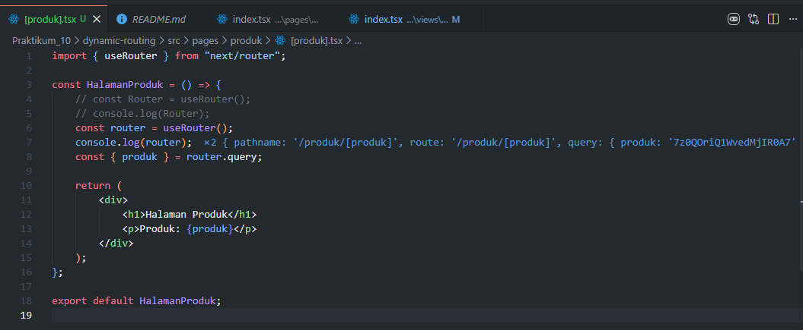 
2. Jalankan browser di `http://localhost:3000/produk`
3. Klik salah satu gambar untuk menuju halaman detail
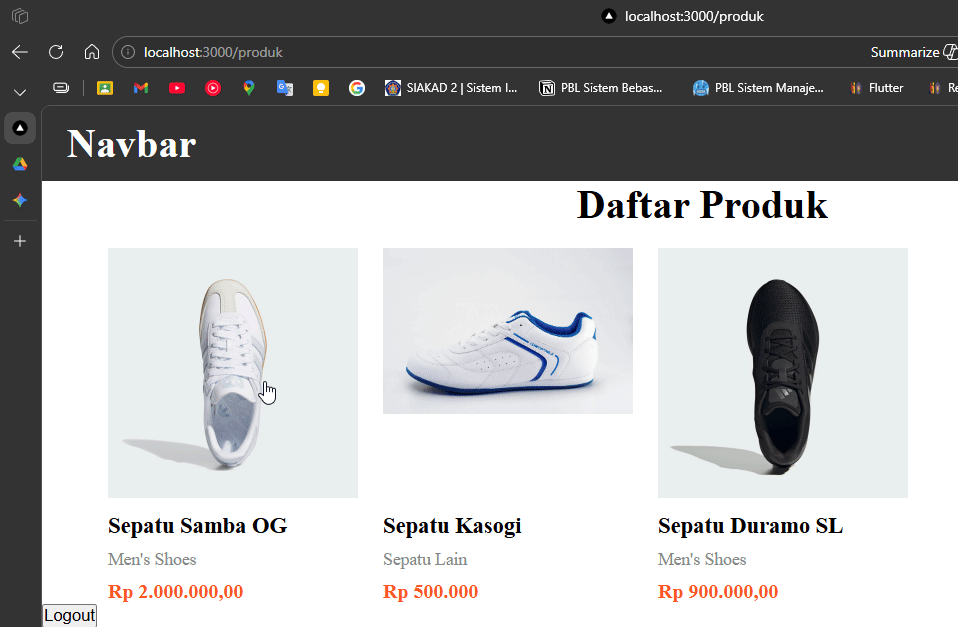 

### Langkah 2 – Implementasi CSR (Client-Side Rendering)
1. Modifikasi file `[produk].tsx` di folder `src/pages/produk/`
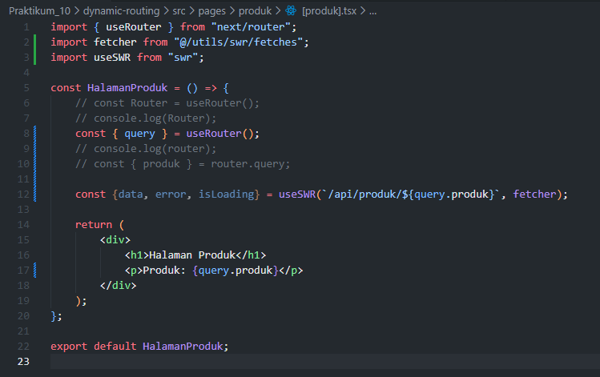 
2. Rename file `produk.ts` (folder `pages/api/`) menjadi `[[...produk]].ts` 
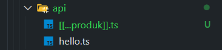  
3. Update file `servicefirebase.ts`
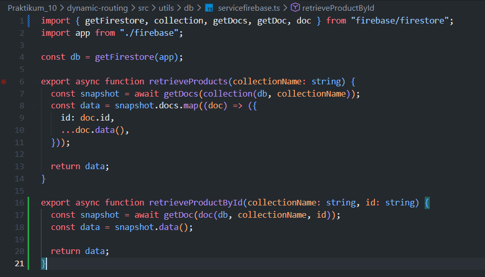
4. Update file `[[...produk]].ts` 
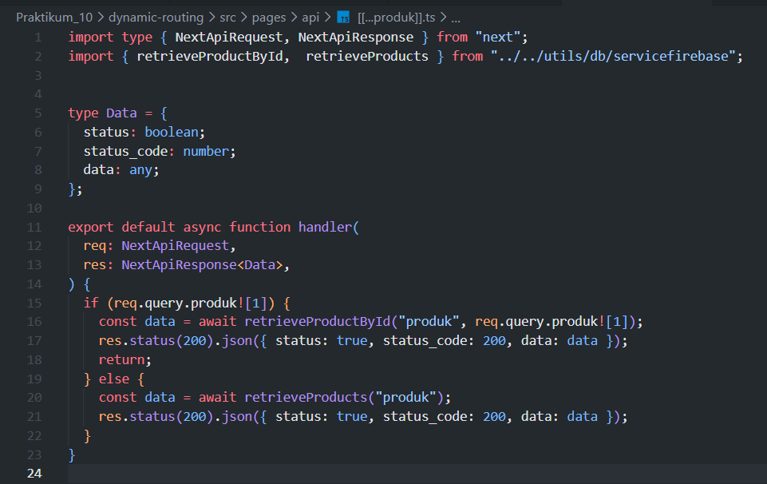 
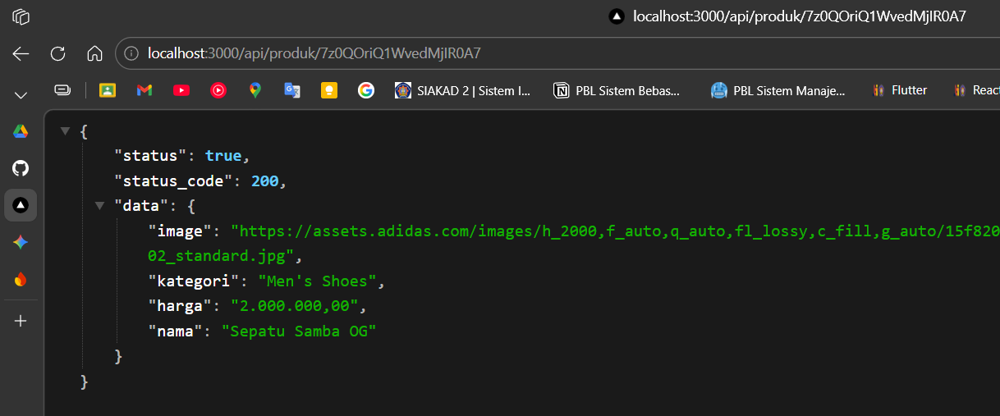 
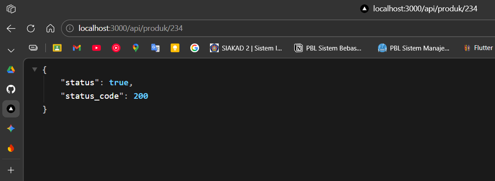 
5. Buat file `index.tsx` di folder `views/DetailProduk` dan `detailProduk.module.scss`
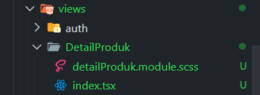 
- `detailProduk.module.scss` 
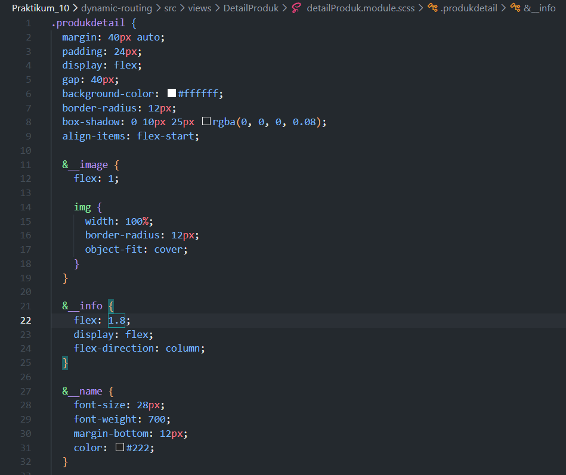 
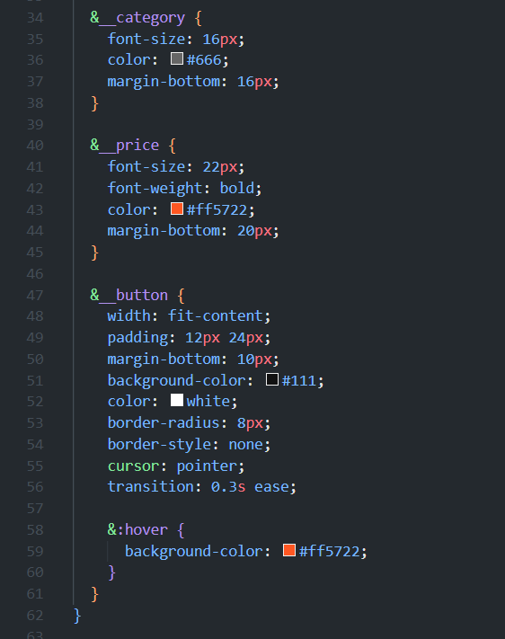 
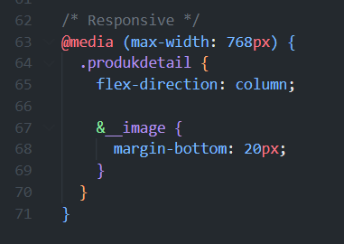 
- `index.tsx` 
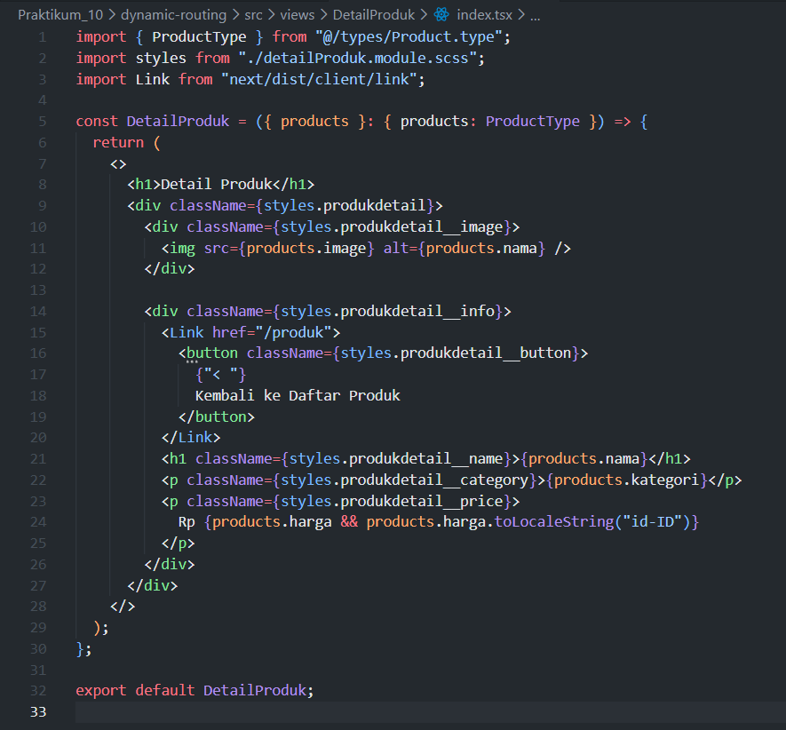 
6. Modifikasi `[produk].tsx` di `src/pages/produk/` 
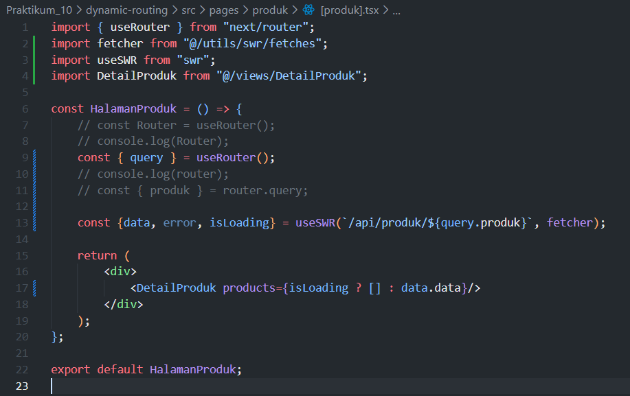 
7. Test: `http://localhost:3000/produk/` → klik produk → `http://localhost:3000/produk/"id produk"` 
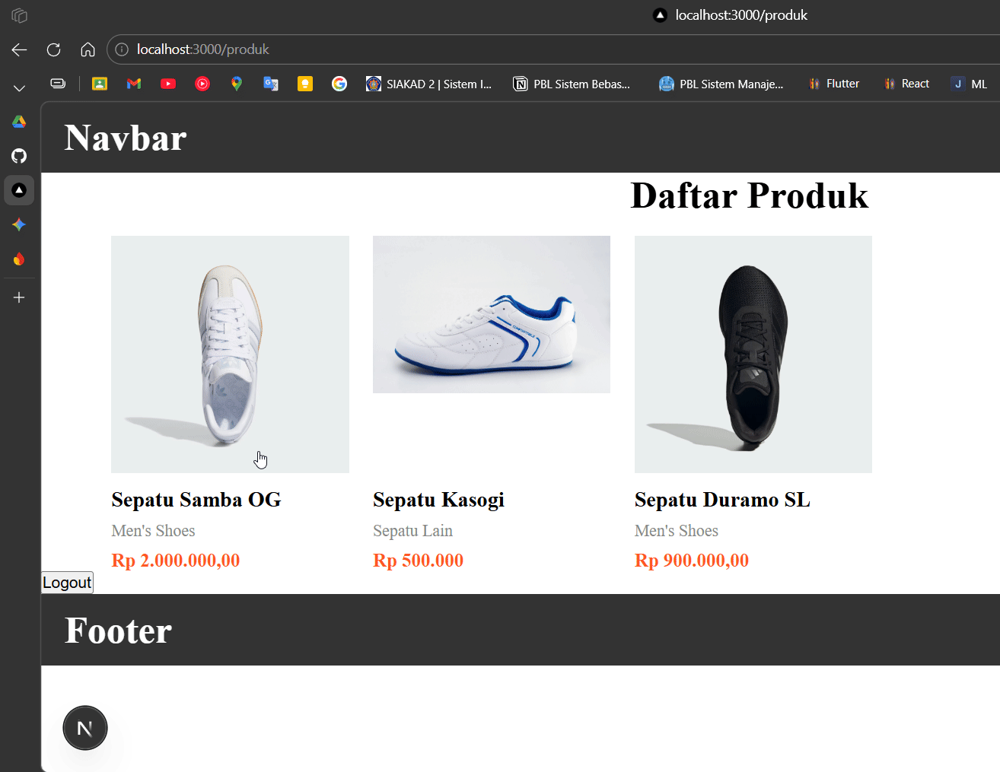 
- update style center title 
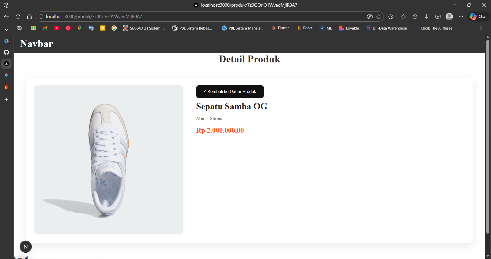 

### Langkah 3 – Implementasi SSR (Server-Side Rendering)
1. Comment line 9-20 di `[produk].tsx` dan tambahkan kode SSR
2. Test: `http://localhost:3000/produk/server`
3. Catatan: Tidak ada loading state karena data sudah tersedia sebelum render

### Langkah 4 – Implementasi SSG (Static Site Generation)
1. Modifikasi `[produk].tsx` dengan `getStaticPaths` dan `getStaticProps`
2. Update `index.tsx` di `src/views/DetailProduct`
3. Test: `http://localhost:3000/produk`

### Pengujian

| Metode | Tindakan | Hasil |
|--------|----------|-------|
| **CSR** | Refresh halaman → Periksa Network XHR | Ada loading; API request terlihat |
| **SSR** | Refresh halaman | Tidak ada loading; fetch tidak terlihat |
| **SSG** | Build → Start → Tambah produk → Refresh | Produk baru tidak muncul sampai build ulang |

### Tugas Praktikum

**Tugas Individu:**
1. Implementasikan halaman detail dengan CSR, SSR, dan SSG
2. Buat tabel perbandingan CSR vs SSR vs SSG (Loading, Build Required, SEO, Perubahan Data)
3. Dokumentasikan: Screenshot, Network tab, Build result

### CSR
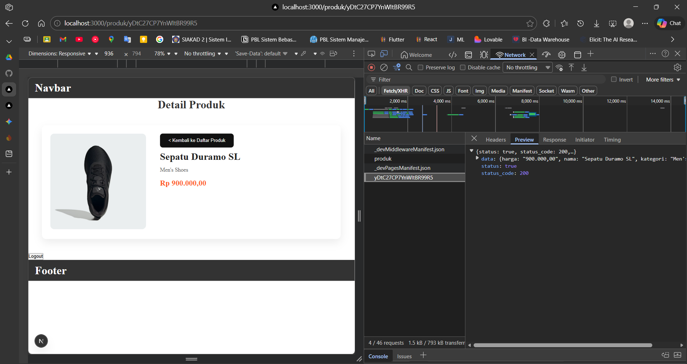
### SSR
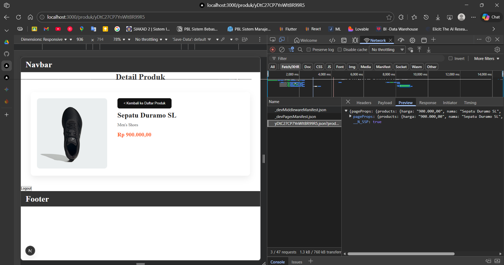
### SSG

### Pertanyaan Analisis
1. Mengapa `getStaticPaths` wajib pada dynamic SSG?
2. Mengapa CSR membutuhkan loading state?
3. Mengapa SSG tidak menampilkan produk baru tanpa build ulang?
4. Mana metode terbaik untuk halaman detail e-commerce?
5. Apa risiko menggunakan SSG untuk produk yang sering berubah?

