## Praktikum 11 - Incremental Static Regeneration (ISR)

### Langkah 1: Tambahkan Revalidate

**1.1 Buka halaman static.tsx**
- Lokasi: `src/pages/produk`
- Tambahkan `revalidate: 10` untuk memeriksa ulang setiap 10 detik
- Jika ada perubahan data → cache diperbarui<br>
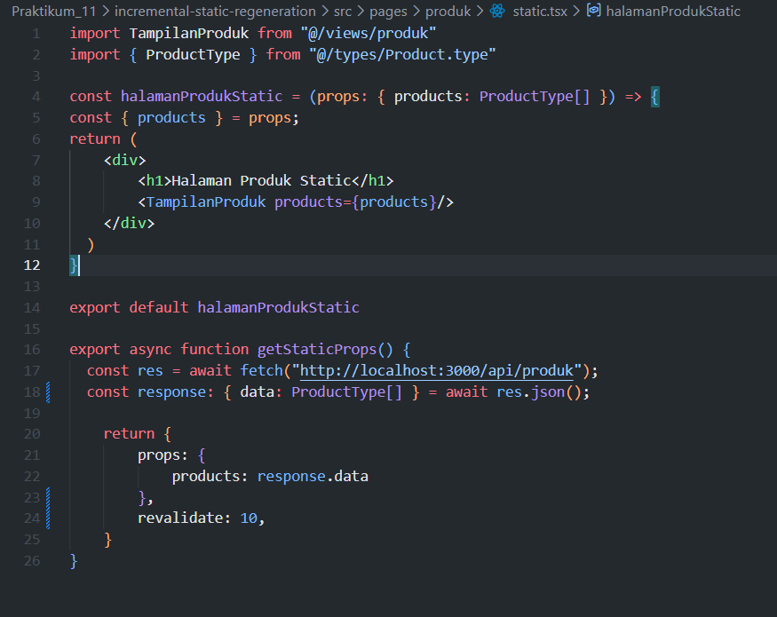

**1.2 Pengujian ISR**
- Jalankan: `npm run build && npm run start`<br>
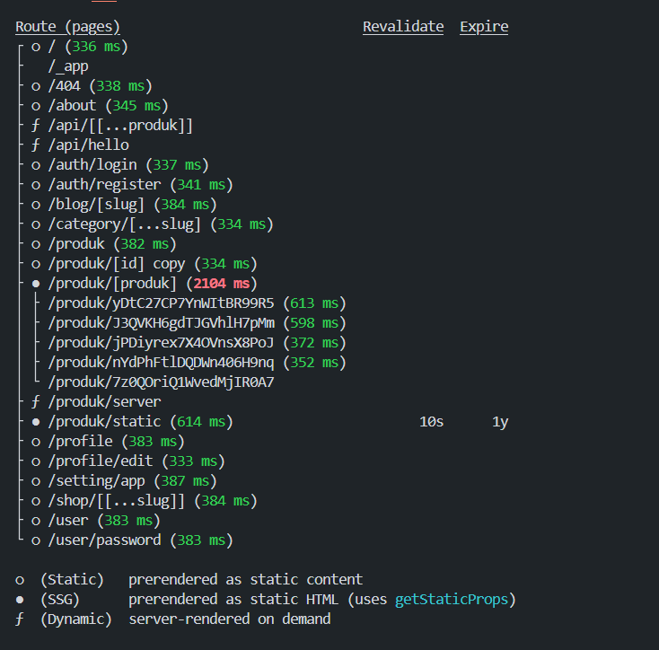<br>
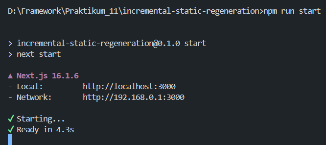<br>
- Tambahkan data baru di Firebase<br>
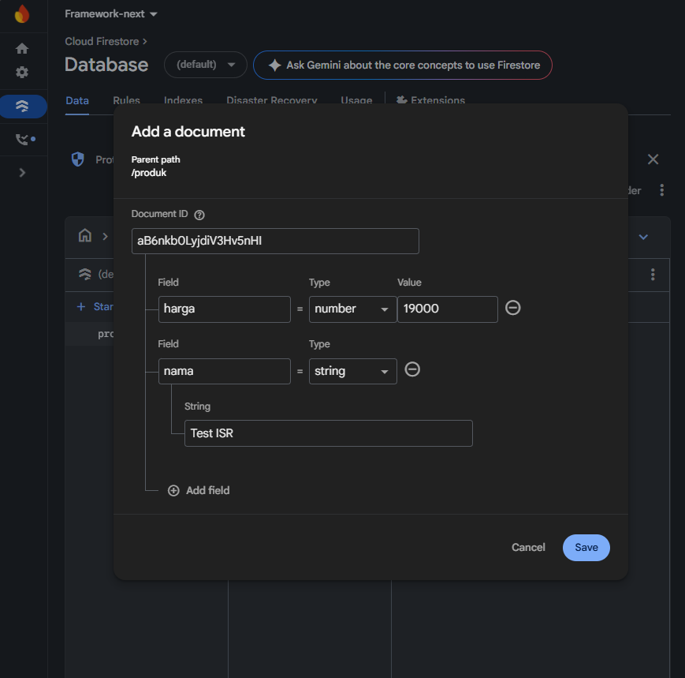<br>
- Produk Awal:<br>
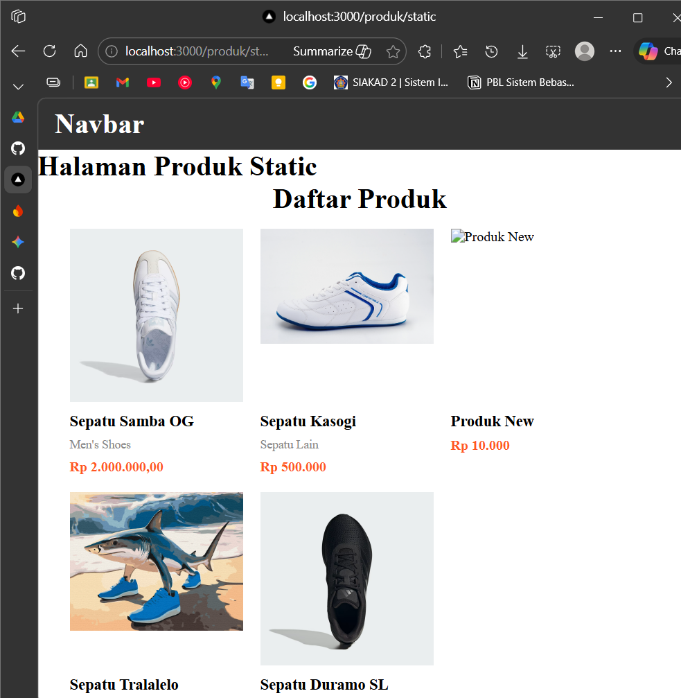<br>
- 10 detik setelah penambahan dan di refresh<br>
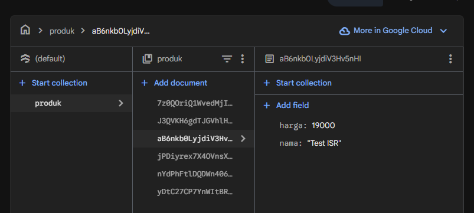<br>
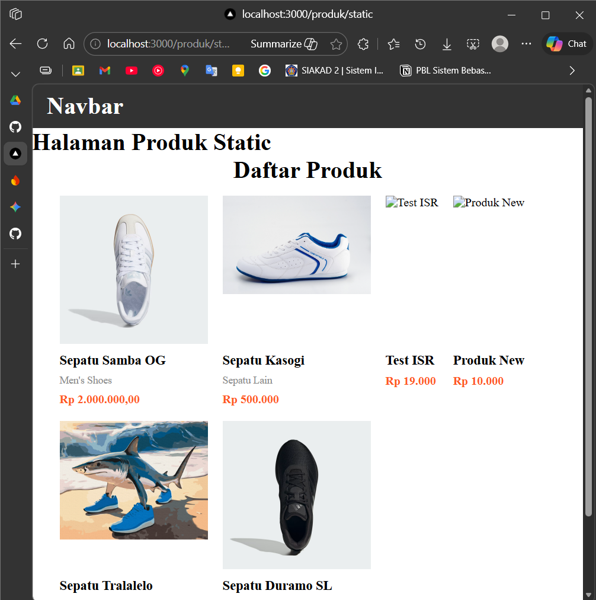<br>

> Refresh sebelum 10 detik → tampil data lama <br>
> Refresh setelah 10 detik → tampil data baru

### Langkah 2: On-Demand Revalidation

**2.1 Buat API Revalidate**
- Buat file `revalidate.ts` di `pages/api/`
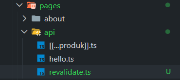
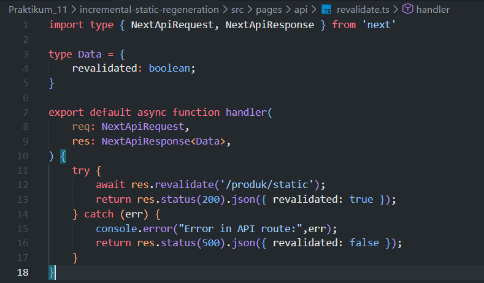
- Endpoint dapat dipicu tanpa menunggu waktu revalidate
- coba tambah data baru
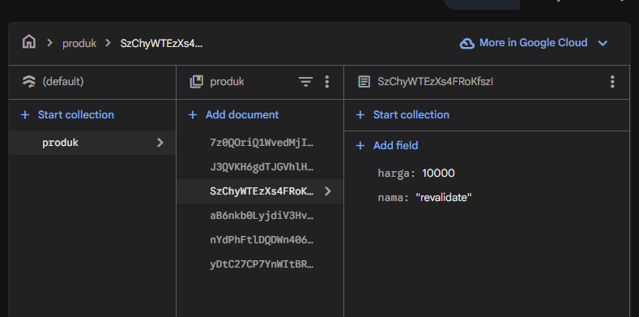
- setelah ditambahkan lalu di refresh tanpa menunggu 10 detik
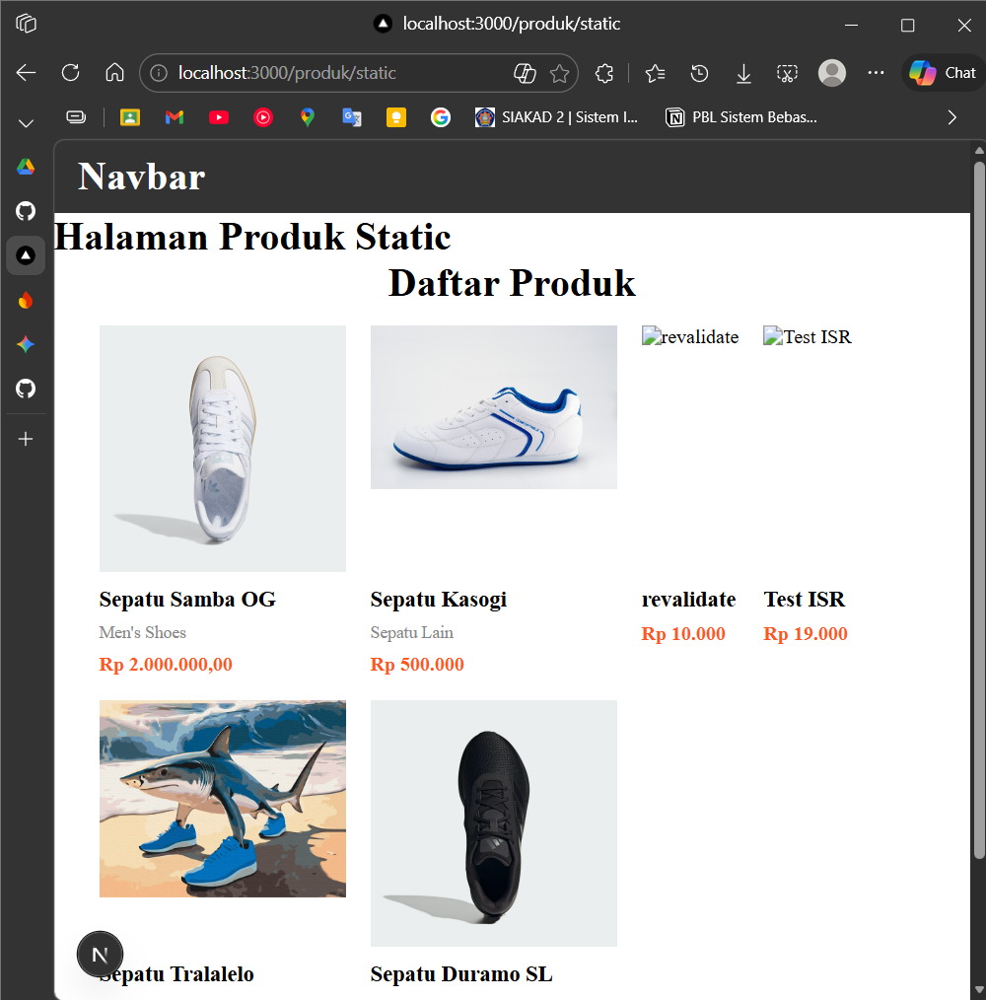
- setelah data dihapus 


**2.2 Tambahkan Parameter Data**
- Modifikasi `revalidate.ts` dengan kondisi: `req.query.data === "produk"`
- Uji: `http://localhost:3000/api/revalidate?data=produk`

**2.3 Tambahkan Token Security**
- Buka file `.env` dan tambahkan token
- Modifikasi `revalidate.ts` (line 13-17) untuk validasi token
- Uji: `http://localhost:3000/api/revalidate?data=products&token=12345678`

### Langkah 3: Pengujian Manual

**Hasil sukses:**
```
{ revalidate: true }
```

**Uji dengan:**
- Token benar ✓
- Token salah ✗
- Tanpa token ✗

### Langkah 4: Tugas Praktikum

1. Tambahkan produk baru di Firebase
2. Implementasikan ISR dengan `revalidate: 10`
3. Buat endpoint On-Demand Revalidation
4. Validasi token pada endpoint
5. Uji semua skenario token

### Langkah 5: Pertanyaan Analisis

1. Mengapa ISR lebih fleksibel dibanding SSG?
2. Perbedaan revalidate waktu vs on-demand?
3. Mengapa endpoint revalidation harus diamankan?
4. Risiko jika token tidak digunakan?
5. Kapan ISR lebih cocok dibanding SSR?
