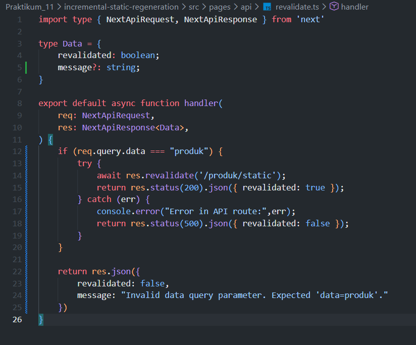
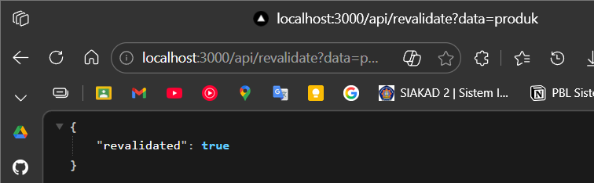
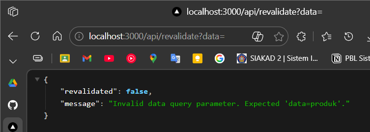
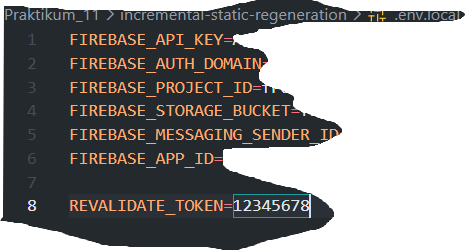
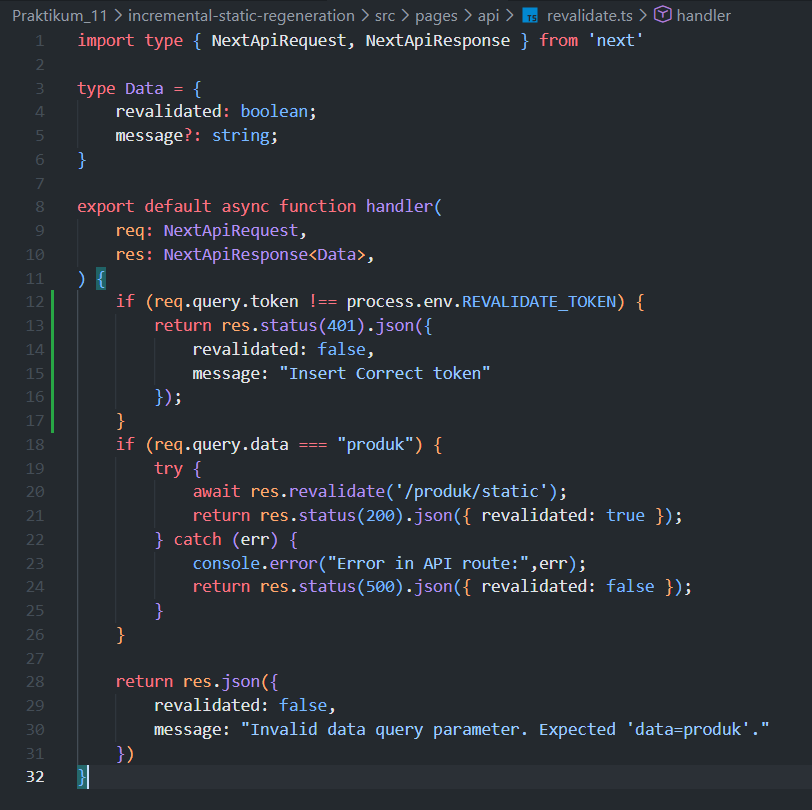
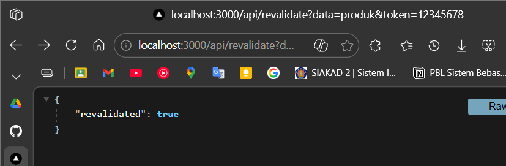
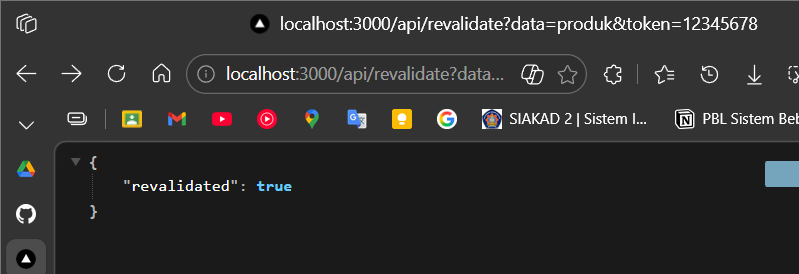
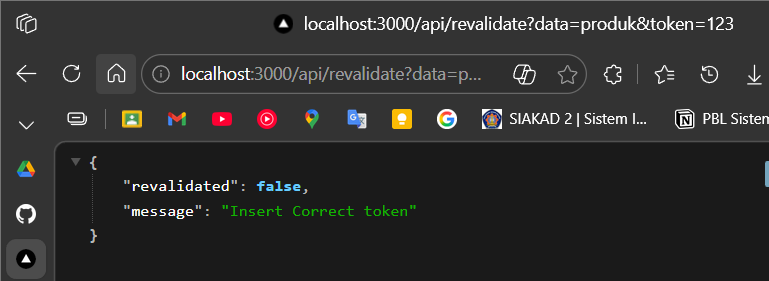
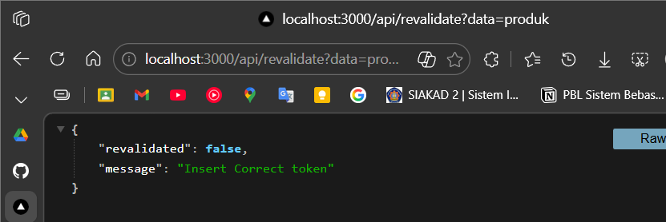
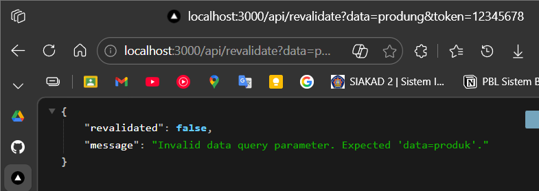

## Praktikum 11 - Incremental Static Regeneration (ISR)

### Langkah 1: Tambahkan Revalidate

**1.1 Buka halaman static.tsx**
- Lokasi: `src/pages/produk`
- Tambahkan `revalidate: 10` untuk memeriksa ulang setiap 10 detik
- Jika ada perubahan data → cache diperbarui 

**1.2 Pengujian ISR**
- Jalankan: `npm run build && npm run start` 
 
 
- Tambahkan data baru di Firebase 
 
- Produk Awal: 
 
- 10 detik setelah penambahan dan di refresh 
 
 

> Refresh sebelum 10 detik → tampil data lama  
> Refresh setelah 10 detik → tampil data baru

### Langkah 2: On-Demand Revalidation

**2.1 Buat API Revalidate**
- Buat file `revalidate.ts` di `pages/api/` 
 
 
- Endpoint dapat dipicu tanpa menunggu waktu revalidate 
- coba tambah data baru 
 
- setelah ditambahkan lalu di refresh tanpa menunggu 10 detik 
 
- setelah data dihapus  
 

**2.2 Tambahkan Parameter Data**
- Modifikasi `revalidate.ts` dengan kondisi: `req.query.data === "produk"` 
 
- Uji: `http://localhost:3000/api/revalidate?data=produk` 
 
- `http://localhost:3000/api/revalidate?data=`
 

**2.3 Tambahkan Token Security**
- Buka file `.env` dan tambahkan token 
 
- Modifikasi `revalidate.ts` untuk validasi token 
 
- Uji: `http://localhost:3000/api/revalidate?data=produk&token=12345678` 
 

### Langkah 3: Pengujian Manual

**Uji dengan:**
- Token benar ✓ 
 
- Token salah ✗ 
 
- Tanpa token ✗ 
 
- token benar tapi parameter data salah 
 

### Pertanyaan Analisis

1. Mengapa ISR lebih fleksibel dibanding SSG?
> ISR memperbarui halaman secara otomatis tanpa rebuild ulang. SSG harus rebuild seluruh proyek jika ada perubahan data, sedangkan ISR cukup tunggu waktu revalidate atau trigger manual.

2. Perbedaan revalidate waktu vs on-demand?
> Revalidate waktu: halaman diperbarui otomatis setelah X detik. On-demand: halaman diperbarui hanya saat Anda memanggil endpoint tertentu, lebih cepat dan hemat resource.

3. Mengapa endpoint revalidation harus diamankan?
> Tanpa keamanan, siapa saja bisa memanggil endpoint dan memaksa pembaruan halaman, yang bisa disalahgunakan untuk serangan atau pemborosan server.

4. Risiko jika token tidak digunakan?
> Endpoint revalidate bisa dipicu oleh orang asing, menyebabkan server sibuk terus-menerus memproses ulang data tanpa perlu, atau bahkan digunakan untuk sabotase.

5. Kapan ISR lebih cocok dibanding SSR?
> ISR cocok untuk halaman yang jarang berubah tapi perlu update berkala. SSR cocok untuk halaman yang selalu real-time. ISR lebih cepat dan hemat server dibanding SSR.
