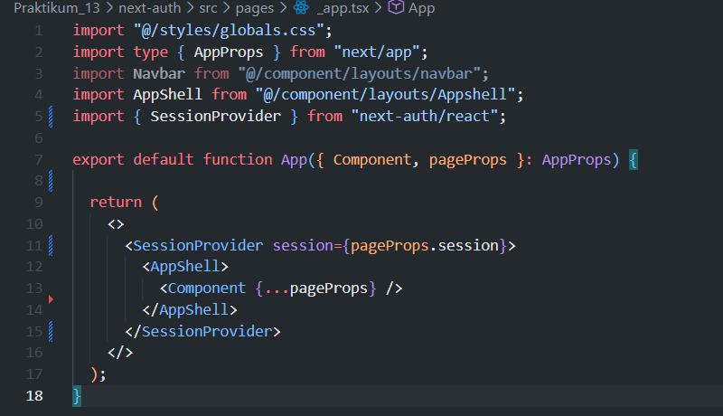
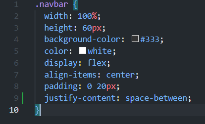
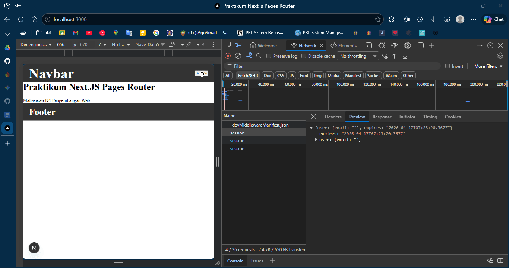
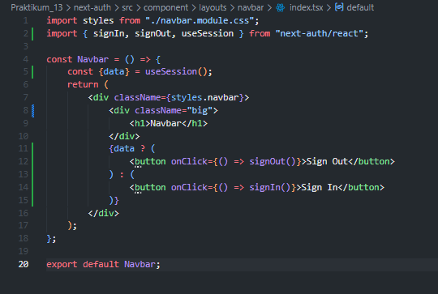
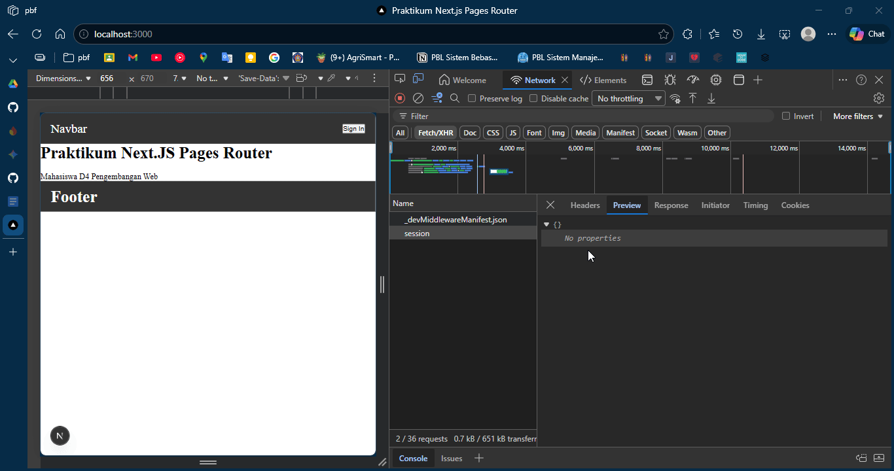
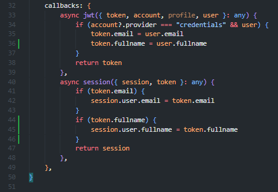
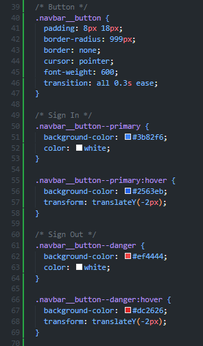
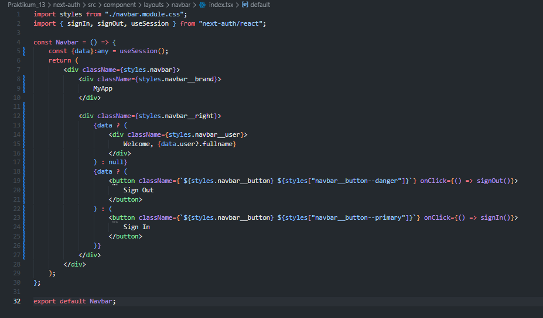
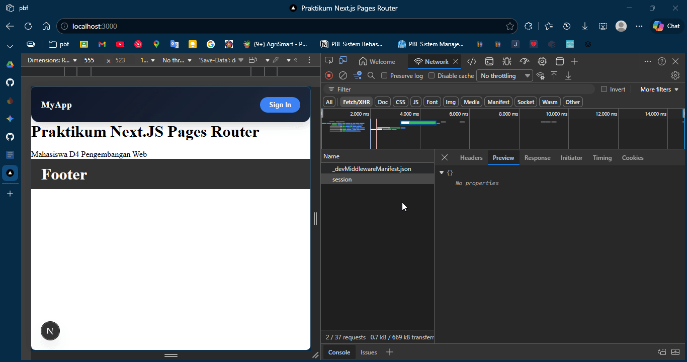

## Praktikum 13 - Sistem Autentikasi & Proteksi Route

### Langkah 1 – Install NextAuth
1. Jalankan command: `npm install next-auth --force` 
 

### Langkah 2 – Konfigurasi API Auth
1. Buat file `pages/api/auth/[...nextauth].ts` 
 
2. Modifikasi file `[...nextauth].ts` dengan konfigurasi NextAuth 
 
 

### Langkah 3 – Tambahkan Secret
1. Buka file `.env.local`
2. Tambahkan pada line 12: `NEXTAUTH_SECRET=RANDOM_BASE64_STRING`
3. Generate RANDOM_BASE64_STRING menggunakan https://www.convertsimple.com/random-base64-generator/ 
 

### Langkah 4 – Tambahkan SessionProvider
1. Buka file `_app.tsx` 
2. Modifikasi dengan SessionProvider 
 

### Langkah 5 – Tambahkan Tombol Login & Logout
1. Buka `components/navbar/index.tsx` dan modifikasi line 10 dan 2 
 
2. Buka `navbar.module.css` dan tambahkan code pada line 9 
 
3. Jalankan `http://localhost:3000/` 
4. Klik Sign In, isikan credentials, dan klik Sign In 
5. Verifikasi session muncul setelah login 
 
6. Untuk dapat menangkap data pada session maka tambahkan code sebagai berikut : 
 
7. Uji coba sign in dan sign out 
 

### Langkah 6 – Menambahkan Data Tambahan (Full Name)
1. Buka `[...nextauth].ts` dan modifikasi callbacks 
 
2. Modifikasi `navbar.module.css` 
 
 
 
3. Modifikasi `components/navbar/index.tsx` 
 
4. Jalankan browser dan lakukan Sign In 
 

### Langkah 7 – Proteksi Halaman Profile
1. Buat `pages/profile/index.tsx`
2. Buat `src/middleware/withAuth.ts` dengan middleware authorization
3. Modifikasi `middleware.ts`

### Pengujian
- **Uji 1**: Akses `/profile` tanpa login → Redirect ke home
- **Uji 2**: Login terlebih dahulu → Akses `/profile` → Berhasil masuk
- **Uji 3**: Logout → Akses `/profile` → Tidak bisa masuk

### Alur Login NextAuth
1. User klik Sign In
2. NextAuth tampilkan form credentials
3. Authorize() dijalankan
4. JWT dibuat
5. Session disimpan
6. Frontend akses useSession()

### Tugas Praktikum
1. Implementasikan login menggunakan Credentials Provider
2. Tambahkan field full name
3. Tampilkan full name setelah login
4. Buat halaman profile
5. Lindungi halaman profile dengan middleware
6. Dokumentasikan screenshot login, session, dan redirect middleware

### Pertanyaan Analisis
1. Mengapa session menggunakan JWT?
2. Apa perbedaan authorize() dan callback jwt()?
3. Mengapa middleware perlu getToken()?
4. Apa risiko jika NEXTAUTH_SECRET tidak digunakan?
5. Apa perbedaan autentikasi dan otorisasi dalam sistem ini?

