## Praktikum 14 - Implementasi Sistem Registrasi (Database Integration)

### Langkah 1 – Membuat Register View
- Buat folder pada views/auth dengan nama register dan tambahkan 2 file yaitu index.tsx dan register.module.scss 
 
- Buka file register.tsx pada folder auth/register.tsx dan Modifikasi file register.tsx (pada folder pages/auth/register.tsx) 
 
- Modifikasi register.module.scss 
 
 
 
- Tambahkan form inputan pada file index.tsx (pada folder views/auth/register/index.tsx) dengan field: 
    - Email 
     
    - Full Name 
     
    - Password 
     
    - Button Register 
     
- Jalankan browser di http://localhost:3000/auth/register 
 

### Langkah 2 – Membuat API Register
- Buka file servicefirebase.ts pada folder src/utils/db dan modifikasi 
 
> disini ada yang dibedakan dari jobsheet agar bisa saat klik register masuk ke menu login, soalnya kalo mengikuti jobsheet pasti tidak mengarah ke auth/login dan di error 400
 

 
- Buat file register.ts pada folder api 
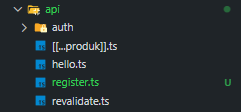 
- Modifikasi file register.ts 
 
- Modifikasi index.tsx pada folder register (tambahkan beberapa code) 
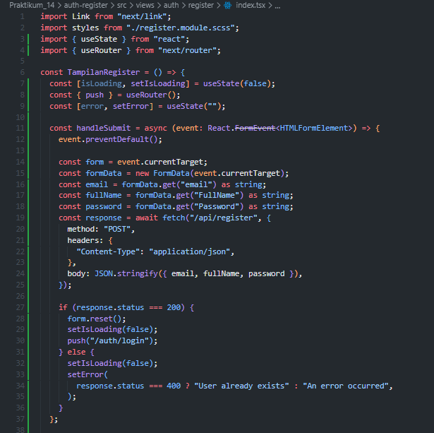 
 
- Buka browser http://localhost:3000/auth/register, isikan data dan klik register. Jika berhasil maka akan masuk ke menu login 
 

### Langkah 3 – Install bcrypt
- npm install bcrypt --force 
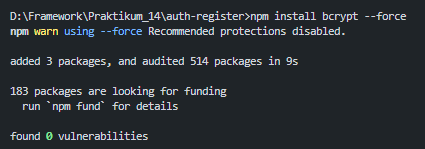 
- npm install --save-dev @types/bcrypt --force 
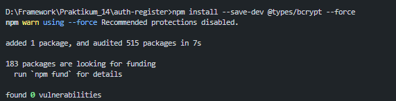 
- Buka file servicefirebase.ts pada folder src/utils/db dan modifikasi 
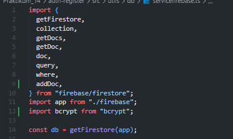 
 
 
- Jalankan browser http://localhost:3000/auth/register dan input data setelah itu klik register 
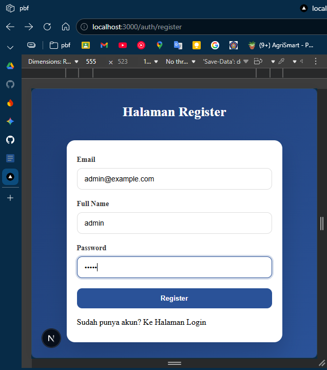 
- Buka Firebase jika berhasil maka data register akan masuk 
 
- Tambahkan notifikasi error untuk email duplikat pada index.tsx 
 
- Tambahkan loading indicator saat klik register 
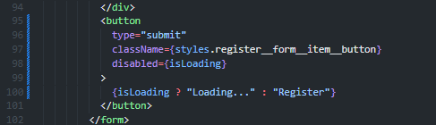 
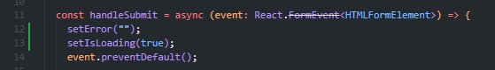 
- Setelah ditambahkan 
 

### Langkah 4 – Pengujian

**Uji 1 – Register Baru**
- Input: Email baru
- Hasil: Data tersimpan di Firestore, password ter-hash, redirect ke login 
 

**Uji 2 – Email Sudah Ada** 
- Input: Email yang sama 
- Hasil: Error 400 dengan message "Email already exists" 
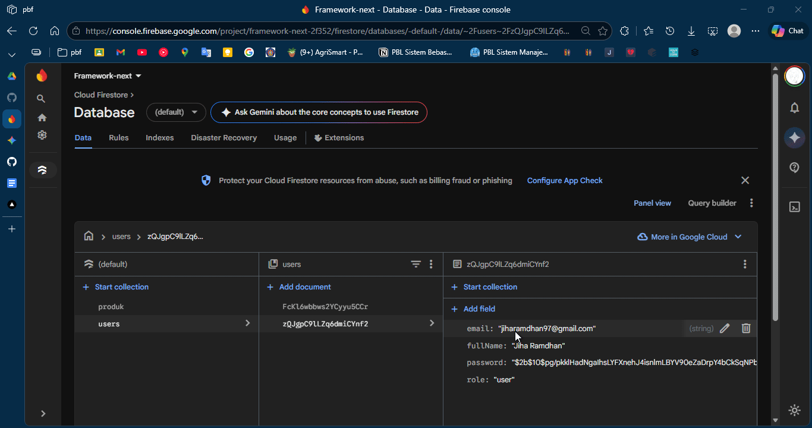 

**Uji 3 – Method GET** 
- Akses: /api/register 
- Hasil: 405 Method Not Allowed 
 

### Tugas Praktikum
1. Implementasikan register terhubung database (Sudah Terhubung) 
2. Tambahkan validasi: Email wajib, Password minimal 6 karakter 
- modifikasi index.tsx 
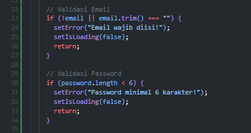 
- menambahkan field required dan minLength untuk password 
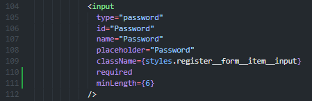 
- hasil 
 
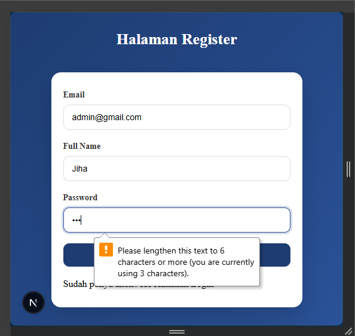 
3. Tambahkan role default "member" 
- modifikasi servicefirebase.ts 
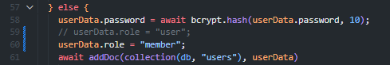 
4. Tampilkan pesan error di UI 
- bisa jika mematikan required dan minLength 
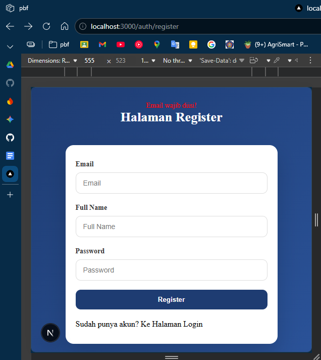 
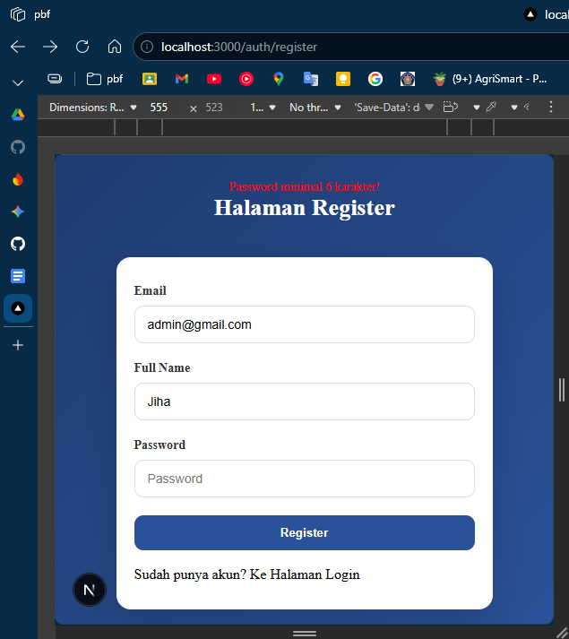 
5. Screenshot hasil: Register sukses, Email sudah ada, Database Firestore 
- Register berhasil dan ada di firestore dengan role member 
 
- Register jika akun sudah ada 
 

### Pertanyaan Analisis
1. Mengapa password harus di-hash?
2. Apa perbedaan addDoc dan setDoc?
3. Mengapa perlu validasi method POST?
4. Apa risiko jika email tidak dicek unik?
5. Apa fungsi role pada user?
