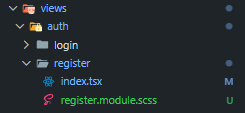
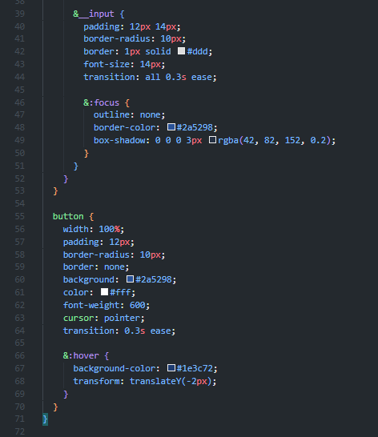
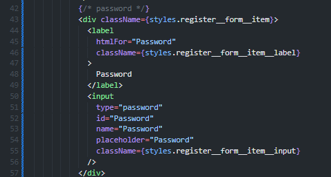

## Praktikum 14 - Implementasi Sistem Registrasi (Database Integration)

### Langkah 1 – Membuat Register View
- Buat folder pada views/auth dengan nama register dan tambahkan 2 file yaitu index.tsx dan register.module.scss 
 
- Buka file register.tsx pada folder auth/register.tsx dan Modifikasi file register.tsx (pada folder pages/auth/register.tsx) 
 
- Modifikasi register.module.scss 
 
 
 
- Tambahkan form inputan pada file index.tsx (pada folder views/auth/register/index.tsx) dengan field: 
    - Email 
     
    - Full Name 
     
    - Password 
     
    - Button Register 
     
- Jalankan browser di http://localhost:3000/auth/register 
 

### Langkah 2 – Membuat API Register
- Buka file servicefirebase.ts pada folder src/utils/db dan modifikasi
- Buat file register.ts pada folder api
- Modifikasi file register.ts
- Modifikasi index.tsx pada folder register (tambahkan beberapa code)
- Buka browser http://localhost:3000/auth/register, isikan data dan klik register. Jika berhasil maka akan masuk ke menu login

### Langkah 3 – Install bcrypt
- npm install bcrypt --force
- npm install --save-dev @types/bcrypt --force
- Buka file servicefirebase.ts pada folder src/utils/db dan modifikasi
- Jalankan browser http://localhost:3000/auth/register dan input data setelah itu klik register
- Buka Firebase jika berhasil maka data register akan masuk
- Tambahkan notifikasi error untuk email duplikat pada index.tsx
- Tambahkan loading indicator saat klik register

### Langkah 4 – Pengujian

**Uji 1 – Register Baru**
- Input: Email baru
- Hasil: Data tersimpan di Firestore, password ter-hash, redirect ke login

**Uji 2 – Email Sudah Ada**
- Input: Email yang sama
- Hasil: Error 400 dengan message "Email already exists"

**Uji 3 – Method GET**
- Akses: /api/register
- Hasil: 405 Method Not Allowed

### Langkah 5 – Struktur Database (Firestore)
Collection: users
| Field | Tipe |
|-------|------|
| fullName | string |
| email | string |
| password | string (hashed) |
| role | string |
| createdAt | timestamp |

### Tugas Praktikum
1. Implementasikan register terhubung database
2. Tambahkan validasi: Email wajib, Password minimal 6 karakter
3. Tambahkan role default "member"
4. Tampilkan pesan error di UI
5. Screenshot hasil: Register sukses, Email sudah ada, Database Firestore

### Pertanyaan Analisis
1. Mengapa password harus di-hash?
2. Apa perbedaan addDoc dan setDoc?
3. Mengapa perlu validasi method POST?
4. Apa risiko jika email tidak dicek unik?
5. Apa fungsi role pada user?
