## Praktikum 15 - Implementasi Login Database & Multi-Role

### Langkah 1 – Custom Login Page
- Tambahkan custom page di NextAuth line 51-53 
 
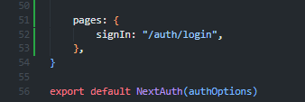 

- Jalankan browser http://localhost:3000/ dan klik sign in maka akan diarahkan ke login 
 

### Langkah 2 – Handle Login di Frontend
- Copy paste isi dari register/index.tsx ke file login/index.tsx 
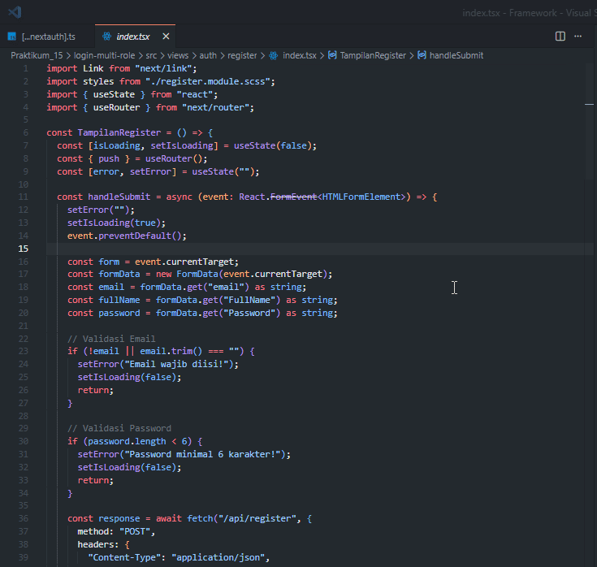 
- Copy paste isi dari register/register.module.scss ke file login/login.module.scss 
 
- Semua text register pada file index.tsx pada folder login diubah menjadi login 
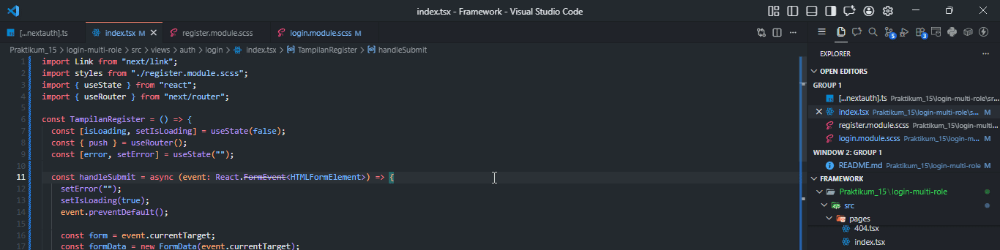 
- Jangan lupa setting link hrefnya 
 
- Lakukan hal yang sama pada file login.module.scss rubah text register menjadi login 
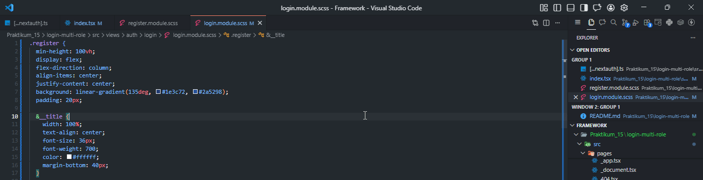 
- Cek pada file login.tsx pada pages/auth 
 
- Jalankan browser localhost:3000/auth/login. Tampilannya akan sama dengan register 
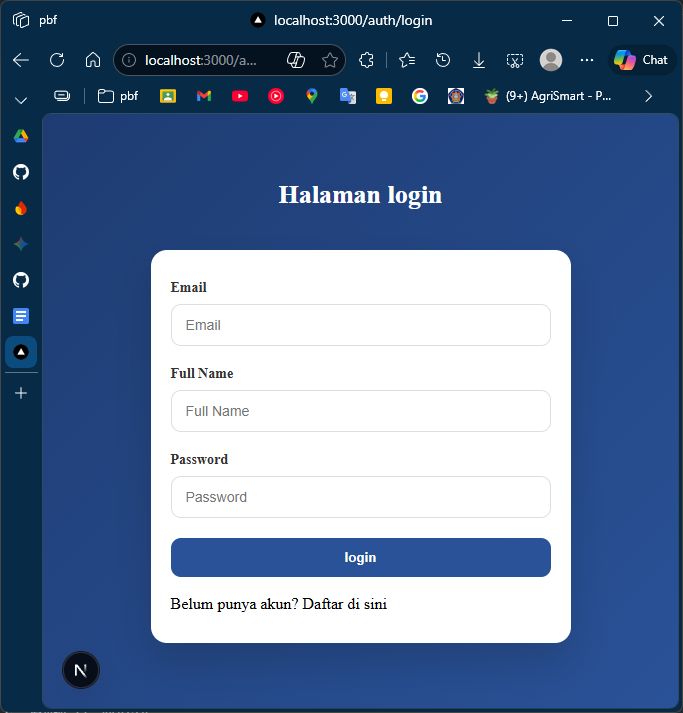 
- Pada tampilan register kita tidak perlu hapus fullname, jadi pada folder views/auth/login/index.tsx hapus fullname 
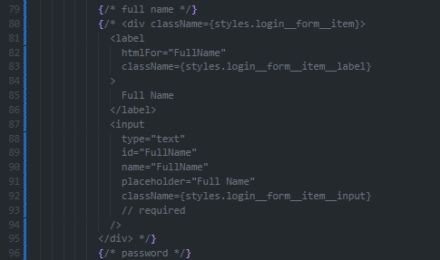 
 
- Buka file index.tsx pada folder views/auth/login dan modifikasi codenya seperti berikut (Untuk line 64 sampai kebawah tidak ada perubahan) 
- Note: pastikan tulisan password pada event.password.value pada line 48 sama dengan yang ada di database 
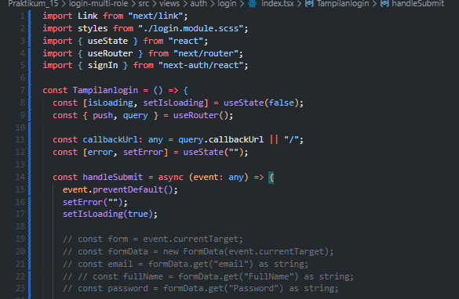 
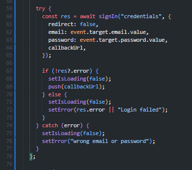 
- Buka file servicefirebase.ts dan tambahkan code di line 25-38 
 

### Langkah 3 – Authorize di NextAuth (Database Login)
- Buka file [...nextauth].ts modifikasi menjadi berikut (pada bagian providers) 
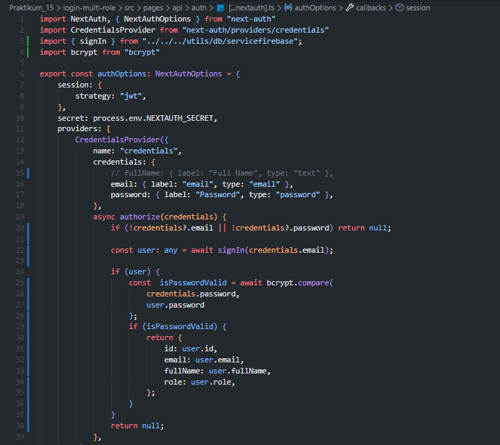 

### Langkah 4 – Tambahkan Role ke Token
- JWT Callback pada file [...nextauth].ts Modifikasi menjadi 
 
- Jalankan browser http://localhost:3000/auth/login 
 

**Note ERROR:** Jika terdapat error seperti "head tag is being rendered inside a div", buka file `src/views/auth/login/index.tsx` dan tambahkan `<> </>` pada line 81 dan 150. 
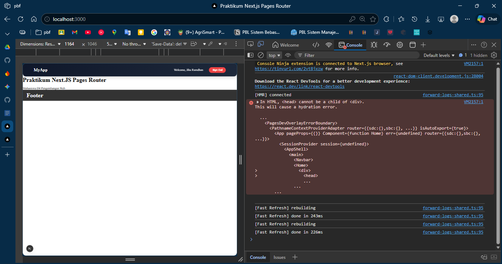 
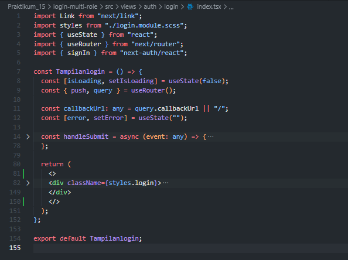 
modifikasi index.tsx juga agar menggunakan Home milik next/head 
 
hasil 
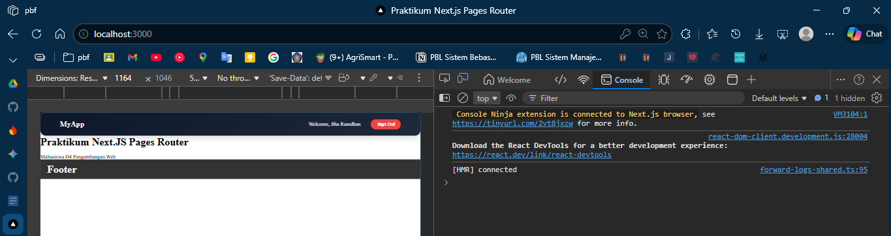 

### Langkah 5 – Callback URL Logic
- Modifikasi withAuth.ts pada folder src/middleware 
 
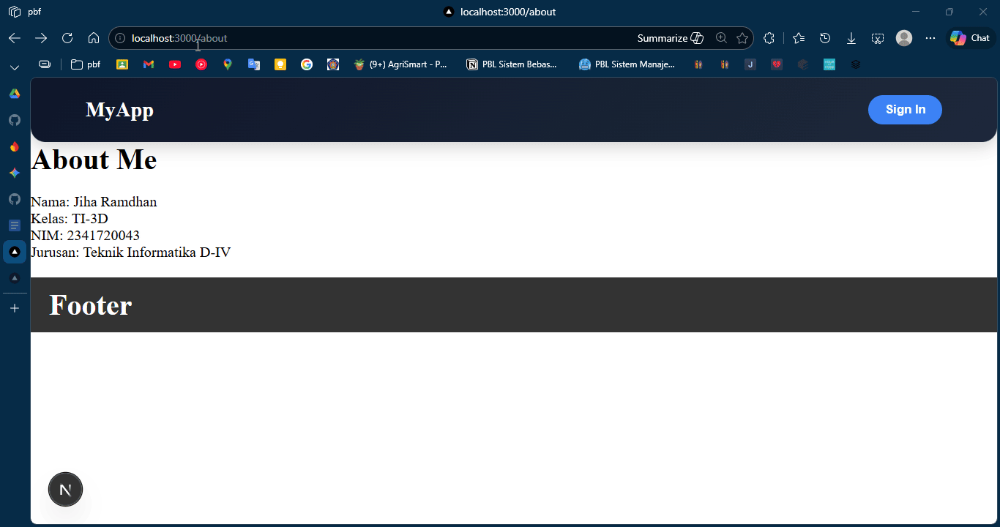 
- Tujuannya: Setelah login, user kembali ke halaman sebelumnya. 

### Langkah 6 – Membuat Halaman Admin dan Authorisasi
- Buat halaman admin
- Pada index.tsx tambahkan code berikut
- Modifikasi withAuth.ts
- Jalankan browser localhost:3000/produk dan pada status sudah login. Rubah urlnya menjadi http://localhost:3000/admin maka user akan diarahkan ke localhost. Pada intinya role selain admin tidak bisa mengakses
- Untuk mencoba halaman admin rubah role pada firebase pada salah satu akun dan jalankan http://localhost:3000/admin

## D. Pengujian

### Uji 1 – Login Valid
**Input:**
- Email benar
- Password benar

**Hasil:**
- Login berhasil
- Redirect sesuai callbackUrl

### Uji 2 – Password Salah
**Input:**
- Email benar
- Password salah

**Hasil:**
- Error message tampil
- Tidak login

### Uji 3 – Akses Admin sebagai User
**Login sebagai:**
- role: user

**Akses:** /admin

**Hasil:**
- Redirect ke home

### Uji 4 – Akses Admin sebagai Admin
**Login sebagai:**
- role: admin

**Akses:** /admin

**Hasil:**
- Bisa masuk halaman admin

## E. Struktur Database Users
**Collection: users**

| Field | Tipe |
|-------|------|
| email | string |
| password | string (hashed) |
| role | string |
| fullName | string |

## F. Perbandingan Sistem

| Fitur | Sebelum | Sekarang |
|-------|---------|---------|
| Login | Hardcoded | Database |
| Password | Plaintext | Hashed |
| Role | Tidak ada | Ada |
| Redirect | Manual | Callback URL |
| Middleware | Basic | Role-based |

## G. Tugas Praktikum
1. Implementasikan login database.
2. Tambahkan role pada user.
3. Buat halaman:
    - /profile
    - /admin
4. Proteksi /admin hanya untuk admin.
5. Implementasikan callback URL.

## H. Pertanyaan Analisis
1. Mengapa password harus diverifikasi dengan bcrypt.compare?
2. Mengapa role disimpan di token?
3. Apa fungsi callbackUrl?
4. Mengapa middleware penting untuk security?
5. Apa risiko jika role tidak dicek di middleware?

