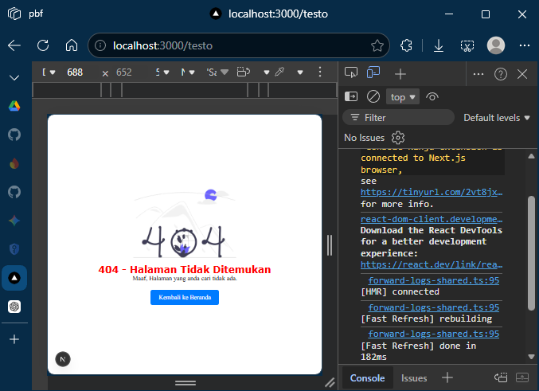
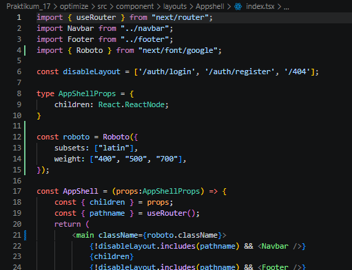

## Praktikum 17 - Optimize

### Langkah 1 – Image Optimization

#### A. Optimasi Gambar Lokal (Public Folder)
- Studi kasus:
   - Mengganti tag `` pada halaman 404 dengan `next/image`.
- Langkah:
   - Buka file `src/pages/404.tsx`.
   - Modifikasi seperti berikut: 
    

**Hasil:** 

- Warning hilang
- Image dioptimasi otomatis
- Mengurangi bandwidth
- Mendukung lazy loading otomatis

#### B. Optimasi Gambar Remote (External URL)
- Buka file `views/product/index.tsx`.
- Modifikasi file `index.tsx`. 
 
 
**Note:** Dikarenakan gambar diambil dari URL tertentu maka konfigurasi berbeda. 
- Buka file `next.config.js`. 
 

**Hasil:** 

- Gambar di-proxy melalui `/_next/image`
- Performa lebih optimal
- Kompresi otomatis

### Langkah 2 – Font Optimization

#### A. Menggunakan `next/font`
- Buka file `index.tsx` pada folder `Appshell/index.tsx` dan modifikasi.

- Jalankan browser `localhost:3000/produk`, maka font akan berubah menjadi Roboto.
- Untuk mengecek font, bisa menggunakan extension FontFinder.

**Hasil:**

- Tidak perlu load dari CDN manual
- Tidak blocking render
- Performance meningkat
- Tidak terjadi FOUT (Flash of Unstyled Text)

### Langkah 3 – Script Optimization

#### B. Menggunakan `next/script`
- Buka file `index.tsx` pada folder `layouts/Navbar` dan modifikasi.
- Pada kasus di atas, kita mengubah line 11 menggunakan model TypeScript, dapat terlihat ketika kita refresh web produk tulisan `MyApp` akan terlihat berkedip.
- Perbedaan mendasar antara line 11–13 dan line 15–18 pada file `index.tsx` Anda terletak pada metode rendering teks dan interaksi dengan DOM (Document Object Model). Berikut adalah rincian perbedaannya:

**I. Metode Rendering**
a. **Line 11–13 (Standard React/JSX):** Ini adalah cara standar React.  
Teks `"MyApp"` ditulis langsung di dalam tag `div`. React akan langsung merender teks ini ke dalam HTML saat komponen dimuat.  

b. **Line 15–18 (Next.js Script & Manual DOM):** Menggunakan komponen `<Script>` dari Next.js dengan strategi `lazyOnload`.  
Teks tidak ada di dalam HTML saat awal dimuat, melainkan baru “disuntikkan” secara manual menggunakan perintah JavaScript:  
`document.getElementById('title').innerHTML = 'MyApp';`  
setelah script tersebut diunduh di latar belakang.

**II. Performa dan SEO**
a. **Line 11–13:** Sangat baik untuk SEO karena teks `"MyApp"` langsung terbaca oleh robot pencari (crawler) dalam kode sumber HTML.  

b. **Line 15–18:** Kurang baik untuk SEO untuk konten penting karena teks baru muncul setelah JavaScript dijalankan. Strategi `lazyOnload` berarti script ini dijalankan paling akhir setelah semua sumber daya utama selesai dimuat, sehingga mungkin ada jeda waktu (delay) sebelum teks muncul di layar.

**III. Keamanan (XSS)**
a. **Line 11–13:** Aman karena React secara otomatis melakukan escape pada string untuk mencegah serangan Cross-Site Scripting (XSS).  

b. **Line 15–18:** Memiliki risiko keamanan lebih tinggi karena menggunakan `.innerHTML`. Jika data yang dimasukkan berasal dari input user, ini bisa dimanfaatkan untuk menyuntikkan skrip berbahaya.

#### C. Strategi Script

| Strategy            | Fungsi                              |
|---------------------|-------------------------------------|
| `beforeInteractive` | Sebelum halaman interaktif          |
| `afterInteractive`  | Setelah halaman interaktif          |
| `lazyOnload`        | Setelah semua selesai               |
| `worker`            | Web worker                          |

**Hasil:**
- Script tidak blocking
- Cocok untuk Google Analytics
- Performa lebih ringan

### Langkah 4 – Optimasi Avatar dengan `next/image`

- Buka file `index.tsx` pada folder `layouts/navbar` dan modifikasi.
- Tambahkan hostname Google.

### Tugas Praktikum
1. Optimasi semua image di project menggunakan `next/image`.
2. Gunakan minimal 1 font dari `next/font`.
3. Tambahkan script Google Analytics menggunakan `next/script`.
4. Terapkan dynamic import pada minimal 1 komponen.
5. Dokumentasikan perubahan performa (screenshot Lighthouse).

### Refleksi & Diskusi
1. Mengapa `` biasa tidak optimal?
2. Apa perbedaan font CDN dan `next/font`?
3. Mengapa script bisa membuat website lambat?
4. Kapan harus menggunakan dynamic import?
5. Apa dampak bundle size terhadap UX?

### Kesimpulan
Dalam praktikum ini mahasiswa telah mempelajari:
- Image Optimization
- Remote Image Configuration
- Font Optimization
- Script Optimization
- Dynamic Import
- Lazy Loading

Semua fitur ini merupakan keunggulan utama Next.js dalam meningkatkan performa aplikasi modern.
