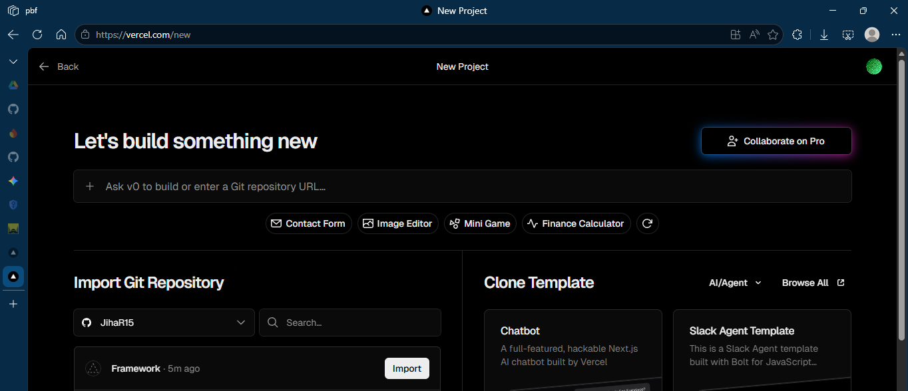
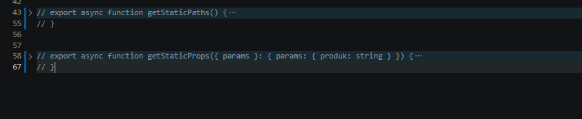

## Praktikum 19 - Deploy

> Disini saya menggunakan Repo yang sudah dibuat saja, tanpa membuat Repo baru.

### Langkah 1 – Deployment ke Vercel

**Import Project**
> Disini saya sudah menghubungkan project dengan GitHub, jadi tinggal import saja.
1. Klik **Import**.


**Catatan**
- Sebelum di-import, lakukan konfigurasi terlebih dahulu.

### C. Mengatasi Error Saat Deployment
- Dikarenakan pada code masih terdapat code static-site generation.

**Masalah: Static Site Generation Gagal**
- Hapus file `static.tsx`.
- Comment pada line 46 pada file `[produk].tsx` yang berhubungan dengan static-site generation.


**Solusi**
1. Gunakan SSR (Server Side Rendering).
     - SSR yang sebelumnya di-comment dibuka comment-nya pada file `[produk].tsx`.
     

2. Gunakan Environment Variable
     - Buat di `.env.local`:
         ```env
         NEXT_PUBLIC_API_URL=http://localhost:3000
         ```
     - Ganti semua hardcoded URL menjadi:
         ```bash
         process.env.NEXT_PUBLIC_API_URL
         ```
     - Contoh:
         ```bash
         fetch(`${process.env.NEXT_PUBLIC_API_URL}/api/product`)
         ```
     - Terapkan pada file `[produk].tsx` dan `server.tsx`.
     
     

3. Commit dan push kembali.


4. Selanjutnya import dan lakukan pengaturan sesuai kebutuhan.

5. Setelah itu klik **Deploy**. Jika berhasil, hasilnya akan muncul.

### Langkah 3 – Menambahkan Environment Variable di Vercel

**Buka Project di Vercel**
- Masuk ke **Settings → Environment Variables**.

**Import dari `.env.local`**
- Klik **Import .env** dan sesuaikan `NEXT_PUBLIC_API_URL` dengan URL project Vercel.
- Atau isi manual:
    ```env
    NEXT_PUBLIC_API_URL=https://namaproject.vercel.app
    ```

**Catatan**
- Tanpa tanda `/` di belakang URL.

**Redeploy**
- Deployment → **Redeploy**.

### Langkah 4 – Konfigurasi Google OAuth Production

**Masuk ke Google Cloud Console**
- Buka Google Developer Console.
- Masuk ke **Credentials**.
- Pilih **OAuth Client**.

**Tambahkan Authorized Origins**
- Tambahkan **Redirect URI**.

**Simpan perubahan.**

**Catatan**
- Ada kesalahan pada code `index.tsx` di folder `views/auth/login`.
- Code sebelumnya dimodifikasi.

**Redeploy Vercel**
- Agar environment terbaru terbaca.

### Langkah 5 – Pengujian Setelah Deployment

Coba akses:
- `/`
- `/about`
- `/product`
- `/profile`
- Login Google
- Login credential biasa

Pastikan:
- SSR berjalan
- API tidak lagi `localhost`
- Database terkoneksi
- Google login berhasil

### Analisis Konsep

| Konsep | Penjelasan |
|---|---|
| SSG | Data diambil saat build |
| SSR | Data diambil saat request |
| CSR | Data diambil di browser |
| Environment Variable | Variabel rahasia/configuration |
| Redeploy | Build ulang setelah perubahan |
| OAuth Production | Harus update origin & callback |

### Tugas Praktikum
1. Deploy project Next.js ke Vercel.
2. Pastikan API tidak menggunakan `localhost`.
3. Konfigurasikan Google OAuth production.
4. Lakukan minimal 1 redeploy.
5. Dokumentasikan:
     - Screenshot dashboard Vercel
     - URL hasil deployment
     - Screenshot login Google berhasil

### Refleksi & Diskusi
1. Mengapa `localhost` tidak boleh digunakan di production?
2. Mengapa SSG bisa gagal saat build?
3. Apa perbedaan SSR dan SSG saat deployment?
4. Mengapa perlu redeploy setelah menambahkan environment?
5. Apa fungsi redirect URI pada OAuth?

### Kesimpulan
Pada praktikum ini mahasiswa telah:
- Menghubungkan project dengan GitHub
- Melakukan deployment ke Vercel
- Mengelola environment variable
- Mengatasi error SSG
- Mengonfigurasi OAuth production
- Menguji aplikasi hasil deployment